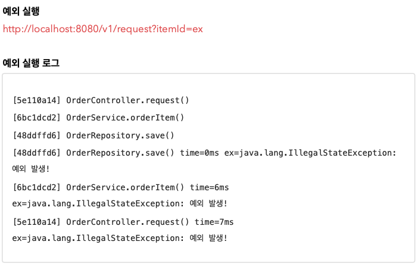

# Section 1. 예제 만들기

## 예제 프로젝트 만들기 - VO

상품을 주문하는 프로세스로 가정하고, 일반적인 웹 애플리케이션에서 Controller -> Service -> Repository 로 이어지는 흐름을 최대한 단순하게 만들어보자.


### OrderRepositoryV0

``` java
package hello.advanced.app.v0;


import lombok.RequiredArgsConstructor;
import org.springframework.stereotype.Repository;

@Repository
@RequiredArgsConstructor
public class OrderRepositoryV0 {

    public void save(String itemId) {
        // 저장 로직
        if (itemId.equals("ex")) {
            throw new IllegalStateException("예외 발생!");
        }
        sleep(1000);
    }

    private void sleep(int millis) {
        try {
            Thread.sleep(millis);
        } catch(InterruptedException e) {
            e.printStackTrace();
        }
    }
}
```

- `@Repsitory` : 컴포넌트 스캔의 대상이 된다. 따라서 스프링 빈으로 자동 등록된다.
- `sleep(1000)` : 리포지토리는 상품을 저장하는데 약 1초 정도 걸리는 것으로 가정하기 위해 1초 지연을 주었다. (1000ms)
  - 예외가 발생하는 상황도 확인하기 위해 파라미터 `itemId` 의 값이 `ex` 로 넘어오면 `IllegalStateException` 예외가 발생하도록 했다.


### OrderServiceV0

``` java
package hello.advanced.app.v0;

import lombok.RequiredArgsConstructor;
import org.springframework.stereotype.Service;

@Service
@RequiredArgsConstructor
public class OrderServiceV0 {

    private final OrderRepositoryV0 orderRepository;

    public void orderItem(String itemId) {
        orderRepository.save(itemId);
    }
}
```

- `@Service` : 컴포넌트 스캔의 대상이 된다.
- 실무에서는 복잡한 비즈니스 로직이 서비스 계층에 포함되지만, 예제에서는 단순함을 위해서 리포지토리 저장을 호출하는 코드만 있다.


### OrderControllerV0

``` java
package hello.advanced.app.v0;

import lombok.RequiredArgsConstructor;
import org.springframework.web.bind.annotation.GetMapping;
import org.springframework.web.bind.annotation.RestController;

@RestController
@RequiredArgsConstructor
public class OrderControllerV0 {

    private final OrderServiceV0 orderService;

    @GetMapping("/v0/request")
    public String request(String itemId) {
        orderService.orderItem(itemId);
        return "ok";
    }
}
```

- `@RestController`: 컴포넌트 스캔과 스프링 REST 컨트롤러로 인식된다.
- `/v0/request` 메서드는 HTTP 파라미터로 `itemId` 를 받을 수 있다.

- 실행: http://localhost:8080/v0/request?itemId=hello


## 로그 추적기 - 요구사항 분석

기존에는 개발자가 문제가 발생한 다음에 관련 부분을 어렵게 찾아서 로그를 하나하나 직접 만들어서 남겼다. 로그를 미리 남겨둔다면 이런 부분을 손쉽게 찾을 수 있을 것이다. 이 부분을 개선하고 자동화 하는 것이 로그 로그 추적기의 핵심


### 요구사항

- 모든 PUBLIC 메서드의 호출과 응답 정보를 로그로 출력
- 애플리케이션의 흐름을 변경하면 안됨
  - 로그를 남긴다고해서 비즈니스 로직의 동작에 영향을 주면 안됨
- 메서드 호출에 걸린 시간
- 정상 흐름과 예외 흐름 구분
  - 예외 발생시 예외 정보가 남아야 함
- 메서드 호출의 깊이 표현
- HTTP 요청을 구분
  - HTTP 요청 단위로 특정 ID를 남겨서 어떤 HTTP 요청에서 시작된 것인지 명확하게 구분이 가능해야 함
  - 트랜잭션 ID (DB 트랜잭션X), 여기서는 하나의 HTTP 요청이 시작해서 끝날 때 까지를 하나의 트랜잭션이라 함


### 예시

```
정상 요청
[796bccd9] OrderController.request()
[796bccd9] |-->OrderService.orderItem()
[796bccd9] |   |-->OrderRepository.save()
[796bccd9] |   |<--OrderRepository.save() time=1004ms
[796bccd9] |<--OrderService.orderItem() time=1014ms
[796bccd9] OrderController.request() time=1016ms
예외 발생
[b7119f27] OrderController.request()
[b7119f27] |-->OrderService.orderItem()
[b7119f27] | |-->OrderRepository.save() [b7119f27] | |<X-OrderRepository.save() time=0ms ex=java.lang.IllegalStateException: 예외 발생! [b7119f27] |<X-OrderService.orderItem() time=10ms ex=java.lang.IllegalStateException: 예외 발생! [b7119f27] OrderController.request() time=11ms ex=java.lang.IllegalStateException: 예외 발생!

```


## 로그 추적기 V1 - 프로토타입 개발

애플리케이션의 모든 로직에 직접 로그를 남겨도 되지만, 그것보다는 더 효율적인 개발 방법이 필요하다.

특히 트랜잭션ID와 깊이를 표현하는 방법은 기존 정보를 이어받아야 하기 때문에 단순히 로그만 남긴다고 해결할 수 있는 것은 아니다. 요구사항에 맞추어 애플리케이션에 효과적으로 로그를 남기기 위한 로그 추적기를 개발해보자.

먼저 로그 추적기를 위한 기반 데이터를 가지고 있는 `TraceId`, `TraceStatus` 클래스를 만들어보자.


### TraceId

``` java
package hello.advanced.trace;

import java.util.UUID;

public class TraceId {

    private String id;
    private int level;

    public TraceId() {
        this.id = createId();
        this.level = 0;
    }

    private TraceId(String id, int level) {
        this.id = id;
        this.level = level;
    }

    private String createId() {
        return UUID.randomUUID().toString().substring(0, 8);
    }

    public TraceId createNextId() {
        return new TraceId(id, level + 1);
    }

    public TraceId createPreviousId() {
        return new TraceId(id, level - 1);
    }

    public boolean isFirstLevel() {
        return level == 0;
    }

    public String getId() {
        return id;
    }

    public int getLevel() {
        return level;
    }
}
```

로그 추적기는 트랜잭션 ID와 깊이를 표현하는 방법이 필요하다. 여기서는 트랜잭션 ID와 깊이를 표현하는 level을 묶어서 `TraceId` 라는 개념을 만들었다. `TraceId` 는 단순히 id(트랜잭션ID)와 levl 정보를 함께 가지고 있다.


**UUID**

TraceId 를 처음 생성하면 createId() 를 사용해서 UUID를 만들어낸다. UUID가 너무 길어서 여기서는 앞 8자리만 사용한다. 이 정도면 로그를 충분히 구분할 수 있다. 여기서는 이렇게 만들어진 값을 트랜잭션 ID로 사용한다.

```
ab99e16f-3cde-4d24-8241-256108c203a2 //생성된 UUID
ab99e16f // 앞 8자리만 사용
```


**createNextId()**

다음 TraceId 를 만든다. 예제 로그를 잘 보면 깊이가 증가해도 트랜잭션ID는 같다. 대신에 깊이가 하나 증가한다.

따라서 createNextId() 를 사용해서 현재 TraceId 를 기반으로 다음 TraceId 를 만들면 id는 기존과 같고, level은 하나 증가한다.


**createPreviousId()**

createNextId() 의 반대 역할을 한다. id는 기존과 같고, level은 하나 감소한다.


**isFirstLevel()**

첫 번째 레벨 여부를 편리하게 확인할 수 있는 메서드


### TraceStatus

``` java
package hello.advanced.trace;

public class TraceStatus {
    
    private TraceId traceId;
    private Long startTimeMs;
    private String message;

    public TraceStatus(TraceId traceId, Long startTimeMs, String message) {
        this.traceId = traceId;
        this.startTimeMs = startTimeMs;
        this.message = message;
    }

    public TraceId getTraceId() {
        return traceId;
    }

    public Long getStartTimeMs() {
        return startTimeMs;
    }

    public String getMessage() {
        return message;
    }
}
```

- TraceStatus 클래스: 로그의 상태 정보를 나타낸다.
- TraceStatus는 로그를 시작할 떄의 상태 정보를 가지고 있다. 이 상태 정보는 로그를 종료할 때 사용된다.
- traceId: 내부에 트랜잭션ID와 level을 가지고 있다.
- startTimeMs: 로그 시작시간. 로그 종료시 이 시작 시간을 기준으로 시작~종료까지 전체 수행 시간을 구할 수 있다.
- message: 시작시 사용한 메시지이다. 이후 로그 종료시에도 이 메시지를 사용해서 출력한다.


### HelloTraceV1

``` java
package hello.advanced.trace.hellotrace;

import hello.advanced.trace.TraceId;
import hello.advanced.trace.TraceStatus;
import lombok.extern.slf4j.Slf4j;
import org.springframework.stereotype.Component;

@Slf4j
@Component
public class HelloTraceV1 {
    private static final String START_PREFIX = "-->";
    private static final String COMPLETE_PREFIX = "<--";
    private static final String EX_PREFIX = "<X-";

    public TraceStatus begin(String message) {
        TraceId traceId = new TraceId();
        Long startTimeMs = System.currentTimeMillis();
        log.info("[{}] {}{}", traceId.getId(), addSpace(START_PREFIX, traceId.getLevel()), message);
        return new TraceStatus(traceId, startTimeMs, message);
    }

    public void end(TraceStatus status) {
        complete(status, null);
    }

    public void exception(TraceStatus status, Exception e) {
        complete(status, e);
    }

    private void complete(TraceStatus status, Exception e) {
        Long stopTimeMs = System.currentTimeMillis();
        long resultTimeMs = stopTimeMs - status.getStartTimeMs();
        TraceId  traceId = status.getTraceId();
        if (e == null) {
            log.info("[{}] {}{} time={}ms", traceId.getId(),
                    addSpace(COMPLETE_PREFIX, traceId.getLevel()), status.getMessage(),
                    resultTimeMs);
        } else {
            log.info("[{}] {}{} time={}ms ex={}", traceId.getId(),
                    addSpace(EX_PREFIX, traceId.getLevel()), status.getMessage(), resultTimeMs,
                    e.toString());
        }
    }

    private static String addSpace(String prefix, int level) {
        StringBuilder sb = new StringBuilder();
        for (int i = 0; i < level; i++) {
            sb.append( (i==level -1) ? "|" + prefix : "|  ");
        }
        return sb.toString();
    }
}
```

`HelloTraceV1` 을 사용해서 실제 로그를 시작하고 종료할 수 있다. 그리고 로그를 출력하고 실행시간도 측정할 수 있다.

- `@Component` : 싱글톤으로 사용하기 위해 스프링 빈으로 등록한다. 컴포넌트 스캔의 대상이 된다.


**공개(public) 메서드**

- `TraceStatus begin(String message)`
  - 로그를 시작한다.
  - 로그 메시지를 파라미터로 받아서 시작 로그를 출력한다.
  - 응답 결과로 현재 로그의 상태인 `TraceStatus` 를 반환한다.
- `void end(TraceStatus status)`
  - 로그를 정상 종료한다.
  - 파라미터로 시작 로그의 상태를 전달 받는다. 이 값을 활용해서 실행 시간을 계산하고, 종료시에도 시작할 떄와 동일한 로그 메시지를 출력할 수 있다.
  - 정상 흐름에서 호출한다.
- `void exception(TraceStatus status, Exception e)`
  - 로그를 예외 상황으로 종료한다.
  - `TraceStatus`, `Exception` 정보를 함께 전달받아서 실행시간, 예외 정보를 포함한 결과 로그를 출력한다.
  - 예외가 발생했을 때 호출한다.


**비공개(private) 메서드**

- `void complete(TraceStatus status, Exception e)`
  - end(), excpetion() 의 요청 흐름을 한 곳에서 편리하게 처리한다. 실행 시간을 측정하고 로그를 남긴다.
- `static String addSpace(String prefix, int level)` : 다음과 같은 결과를 출력한다.
  - prefix: -->
    - level 0:
    - level 1: |-->
    - level 2: |   | -->
  - prefix: <--
    - 위와 동일
  - prefix: <x--
    - 위와 동일


### HelloTraceV1Test

``` java
package hello.advanced.trace.hellotrace;

import static org.junit.jupiter.api.Assertions.*;

import hello.advanced.trace.TraceStatus;
import org.junit.jupiter.api.Test;

class HelloTraceV1Test {

    @Test
    void begin_end() {
        HelloTraceV1 trace = new HelloTraceV1();
        TraceStatus status = trace.begin("hello");
        trace.end(status);
    }

    @Test
    void begin_exception() {
        HelloTraceV1 trace = new HelloTraceV1();
        TraceStatus status = trace.begin("hello");
        trace.exception(status, new IllegalStateException());
    }
}
```

> [참고]
>
> 이것은 온전한 테스트 코드가 아니다. 일반적으로 테스트라고 하면 자동으로 검증하는 과정이 필요하다. 이 테스트는 검증하는 과정이 없고 결과를 콘솔로 직접 확인해야 한다. 이렇게 응답값이 없는 경우를 자동으로 검증하려면 여러가지 테스트 기법이 필요하다. 이번 강의에서는 예제를 최대한 단순화하기 위해 검증 테스트를 생략했다.

> [주의]
>
> 지금까지 만든 로그 추적기가 어떻게 동작하는지 확실히 이해해야 다음 단계로 넘어갈 수 있다. 복습과 코드를 직접 만들어보면서 확실하게 본인 것을노 만들고 다음으로 넘어가자.


## 로그 추적기 V1 - 적용

이제 애플리케이션에 우리가 개발한 로그 추적기를 적용해보자.

기존 V0 패키지에 코드를 직접 작성해도 되지만, 기존 코드를 유지하고, 비교하기 위해서 v1 패키지를 새로 만들고 기존 코드를 복사하자.


### V1 적용하기

- OrderControllerV1

  ``` java
  package hello.advanced.app.v1;
  
  import hello.advanced.trace.TraceStatus;
  import hello.advanced.trace.hellotrace.HelloTraceV1;
  import lombok.RequiredArgsConstructor;
  import org.springframework.web.bind.annotation.GetMapping;
  import org.springframework.web.bind.annotation.RestController;
  
  @RestController
  @RequiredArgsConstructor
  public class OrderControllerV1 {
  
      private final OrderServiceV1 orderService;
      private final HelloTraceV1 trace;
  
      @GetMapping("/v1/request")
      public String request(String itemId) {
          TraceStatus status = null;
          try {
              status = trace.begin("OrderController.request()");
              orderService.orderItem(itemId);
              trace.end(status);
              return "ok";
          } catch (Exception e) {
              trace.exception(status, e);
              throw e;
          }
      }
  }
  ```

  - `trace.begin("OrderController.request()")`: 로그를 시작할 때 메시지 이름으로 컨트롤러 이름 + 메서드 이름을 주었다. 이렇게 하면 어떤 컨트롤러와 메서드가 호출되었는지 로그로 편리하게 확인할 수 있다.
  - 단순하게 trace.begin(), trace.end() 등의 두 줄의 코드만 적용하면 될 줄 알았지만 실상은 그렇지 않다. trace.exception() 으로 예외까지 처리해야 하므로 지저분한ㄷ try, catch 코드가 추가된다.
  - begin() 의 결과 값으로 받은 TraceStatus tstaus 값을 end(), exception() 에 넘겨야 한다. 결국 try, catch 블록 모두에 이 값을 넘겨야 한다. 따라서 try 상위에 TraceStatus status 코드를 선언해야 한다.
  - throw e: 예외를 꼭 다시 던져주어야 한다. 그렇지 않으면 여기서 예외를 먹어버리고 이후에 정상 흐름으로 동작한다. 로그는 애플리케이션 흐름에 영향을 주면 안된다. 로그 때문에 예외가 사라지면 안된다.
  - 실행
    - 정상: http://localhost:8080/v1/request?itemId=hello
    - 예외: http://localhost:8080/v1/request?itemId=ex

- OrderServiceV1

  ``` java
  package hello.advanced.app.v1;
  
  import hello.advanced.trace.TraceStatus;
  import hello.advanced.trace.hellotrace.HelloTraceV1;
  import lombok.RequiredArgsConstructor;
  import org.springframework.stereotype.Service;
  
  @Service
  @RequiredArgsConstructor
  public class OrderServiceV1 {
  
      private final OrderRepositoryV1 orderRepository;
      private final HelloTraceV1 trace;
  
      public void orderItem(String itemId) {
          TraceStatus status = null;
          try {
              status = trace.begin("OrderService.orderItem()");
              orderRepository.save(itemId);
              trace.end(status);
          } catch (Exception e) {
              trace.exception(status, e);
              throw e;
          }
      }
  }
  ```

- OrderRepositoryV1

  ``` java
  package hello.advanced.app.v1;
  
  import hello.advanced.trace.TraceStatus;
  import hello.advanced.trace.hellotrace.HelloTraceV1;
  import lombok.RequiredArgsConstructor;
  import org.springframework.stereotype.Repository;
  
  @Repository
  @RequiredArgsConstructor
  public class OrderRepositoryV1 {
      
      private final HelloTraceV1 trace;
  
      public void save(String itemId) {
  
          TraceStatus status = null;
          try {
              status = trace.begin("OrderRepository.save()");
              // 저장 로직
              if (itemId.equals("ex")) {
                  throw new IllegalStateException("예외 발생!");
              }
              sleep(1000);
              trace.end(status);
          } catch (Exception e) {
              trace.exception(status, e);
              throw e;
          }
      }
  
      private void sleep(int millis) {
          try {
              Thread.sleep(millis);
          } catch (InterruptedException e) {
              e.printStackTrace();
          }
      }
  }
  ```

  - 정상 실행: http://localhost:8080/v1/request?itemId=hello




HelloTraceV1 덕분에 직접 로그를 하나하나 남기는 것 보다는 편하게 여러가지 로그를 남길 수 있었다. 하지만 로그를 남기기 위한 코드가 생각보다 너무 복잡하다. 지금은 우선 요구사항과 동작하는 것에만 집중하자.


### 남은 문제 - 요구사항

- ~~모든 PUBLIC 메서드의 호출과 응답 정보를 로그로 출력~~
- ~~애플리케이션의 흐름을 변경하면 안됨~~
  - ~~로그를 남긴다고해서 비즈니스 로직의 동작에 영향을 주면 안됨~~
- ~~메서드 호출에 걸린 시간~~
- ~~정상 흐름과 예외 흐름 구분~~
  - ~~예외 발생시 예외 정보가 남아야 함~~
- 메서드 호출의 깊이 표현
- HTTP 요청을 구분
  - HTTP 요청 단위로 특정 ID를 남겨서 어떤 HTTP 요청에서 시작된 것인지 명확하게 구분이 가능해야 함
  - 트랜잭션 ID (DB 트랜잭션X), 여기서는 하나의 HTTP 요청이 시작해서 끝날 때 까지를 하나의 트랜잭션이라 함

아직 구현하지 못한 요구사항은 메서드 호출의 깊이를 표현하고, 같은 HTTP 요청이면 같은 트랜잭션 ID를 남기는 것이다. 이 기능은 직전 로그의 깊이와 트랜잭션 ID가 무엇인지 알아야 할 수 있는 일이다. 예를 들어서 `OrderController.request()` 에서 로그를 남길 때 어떤 깊이와 어떤 트랜잭션 ID를 사용했는지를 그 다음에 로그를 남기는 `OrderService.orderItem()` 에서 로그를 남길 때 알아야 한다. 결국 현재 로그의 상태 정보인 트랜잭션 ID와 level이 다음으로 전달되어야 한다.

**정리하자면 로그에 대한 문맥(Context) 정보가 필요하다.**


## 로그 추적기 V2 - 파라미터로 동기화 개발

트랜잭션ID와 메서드 호출의 깊ㅇ니를 표현하는 가장 단순한 방법은 첫 로그에서 사용한 트랜잭션ID와 level을 다음 로그에 넘겨주면 된다. 현재 로그의 상태 정보인 트랜잭션ID와 level은 TraceId에 포함되어 있다. 따라서 TraceID 를 다음 로그에 넘겨주면 된다. 이 기능을 추가한 HelloTraceV2 를 개발해보자.


### HelloTraceV2

``` java
package hello.advanced.trace.hellotrace;

import hello.advanced.trace.TraceId;
import hello.advanced.trace.TraceStatus;
import lombok.extern.slf4j.Slf4j;
import org.springframework.stereotype.Component;

@Slf4j
@Component
public class HelloTraceV2 {

    private static final String START_PREFIX = "-->";
    private static final String COMPLETE_PREFIX = "<--";
    private static final String EX_PREFIX = "<X-";

    public TraceStatus begin(String message) {
        TraceId traceId = new TraceId();
        Long startTimeMs = System.currentTimeMillis();
        log.info("[" + traceId.getId() + "] " + addSpace(START_PREFIX,
                traceId.getLevel()) + message);
        return new TraceStatus(traceId, startTimeMs, message);
    }

    // V2에서 추가
    public TraceStatus beginSync(TraceId beforeTraceId, String message) {
        TraceId nextId = beforeTraceId.createNextId();
        Long startTimeMs = System.currentTimeMillis();
        log.info("[" + nextId.getId() + "] " + addSpace(START_PREFIX,
                nextId.getLevel()) + message);
        return new TraceStatus(nextId, startTimeMs, message);
    }

    public void end(TraceStatus status) {
        complete(status, null);
    }

    public void exception(TraceStatus status, Exception e) {
        complete(status, e);
    }

    private void complete(TraceStatus status, Exception e) {
        Long stopTimeMs = System.currentTimeMillis();
        long resultTimeMs = stopTimeMs - status.getStartTimeMs();
        TraceId traceId = status.getTraceId();
        if (e == null) {
            log.info("[" + traceId.getId() + "] " + addSpace(COMPLETE_PREFIX,
                    traceId.getLevel()) + status.getMessage() + " time=" + resultTimeMs + "ms");
        } else {
            log.info("[" + traceId.getId() + "] " + addSpace(EX_PREFIX,
                    traceId.getLevel()) + status.getMessage() + " time=" + resultTimeMs + "ms" +
                    " ex=" + e);
        }
    }

    private static String addSpace(String prefix, int level) {
        StringBuilder sb = new StringBuilder();
        for (int i = 0; i < level; i++) {
            sb.append( (i == level - 1) ? "|" + prefix : "|   ");
        }
        return sb.toString();
    }
}
```

- `beginSync()`
  - 기존 TraceId 에서 createNextId() 를 통해 다음 ID를 구한다.
  - createNextId() 의 TraceId 생성 로직은 다음과 같다.
    - 트랜잭션 ID는 기존과 같이 유지한다.
    - 깊이를 표현하는 level은 하나 증가한다.


### HelloTraceV2Test

``` java
package hello.advanced.trace.hellotrace;

import hello.advanced.trace.TraceStatus;
import org.junit.jupiter.api.Test;

class HelloTraceV2Test {

    @Test
    void begin_end_level2() {
        HelloTraceV2 trace = new HelloTraceV2();
        TraceStatus status1 = trace.begin("hello1");
        TraceStatus status2 = trace.beginSync(status1.getTraceId(), "hello2");
        trace.end(status2);
        trace.end(status1);
    }

    @Test
    void begin_exception_level2() {
        HelloTraceV2 trace = new HelloTraceV2();
        TraceStatus status1 = trace.begin("hello");
        TraceStatus status2 = trace.beginSync(status1.getTraceId(), "hello2");
        trace.exception(status2, new IllegalStateException());
        trace.exception(status1, new IllegalStateException());
    }
}
```

처음에는 `begin(...)` 을 사용하고, 이후에는 `beginSync(...)` 를 사용하면 된다. `beginSync(..)` 를 호출할 때 직전 로그의 `traceId` 정보를 넘겨주어야 한다.


실행 로그를 보면 같은 트랜잭션ID 를 유지하고 level 을 통해 메서드 호출의 깊이를 표현하는 것을 확인할 수 있다.


## 로그 추적기 V2 - 적용

로그 추적기 V2 를 적용하기 전에 먼저 기존 코드(v1)를 복사해서 v2 로 만든다.


### V2 적용하기

메서드 호출의 깊이를 표현하고, HTTP 요청도 구분해보자.

이렇게 하려면 처음 로그를 남기는 `OrderController.request()` 에서 로그를 남길 때 어떤 깊이와 어떤 트랜잭션 ID를 사용했는지 다음 차례인 `OrderService.orderItem()` 에서 로그를 남기는 시점에 알아야 한다.

결국 현재 로그의 상태 정보인 트랜잭션ID와 level 이 다음으로 전달되어야 한다. 이 정보는 TraceStatus.traceId 에 담겨있다. 따라서 traceId를 컨트롤러에서 서비스를 호출할 때 넘겨주면 된다.


traceId 를 넘기도록 V2 전체 코드를 수정하자.


### OrderControllerV2

``` java
package hello.advanced.app.v2;

import hello.advanced.trace.TraceStatus;
import hello.advanced.trace.hellotrace.HelloTraceV1;
import hello.advanced.trace.hellotrace.HelloTraceV2;
import lombok.RequiredArgsConstructor;
import org.springframework.web.bind.annotation.GetMapping;
import org.springframework.web.bind.annotation.RestController;

@RestController
@RequiredArgsConstructor
public class OrderControllerV2 {

    private final OrderServiceV2 orderService;
    private final HelloTraceV2 trace;

    @GetMapping("/v2/request")
    public String request(String itemId) {
        TraceStatus status = null;
        try {
            status = trace.begin("OrderController.request()");
            orderService.orderItem(status.getTraceId(), itemId);
            trace.end(status);
            return "ok";
        } catch (Exception e) {
            trace.exception(status, e);
            throw e;
        }
    }
}
```

- TraceStatus status = trace.begin() 에서 반환 받은 TraceStatus에는 트랜잭션ID와 level 정보가 있는 TraceId가 있다.
- orderService.orderItem() 을 호출할 때 TraceId 를 파라미터로 전달한다.
- TraceId 를 파라미터로 전달하기 위해 `OrderServiceV2.orderItem()` 의 파라미터에 `TraceId` 를 추가해야 한다.


### OrderServiceV2

``` java
package hello.advanced.app.v2;

import hello.advanced.trace.TraceId;
import hello.advanced.trace.TraceStatus;
import hello.advanced.trace.hellotrace.HelloTraceV1;
import hello.advanced.trace.hellotrace.HelloTraceV2;
import lombok.RequiredArgsConstructor;
import org.springframework.stereotype.Service;

@Service
@RequiredArgsConstructor
public class OrderServiceV2 {

    private final OrderRepositoryV2 orderRepository;
    private final HelloTraceV2 trace;

    public void orderItem(TraceId traceId, String itemId) {
        TraceStatus status = null;
        try {
//            status = trace.begin("OrderService.orderItem()");
            status = trace.beginSync(traceId, "OrderService.orderItem()");
            orderRepository.save(status.getTraceId(), itemId);
            trace.end(status);
        } catch (Exception e) {
            trace.exception(status, e);
            throw e;
        }
    }
}
```

- orderItem() 은 파라미터로 전달 받은 traceId 를 사용해서 trace.beginSync() 를 실행한다.
- beginSync() 는 내부에서 다음 traceId 를 생성하면서 트랜잭션 ID는 유지하고 level은 하나 증가시킨다.
- beginSync() 가 반환된 새로운 TraceStatus 를 orderRepository.save() 를 호출하면서 파라미터로 전달한다.
- TraceId 를 파라미터로 전달하기 위해 orderRepostiory.save() 의 파라미터에 TraceId를 추가해야 한다.


### OrderRepositoryV2

``` java
package hello.advanced.app.v2;

import hello.advanced.trace.TraceId;
import hello.advanced.trace.TraceStatus;
import hello.advanced.trace.hellotrace.HelloTraceV1;
import hello.advanced.trace.hellotrace.HelloTraceV2;
import lombok.RequiredArgsConstructor;
import org.springframework.stereotype.Repository;

@Repository
@RequiredArgsConstructor
public class OrderRepositoryV2 {

    private final HelloTraceV2 trace;

    public void save(TraceId traceId, String itemId) {

        TraceStatus status = null;
        try {
            status = trace.beginSync(traceId, "OrderRepository.save()");
            // 저장 로직
            if (itemId.equals("ex")) {
                throw new IllegalStateException("예외 발생!");
            }
            sleep(1000);
            trace.end(status);
        } catch (Exception e) {
            trace.exception(status, e);
            throw e;
        }
    }

    private void sleep(int millis) {
        try {
            Thread.sleep(millis);
        } catch (InterruptedException e) {
            e.printStackTrace();
        }
    }
}
```

- save() 는 파라미터로 전달 받은 traceId 를 사용해서 trace.beginSync() 를 실행한다.
- beginSync() 는 내부에서 다음 traceId 를 생성하면서 트랜잭션 ID는 유지하고 level 은 하나 증가시킨다.
- beginSync() 는 이렇게 갱신된 traceId 로 새로운 TraceStatus 를 반환한다.
- trace.end(status) 를 호출하면서 반환된 TraceStatus 를 전달한다.

- 정상실행: http://localhost:8080/v2/request?itemId=hello

  ```
  [c80f5dbb] OrderController.request()
  [c80f5dbb] |-->OrderService.orderItem()
  [c80f5dbb] |   |-->OrderRepository.save()
  [c80f5dbb] |   |<--OrderRepository.save() time=1005ms
  [c80f5dbb] |<--OrderService.orderItem() time=1014ms
  [c80f5dbb] OrderController.request() time=1017ms
  ```

- 예외실행: http://localhost:8080/v2/request?itemId=ex

  ```
  [ca867d59] OrderController.request()
  [ca867d59] |-->OrderService.orderItem()
  [ca867d59] | |-->OrderRepository.save() [ca867d59] | |<X-OrderRepository.save() time=0ms ex=java.lang.IllegalStateException: 예외 발생! [ca867d59] |<X-OrderService.orderItem() time=7ms
  ex=java.lang.IllegalStateException: 예외 발생! [ca867d59] OrderController.request() time=7ms
  ex=java.lang.IllegalStateException: 예외 발생!
  ```

실행 로그를 보면 같은 HTTP 요청에 대해서 트랜잭션ID 가 유지되고, level 도 잘 표현되는 것을 확인할 수 있다.


### 남은 문제

- HTTP 요청을 구분하고 싶이를 표현하기 위해서 TraceId 동기화가 필요하다.
- TraceId 의 동기화를 위해서 관련 메서드의 모든 파라미터를 수정해야 한다.
  - 만약 인터페이스가 있다면 인터페이스까지 모두 고쳐야 하는 상황이다.
- 로그를 처음 시작할 때는 begin() 을 호출하고, 처음이 아닐때는 beginSync() 를 호출해야 한다.
  - 만약에 컨트롤러를 통해서 서비스를 호출하는 것이 아니라, 다른 곳에서 서비스를 처음으로 호출하는 상황이라면 파라미터로 넘길 TraceId 가 없다.


