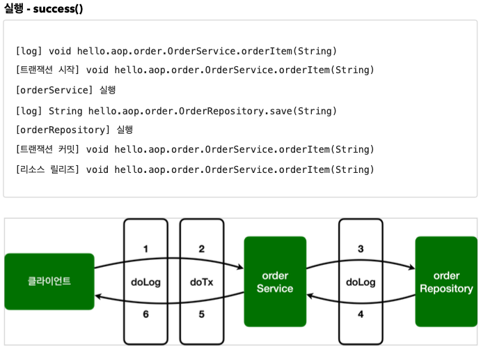
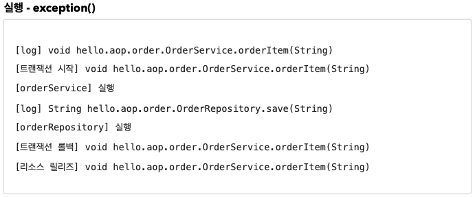
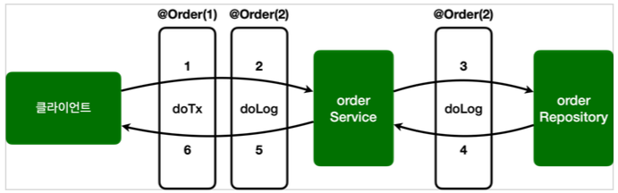
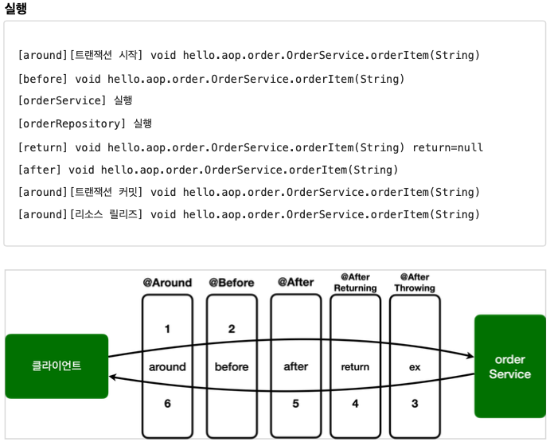

# Section 10. 스프링 AOP 구현

### 프로젝트 세팅

- project: gradle project
- language: java
- spring boot: 2.7.6
- group: hello
- artifact: hello
- name: aop
- package name: hello.aop
- packaging: jar
- java: 11
- dependencies: lombok

이번에는 스프링 웹 기술은 사용하지 않는다. Lombok 만 추가하면 된다. 참고로 스프링 프레임워크의 핵심 모듈들은 별도의 설정이 없어도 자동으로 추가된다. 추가로 AOP 기능을 사용하기 위해서 다음을 build.gradle 에 추가해준다.

```
implementation 'org.springframework.boot:spring-boot-starter-aop'
// 테스트에서 lombok 사용
testCompileOnly 'org.projectlombok:lombok'
testAnnotationProcessor 'org.projectlombok:lombok'
```

> [참고]
>
> @Aspect 를 사용하려면 `@EnableAspectJAutoProxy` 를 스프링 설정에 추가해야 하지만, 스프링 부트를 사용하면 자동으로 추가된다.


## 예제 프로젝트 만들기

#### OrderRepository

``` java
package hello.aop.order;

import lombok.extern.slf4j.Slf4j;
import org.springframework.stereotype.Repository;

@Slf4j
@Repository
public class OrderRepository {

    public String save(String itemId) {
        log.info("[orderRepository] 실행");
        // 저장 로직
        if (itemId.equals("ex")) {
            throw new IllegalStateException("예외 발생!");
        }
        return "Ok";
    }
}
```


#### OrderService

``` java
package hello.aop.order;

import lombok.extern.slf4j.Slf4j;
import org.springframework.stereotype.Service;

@Slf4j
@Service
public class OrderService {

    private final OrderRepository orderRepository;

    public OrderService(OrderRepository orderRepository) {
        this.orderRepository = orderRepository;
    }

    public void orderItem(String itemId) {
        log.info("[orderService] 실행");
        orderRepository.save(itemId);
    }
}
```


#### AopTest

``` java
package hello.aop;

import static org.assertj.core.api.Assertions.assertThatThrownBy;

import hello.aop.order.OrderRepository;
import hello.aop.order.OrderService;
import lombok.extern.slf4j.Slf4j;
import org.junit.jupiter.api.Test;
import org.springframework.aop.support.AopUtils;
import org.springframework.beans.factory.annotation.Autowired;
import org.springframework.boot.test.context.SpringBootTest;

@Slf4j
@SpringBootTest
public class AopTest {

    @Autowired
    OrderService orderService;

    @Autowired
    OrderRepository orderRepository;

    @Test
    void aopInfo() {
        log.info("isAopProxy, orderService={}", AopUtils.isAopProxy(orderService));
        log.info("isAopProxy, orderRepository={}", AopUtils.isAopProxy(orderRepository));
    }

    @Test
    void success() {
        orderService.orderItem("itemA");
    }

    @Test
    void exception() {
        assertThatThrownBy(() ->
                orderService.orderItem("ex")).isInstanceOf(IllegalStateException.class);
    }
}
```

`AopUtils.isAopProxy(...)` 을 통해서 AOP 프록시가 적용 되었는지 확인할 수 있다. 현재 AOP 관련 코드를 작성하지 않았으므로 프록시가 적용되지 않고, 결과도 false 를 반환해야 정상이다.

여기서는 실제 결과를 검증하는 테스트가 아니라 학습 테스트를 진행한다. 앞으로 로그를 직접 보면서 AOP가 잘 동작하는지 확인해볼 것이다. 테스트를 실행해서 잘 동작하면 다음으로 넘어간다.


## 스프랭 AOP 구현1 - 시작

스프링 AOP를 구현하는 일반적인 방법은 앞서 학습한 `@Aspect` 를 사용하는 방법이다.

이번 시간에는 `@Aspect` 를 사용해서 가장 단순한 AOP를 구현해보자.


### AspectV1

``` java
package hello.aop.order.aop;

import lombok.extern.slf4j.Slf4j;
import org.aspectj.lang.ProceedingJoinPoint;
import org.aspectj.lang.annotation.Around;
import org.aspectj.lang.annotation.Aspect;

@Slf4j
@Aspect
public class AspectV1 {
    
    // hello.aop.order 패키지와 하위 패키지
    @Around("execution(* hello.aop.order..*(..))")
    public Object doLog(ProceedingJoinPoint joinPoint) throws Throwable {
        log.info("[log] {}", joinPoint.getSignature()); // join point 시그니처
        return joinPoint.proceed();
    }
}
```

- `@Around` 어노테이션의 값인 `execution(* hello.aop.order..*(..))` 는 포인트컷이 된다.
- `@Around` 어노테이션의 메서드인 `doLog` 는 어드바이스(`Advice`) 가 된다.
- `exectuion(* hello.aop.order..*(..))` 는 `hello.aop.order` 패키지와 그 하위 패키지(`..`)를 지정하는 AspectJ 포인트컷 표현식이다. 앞으로는 간단히 포인트컷 표현식이라 하겠다.
- 이제 `OrderService`, `OrderRepository` 의 모든 메서드는 AOP 적용의 대상이 된다. 참고로 스프링은 프록시 방식의 AOP를 사용하므로 프록시를 통하는 메서드만 적용 대상이 된다.

> [참고]
>
> 스프링 AOP는 AspectJ의 문법을 차용하고, 프록시 방식의 AOP를 제공한다. AspectJ를 직접 사용하는 것이 아니다.
>
> 스프링 AOP를 사용할 때는 `@Aspect` 어노테이션을 주로 사용하는데, 이 어노테이션도 AspectJ가 제공하는 어노테이션이다.

> [참고]
>
> `@Aspect` 를 포함한 `org.aspectj` 패키지 관련 기능은 `aspectjweaver.jar` 라이브러리가 제공하는 기능이다. 앞서 `build.gradle` 에 `spring-boot-starter-aop` 를 포함했는데, 이렇게 하면 스프링의 AOP 관련 기능과 함께 `aspectjweaver.jar` 도 함께 사용할 수 있게 의존관계에 포함된다.
>
> 그런데 스프링에서는 AspectJ 가 제공하는 어노테이션이나 관련 인터페이스만 사용하는 것이고, 실제 AspectJ가 제공하는 컴파일, 로드타임 위버 등을 사용하는 것은 아니다. 스프링은 지금까지 우리가 학습한 것 처럼 프록시 방식의 AOP를 사용한다.


#### AopTest - 추가

``` java
@Import(AspectV1.class) // 추가
```

`@Aspect` 는 애스펙트라는 표식이지 컴포넌트 스캔이 되는 것은 아니다. 따라서 `AspectV1` 를 AOP로 사용하려면 스프링 빈으로 등록해야 한다.

스프링 빈으로 등록하는 방법은 다음과 같다.

- `@Bean` 을 사용해서 직접 등록
- `@Component` 컴포넌트 스캔을 사용해서 자동 등록
- `@Import` 주로 설정 파일을 추가할 때 사용(`@Configuration`)

@Import는 주로 설정 파일을 추가할 때 사용하지만, 이 기능으로 스프링 빈도 등록할 수 있다.

테스트에서는 버전을 올려가면서 변경할 예정이어서 간단하게 사용하자.

AopTest 를 실행하면, AopTest에 @Import(AspectV1.class) 로 스프링 빈을 추가했다. AopUtils.isAopProxy(...) 도 프록시가 적용되었으므로 true를 반환한다.


## 스프링 AOP 구현 - 포인트컷 분리

`@Around` 에 포인트컷 표현식을 직접 넣을 수도 있지만, `@Pointcut` 어노테이션을 사용해서 별도로 분리할 수도 있다.


#### AspectV2

``` java
package hello.aop.order.aop;

import lombok.extern.slf4j.Slf4j;
import org.aspectj.lang.ProceedingJoinPoint;
import org.aspectj.lang.annotation.Around;
import org.aspectj.lang.annotation.Aspect;
import org.aspectj.lang.annotation.Pointcut;

@Slf4j
@Aspect
public class AspectV2 {

    // hello.aop.order 패키지와 하위 패키지
    @Pointcut("execution(* hello.aop.order..*(..))") // pointcut expression
    private void allOrder() {} // pointcut signature
    
    @Around("allOrder()")
    public Object doLog(ProceedingJoinPoint joinPoint) throws Throwable {
        log.info("[log] {}", joinPoint.getSignature());
        return joinPoint.proceed();
    }
}
```


#### @Pointcut

- `@Pointcut` 에 포인트컷 표현식을 사용한다.
- 메서드 이름과 파라미터를 합쳐서 포인트컷 시그니처(signature)라 한다.
- 메서드의 반환 타입은 `void` 여야 한다.
- 코드 내용은 비워둔다.
- 포인트컷 시그니처는 `allOrder()` 다. 이름 그대로 주문과 관련된 모든 기능을 대상으로 하는 포인트컷이다.
- `@Around` 어드바이스에서는 포인트컷을 직접 지정해도 되지만, 포인트컷 시그니처를 사용해도 된다. 여기서는 `@Around("allOrder()")` 를 사용한다.
- `private`, `public` 같은 접근 제어자는 내부에서만 사용하면 `private` 을 사용해도 되지만, 다른 애스펙트에서 참고하려면 `public` 을 사용해야 한다.

결과적으로 `AsepctV1` 과 같은 기능을 수행한다. 이렇게 분리하면 하나의 포인트컷 표현식을 여러 어드바이스에서 함께 사용할 수 있다. 그리고 뒤에 설명하겠지만 다른 클래스에 있는 외부 어드바이스에서도 포인트컷을 함께 사용할 수 있다.


#### AopTest - 수정

``` java
// @Import(AspectV1.class)
@Import(AspectV2.class) 추가
```


## 스프링 AOP 구현3 - 어드바이스 추가

앞서 로그를 출력하는 기능에 추가로 트랜잭션을 적용하는 코드도 추가해보자. 여기서는 진짜 트랜잭션을 실행하는 것은 아니다. 기능이 동작한 것처럼 로그만 남긴다.

트랜잭션 기능은 보통 다음과 같이 동작한다.

- 핵심 로직 실행 직전에 트랜잭션 시작
- 핵심 로직 실행
- 핵심 로직 실행에 문제가 없으면 커밋
- 핵심 로직 실행에 예외가 발생하면 롤백


### AspectV3

``` java
package hello.aop.order.aop;

import lombok.extern.slf4j.Slf4j;
import org.aspectj.lang.ProceedingJoinPoint;
import org.aspectj.lang.annotation.Around;
import org.aspectj.lang.annotation.Aspect;
import org.aspectj.lang.annotation.Pointcut;

@Slf4j
@Aspect
public class AspectV3 {

    // hello.aop.order 패키지와 하위 패키지
    @Pointcut("execution(* hello.aop.order..*(..))")
    public void allOrder() {
    }

    // 클래스 이름 패턴이 *Service
    @Pointcut("execution(* *..*Service.*(..))")
    private void allService() {
    }

    @Around("allOrder()")
    public Object doLog(ProceedingJoinPoint joinPoint) throws Throwable {
        log.info("[log] {}", joinPoint.getSignature());
        return joinPoint.proceed();
    }

    // hello.aop.order 패키지와 하위 패키지 이면서 클래스 이름 패턴이 *Service
    @Around("allOrder() && allService()")
    public Object doTransaction(ProceedingJoinPoint joinPoint) throws Throwable {
        try {
            log.info("[트랜잭션 시작] {}", joinPoint.getSignature());
            Object result = joinPoint.proceed();
            log.info("[트랜잭션 커밋] {}", joinPoint.getSignature());
            return result;
        } catch (Exception e) {
            log.info("[트랜잭션 롤백] {}", joinPoint.getSignature());
            throw e;
        } finally {
            log.info("[리소스 릴리즈] {}", joinPoint.getSignature());
        }
    }
}
```

- allOrder() 포인트컷은 hello.aop.order 패키지와 하위 패키지를 대상으로 한다.
- allService() 포인트컷은 타입 이름 패턴이 `*Service` 를 대상으로 하는데 쉽게 이야기해서 XxxService 처럼 `Service` 로 끝나는 것을 대상으로 한다. `*Servi*` 과 같은 패턴도 가능하다.
- 여기서 타입 이름 패턴이라고 한 이유는 클래스, 인터페이스에 모두 적용되기 떄문이다.


`@Around("allOrder() && allService()")`

- 포인트컷은 위와 같이 조합할 수 있다. `&&`, `||`, `!` 3가지 조합이 가능하다.
- hello.aop.order 패키지와 하위 패키지 이면서 타입 이름 패턴이 `*Service` 인 것을 대상으로 한다.
- 결과적으로 doTransaction() 어드바이스는 OrderService 에만 적용된다.
- `doLog()` 어드바이스는 `OrderService`, `ORderRepository` 에 모두 적용된다.


#### 포인트컷이 적용된 AOP 결과는 다음과 같다.

- `orderService` : `doLog()`, `doTransaction()` 어드바이스 적용
- `orderRepository`: `doLog()` 어드바이스 적용





#### AOP 적용 전

클라이언트 -> `orderService.orderItem()` -> `orderRepository.save()`

#### AOP 적용 후

클라이언트 -> [`doLog()` -> `doTransaction()`] -> `orderService.orderItem()` -> [`doLog()`] -> `orderRepository.save()`


orderService 에는 `doLog()`, `doTransaction()` 두 가지 어드바이스가 적용되어 있고, `orderRepository` 에는 `doLog()` 하나의 어드바이스만 적용된 것을 확인할 수 있다.




예외 상황에서는 트랜잭션 커밋 대신에 트랜잭션 롤백이 호출되는 것을 확인할 수 있다.

그런데 여기에서 로그를 남기는 순서가 [`doLog()` -> `doTransaction()`] 순서로 작동한다. 만약 어드바이스가 적용되는 순서를 변경하고 싶으면 어떻게 하면 될까? 예를 들어서 실행 시간을 측정해야 하는데 트랜잭션과 관련된 시간을 제외하고 측정하고 싶다면 [`doTransaction()` -> `doLog()`] 이렇게 트랜잭션 이후에 로그를 남겨야 할 것이다.


## 스프링 AOP 구현4 - 포인트컷 참조

다음과 같이 포인트컷을 공용으로 사용하기 위해 별도의 외부 클래스에 모아두어도 된다. 참고로 외부에서 호출할 때는 포인트컷의 접근 제어자를 public 으로 열어두어야 한다.


#### Pointcuts

``` java
package hello.aop.order.aop;

import org.aspectj.lang.annotation.Pointcut;

public class Pointcuts {

    // hello.springaop.app 패키지와 하위 패키지
    @Pointcut("execution(* hello.aop.order..*(..))")
    public void allOrder() {

    }

    // 타입 패턴이 *Service
    @Pointcut("execution(* *..*Service.*(..))")
    public void allService(){}
    
    // allOrder && allService
    @Pointcut("allOrder() && allService()")
    public void orderAndService(){}
}
```

`orderAndService()`: `allOrder()` 포인트컷과 `allService()` 포인트컷을 조합해서 새로운 포인트컷을 만들었다.


#### ApsectV4Pointcut

``` java
package hello.aop.order.aop;

import lombok.extern.slf4j.Slf4j;
import org.aspectj.lang.ProceedingJoinPoint;
import org.aspectj.lang.annotation.Around;
import org.aspectj.lang.annotation.Aspect;

@Slf4j
@Aspect
public class AspectV4Pointcut {

    @Around("hello.aop.order.aop.Pointcuts.allOrder()")
    public Object doLog(ProceedingJoinPoint joinPoint) throws Throwable {
        log.info("[log] {}", joinPoint.getSignature());
        return joinPoint.proceed();
    }

    @Around("hello.aop.order.aop.Pointcuts.orderAndService()")
    public Object doTransaction(ProceedingJoinPoint joinPoint) throws Throwable {
        try {
            log.info("[트랜잭션 시작] {}", joinPoint.getSignature());
            Object result = joinPoint.proceed();
            log.info("[트랜잭션 커밋] {}", joinPoint.getSignature());
            return result;
        } catch (Exception e) {
            log.info("[트랜잭션 롤백] {}", joinPoint.getSignature());
            throw e;
        } finally {
            log.info("[리소스 릴리즈] {}", joinPoint.getSignature());
        }
    }
}
```

사용하는 방법은 패키지명을 포함한 클래스 이름과 포인트컷 시그니처를 모두 지정하면 된다.

포인트컷을 여러 어드바이스에서 함께 사용할 때 이 방법을 사용하면 효과적이다.


#### AopTest - 수정

``` java
@Import(AspectV4Pointcut.class)
@SpringBootTest
public class AopTest { }
```


## 스프링 AOP 구현5 - 어드바이스 순서

어드바이스는 기본적으로 순서를 보장하지 않는다. 순서를 지정하고 싶으면 `@Aspect` 적용 단위로 `org.springframework.core.annotation.@Order` 어노테이션을 적용해야 한다. 문제는 이것을 어드바이스 단위가 아니라 클래스 단위로 적용할 수 있다는 점이다. **그래서 지금처럼 하나의 애스펙트에 여러 어드바이스가 있으면 순서를 보장 받을 수 없다.** 따라서 애스펙트를 별도의 클래스로 분리해야 한다.

현재 로그를 남기는 순서가 아마도 [`doLog()` -> `doTransaction()`] 이 순서로 남을 것이다. (참고로 이 순서로 실행되지 않을 수도 있다. JVM이나 실행 환경에 따라 달라질 수도 있다.)

로그를 남기는 순서를 바꿔서 [`doTransaction()` -> `doLog()`] 트랜잭션이 먼저 처리되고, 이후에 로그가 남도록 변경해보자.


#### AspectV5Order

``` java
package hello.aop.order.aop;

import lombok.extern.slf4j.Slf4j;
import org.aspectj.lang.ProceedingJoinPoint;
import org.aspectj.lang.annotation.Around;
import org.aspectj.lang.annotation.Aspect;
import org.springframework.core.annotation.Order;

@Slf4j
public class AspectV5Order {

    @Aspect
    @Order(2)
    public static class LogAspect {
        @Around("hello.aop.order.aop.Pointcuts.allOrder()")
        public Object doLog(ProceedingJoinPoint joinPoint) throws Throwable {
            log.info("[log] {}", joinPoint.getSignature());
            return joinPoint.proceed();
        }
    }

    @Aspect
    @Order(1)
    public static class TxAspect {
        @Around("hello.aop.order.aop.Pointcuts.orderAndService()")
        public Object doTransaction(ProceedingJoinPoint joinPoint) throws Throwable {
            try {
                log.info("[트랜잭션 시작] {}", joinPoint.getSignature());
                Object result = joinPoint.proceed();
                log.info("[트랜잭션 커밋] {}", joinPoint.getSignature());
                return result;
            } catch (Exception e) {
                log.info("[트랜잭션 롤백] {}", joinPoint.getSignature());
                throw e;
            } finally {
                log.info("[리소스 릴리즈] {}", joinPoint.getSignature());
            }
        }
    }
}
```

하나의 애스펙트 안에 있던 어드바이스를 `LogAspect`, `TxAspect` 애스펙트로 각각 분리했다. 그리고 각 애스펙트에 `@Order` 어노테이션을 통해 실행 순서를 적용했다. 참고로 숫자가 작을수록 먼저 실행된다.

`@Order` 는 클래스 레벨에 지정할 수 있다.


#### AopTest - 변경

``` java
@Import({AspectV5Order.LogAspect.class, AspectV5Order.TxAspect.class})
@SpringBootTest
public class AopTest {}
```


실행 결과를 보면 트랜잭션 어드바이스가 먼저 실행되는 것을 확인할 수 있다.

```
[트랜잭션 시작] void hello.aop.order.OrderService.orderItem(String)
[log] void hello.aop.order.OrderService.orderItem(String)
[orderService] 실행
[log] String hello.aop.order.OrderRepository.save(String)
[orderRepository] 실행
[트랜잭션 커밋] void hello.aop.order.OrderService.orderItem(String)
[리소스 릴리즈] void hello.aop.order.OrderService.orderItem(String)
```




## 스프링 AOP 구현6 - 어드바이스 종류

어드바이스는 앞서 살펴본 `@Around` 외에도 여러가지 종류가 있다.


### 어드바이스 종류

- `@Around`: 메서드 호출 전후에 수행, 가장 강력한 어드바이스. 조인 포인트 실행 여부 선택, 반환 값 반환, 예외 변환 등이 가능
- `@Before`: 조인 포인트 실행 이전에 실행

- `@AfterReturning`: 조인 포인트가 정상 완료 후 실행
- `@AfterThrowing`: 메서드가 예외를 던지는 경우 실행
- `@After`: 조인 포인트가 정상 또는 예외에 관계없이 실행(finally)


#### ApsectV6Advice

``` java
package hello.aop.order.aop;

import lombok.extern.slf4j.Slf4j;
import org.aspectj.lang.JoinPoint;
import org.aspectj.lang.ProceedingJoinPoint;
import org.aspectj.lang.annotation.After;
import org.aspectj.lang.annotation.AfterReturning;
import org.aspectj.lang.annotation.AfterThrowing;
import org.aspectj.lang.annotation.Around;
import org.aspectj.lang.annotation.Aspect;
import org.aspectj.lang.annotation.Before;

@Slf4j
@Aspect
public class AspectV6Advice {

    @Around("hello.aop.order.aop.Pointcuts.orderAndService()")
    public Object doTransaction(ProceedingJoinPoint joinPoint) throws Throwable {

        try {
            // @Before
            log.info("[around] [트랜잭션 시작] {}", joinPoint.getSignature());
            Object result = joinPoint.proceed();
            // @AfterReturning
            log.info("[around] [트랜잭션 커밋] {}", joinPoint.getSignature());
            return result;
        } catch (Exception e) {
            // @AfterThrowing
            log.info("[around] [트랜잭션 롤백] {}", joinPoint.getSignature());
            throw e;
        } finally {
            // @After
            log.info("[around] [리소스 릴리즈] {}", joinPoint.getSignature());
        }
    }

    @Before("hello.aop.order.aop.Pointcuts.orderAndService()")
    public void doBefore(JoinPoint joinPoint) {
        log.info("[before] {}", joinPoint.getSignature());
    }

    @AfterReturning(value = "hello.aop.order.aop.Pointcuts.orderAndService()", returning = "result")
    public void doReturn(JoinPoint joinPoint, Object result) {
        log.info("[return] {} return={}", joinPoint.getSignature(), result);
    }

    @AfterThrowing(value = "hello.aop.order.aop.Pointcuts.orderAndService()", throwing = "ex")
    public void doThrowing(JoinPoint joinPoint, Exception exception) {
        log.info("[ex] {} message={}", joinPoint.getSignature(), exception.getMessage());
    }

    @After(value = "hello.aop.order.aop.Pointcuts.orderAndService()")
    public void doAfter(JoinPoint joinPoint) {
        log.info("[after] {}", joinPoint.getSignature());
    }
}
```

`doTransaction()` 메서드에 남겨둔 주석을 보자.

복잡해보이지만 사실 `@Around` 를 제외한 나머지 어드바이스들은 `@Around` 가 할 수 있는 일의 일부만 제공할 뿐이다. 따라서 `@Around` 어드바이스만 사용해도 필요한 기능을 모두 수행할 수 있다.


#### 참고 정보 획득

모든 어드바이스는 `org.aspectj.lang.JoinPoint` 를 첫번째 파라미터에 사용할 수 있다. (생략해도 된다.)

단 `@Around` 는 `ProceedingJoinPoint` 을 사용해야 한다.

참고로 `ProceedingJoinPoint` 는 `org.aspect.lang.JoinPoint` 의 하위 타입이다.


### JoinPoint 인터페이스의 주요 기능

- `getArgs()`: 메서드 인수를 반환한다.
- `getThis()`: 프록시 객체를 반환한다.
- `getTarget()`: 대상 객체를 반환한다.
- `getSignature()`: 조언되는 메서드에 대한 설명을 반환한다.
- `toString()`: 조언되는 방법에 대한 유용한 설명을 인쇄한다.


### ProceedingJoinPoint 인터페이스의 주요 기능

- `proceed()`: 다음 어드바이스나 타겟을 호출한다.

추가로 호출시 전달한 매개변수를 파라미터를 통해서도 전달 받을수도 있는데, 이 부분은 뒤에서...


### 어드바이스 종류

#### @Before : 조인 포인트 실행 전

``` java
@Before("hello.aop.order.aop.Pointcuts.orderAndService()")
public void doBefore(JoinPoint joinPoint) {
  log.info("[before] {}", joinPoint.getSignature());
}
```

`@Around` 와 다르게 작업 흐름을 변경할 수는 없다.

`@Around` 는 `ProceedingJoinPoint.proceed()` 를 호출해야 다음 대상이 호출된다. 만약 호출하지 않으면 다음 대상이 호출되지 않는다. 반면에 `@Before` 는 `ProceedingJoinPoint.proceed()` 자체를 사용하지 않는다. 메서드 종료시 자동으로 다음 타겟이 호출된다. 물론 예외가 발생하면 다음 코드가 호출되지는 않는다.


#### @AfterReturning

메서드 실행이 정상적으로 반환될 때 실행

``` java
@AfterReturning(value = "hello.aop.order.aop.Pointcuts.orderAndService()", returning = "result")
public void doReturn(JoinPoint joinPoint, Object result) {
  log.info("[return] {} return={}", joinPoint.getSignature(), result);
}
```

- `returning` 속성에 사용된 이름은 어드바이스 메서드의 매개변수 이름과 일치해야 한다.
- `returning` 절에 지정된 타입의 값을 반환하는 메서드만 대상으로 실행한다. (부모 타입을 지정하면 모든 자식 타입은 인정된다.)
- `@Around` 와 다르게 반환되는 객체를 변경할 수는 없다. 반환 객체를 변경하려면 `@Around`를 사용해야 한다. 참고로 반환 객체를 조작할 수는 있다.


#### @AfterThrowing

메서드 실행이 예외를 던져서 종료될 때 실행

``` java
@AfterThrowing(value = "hello.aop.order.aop.Pointcuts.orderAndService()", throwing = "ex")
public void doThrowing(JoinPoint joinPoint, Exception ex) {
  log.info("[ex] {} message={}", joinPoint.getSignature(), ex.getMessage());
}
```

- throwing 속성에 사용된 이름은 어드바이스 메서드의 매개변수 이름과 일치해야 한다.
- throwing 절에 지정된 타입과 맞은 예외를 대상으로 실행한다. (부모 타입을 지정하면 모든 자식 타입은 인정된다.)


#### @After

- 메서드 실행이 종료되면 실행된다. (finally를 생각하면 된다)
- 정상 및 예외 반환 조건을 모두 처리한다.
- 일반적으로 리소스를 해제하는 데 사용한다.


#### @Around

- 메서드의 실행의 주변에서 실행된다. 메서드 실행 전후에 작업을 수행한다.
- 가장 강력한 어드바이스
  - 조인 포인트 실행 여부 선택 `joinPoint.proceed() 호출 여부 선택`
  - 전달 값 변환: `joinPoint.proceed(args[])`
  - 반환 값 변환
  - 예외 변환
  - 트랜잭션처럼 `try ~ catch ~ finally` 모두 들어가는 구문 처리 가능
- 어드바이스의 첫번째 파라미터는 `ProceedingJoinPoint` 를 사용해야 한다.
- `proceed()` 를 통해 대상을 실행한다.
- `proceed()` 를 여러번 실행할 수도 있음(재시도)


#### AopTest - 변경

``` java
@Import(AspectV6Advice.class)
@SpringBootTest
...
```





#### 순서

- 스프링은 5.2.7 버전부터 동일한 `@Aspect` 안에서 동일한 조인포인트의 우선순위를 정했다.
- 실행 순서: @Around - @Before - @After - @AfterReturning - @AfterThrowing
- 어드바이스 적용되는 순서는 이렇게 적용되지만, 호출 순서와 리턴 순서는 반대라는 점을 알아두자.
- 물론 `@Aspect` 안에 동일한 종류의 어드바이스가 2개 있으면 순서가 보장되지 않는다. 이 경우 앞서 배운 것처럼 `@Aspect` 를 분리하고 `@Order` 를 적용하자.


#### @Around 외에 다른 어드바이스가 존재하는 이유

@Around 하나만 있어도 모든 기능을 수행할 수 있다. 그런데 다른 어드바이스들이 존재하는 이유는 무엇일까?

``` java
@Around("hello.aop.order.aop.Pointcuts.orderAndService()")
public void doBefore(ProceedingJoinPoint joinPoint) {
  log.info("[before] {}", joinPoint.getSignature());
}
```

이 코드는 타겟을 호출하지 않는 문제가 있다.

이 코드를 개발한 의도는 타겟 실행 전에 로그를 출력하는 것이다. 그런데 `@Around` 는 항상 `joinPoint.proceed()` 를 호출해야 한다. 만약 실수로 호출하지 않으면 타겟이 호출되지 않는 치명적인 버그가 발생한다.

다음 코드를 보자.

``` java
@Before("hello.aop.order.aop.Pointcuts.orderAndService()")
public void doBefore(JoinPoint joinPoint) {
  log.info("[before] {}", joinPoint.getSignature());
}
```

`@Before` 는 `joinPoint.proceed()` 를 호출하는 고민을 하지 않아도 된다.

`@Around` 가 가장 넓은 기능을 제공하는 것은 맞지만 실수할 가능성이 있다. 반면에 `@Before`, `@After` 같은 어드바이스는 기능은 적지만 실수할 가능성이 낮고, 코드도 단순하다. 그리고 가장 중요한 점이 있는데, 바로 이 코드를 작성한 의도가 명확하게 들어난다는 점이다. `@Before` 라는 어노테이션을 보는 순간 아~ 이 코드는 타겟 실행 전에 한정해서 어떤 일을 하는 코드구나 라는 것이 드러난다.


### 좋은 설계는 제약이 있는 것이다

좋은 설계는 제약이 있는 것이다. `@Around` 만 있으면 되는데 왜? 이렇게 제약을 두는가? 제약은 실수를 미연에 방지한다. 일종의 가이드 역할을 한다. 만약 `@Around` 를 사용했는데, 중간에 다른 개발자가 해당 코드를 수정해서 호출하지 않았다면? 큰 장애가 발생했을 것이다. 처음부터 `@Before` 를 사용했다면 이런 문제 자체가 발생하지 않는다.

제약 덕분에 역할이 명확해진다. 다른 개발자도 이 코드를 보고 고민해야 하는 범위가 줄어들고 코드의 의도도 파악하기 쉽다.


