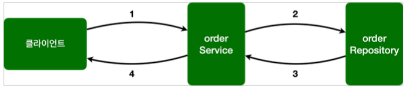
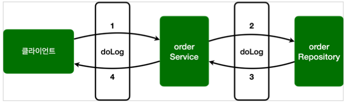

# Section 10. 스프링 AOP 구현

### 프로젝트 세팅

- project: gradle project
- language: java
- spring boot: 2.7.6
- group: hello
- artifact: hello
- name: aop
- package name: hello.aop
- packaging: jar
- java: 11
- dependencies: lombok

이번에는 스프링 웹 기술은 사용하지 않는다. Lombok 만 추가하면 된다. 참고로 스프링 프레임워크의 핵심 모듈들은 별도의 설정이 없어도 자동으로 추가된다. 추가로 AOP 기능을 사용하기 위해서 다음을 build.gradle 에 추가해준다.

```
implementation 'org.springframework.boot:spring-boot-starter-aop'
// 테스트에서 lombok 사용
testCompileOnly 'org.projectlombok:lombok'
testAnnotationProcessor 'org.projectlombok:lombok'
```

> [참고]
>
> @Aspect 를 사용하려면 `@EnableAspectJAutoProxy` 를 스프링 설정에 추가해야 하지만, 스프링 부트를 사용하면 자동으로 추가된다.


## 예제 프로젝트 만들기

#### OrderRepository

``` java
package hello.aop.order;

import lombok.extern.slf4j.Slf4j;
import org.springframework.stereotype.Repository;

@Slf4j
@Repository
public class OrderRepository {

    public String save(String itemId) {
        log.info("[orderRepository] 실행");
        // 저장 로직
        if (itemId.equals("ex")) {
            throw new IllegalStateException("예외 발생!");
        }
        return "Ok";
    }
}
```


#### OrderService

``` java
package hello.aop.order;

import lombok.extern.slf4j.Slf4j;
import org.springframework.stereotype.Service;

@Slf4j
@Service
public class OrderService {

    private final OrderRepository orderRepository;

    public OrderService(OrderRepository orderRepository) {
        this.orderRepository = orderRepository;
    }

    public void orderItem(String itemId) {
        log.info("[orderService] 실행");
        orderRepository.save(itemId);
    }
}
```


#### AopTest

``` java
package hello.aop;

import static org.assertj.core.api.Assertions.assertThatThrownBy;

import hello.aop.order.OrderRepository;
import hello.aop.order.OrderService;
import lombok.extern.slf4j.Slf4j;
import org.junit.jupiter.api.Test;
import org.springframework.aop.support.AopUtils;
import org.springframework.beans.factory.annotation.Autowired;
import org.springframework.boot.test.context.SpringBootTest;

@Slf4j
@SpringBootTest
public class AopTest {

    @Autowired
    OrderService orderService;

    @Autowired
    OrderRepository orderRepository;

    @Test
    void aopInfo() {
        log.info("isAopProxy, orderService={}", AopUtils.isAopProxy(orderService));
        log.info("isAopProxy, orderRepository={}", AopUtils.isAopProxy(orderRepository));
    }

    @Test
    void success() {
        orderService.orderItem("itemA");
    }

    @Test
    void exception() {
        assertThatThrownBy(() ->
                orderService.orderItem("ex")).isInstanceOf(IllegalStateException.class);
    }
}
```

`AopUtils.isAopProxy(...)` 을 통해서 AOP 프록시가 적용 되었는지 확인할 수 있다. 현재 AOP 관련 코드를 작성하지 않았으므로 프록시가 적용되지 않고, 결과도 false 를 반환해야 정상이다.

여기서는 실제 결과를 검증하는 테스트가 아니라 학습 테스트를 진행한다. 앞으로 로그를 직접 보면서 AOP가 잘 동작하는지 확인해볼 것이다. 테스트를 실행해서 잘 동작하면 다음으로 넘어간다.




## 스프랭 AOP 구현1 - 시작

스프링 AOP를 구현하는 일반적인 방법은 앞서 학습한 `@Aspect` 를 사용하는 방법이다.

이번 시간에는 `@Aspect` 를 사용해서 가장 단순한 AOP를 구현해보자.


### AspectV1

``` java
package hello.aop.order.aop;

import lombok.extern.slf4j.Slf4j;
import org.aspectj.lang.ProceedingJoinPoint;
import org.aspectj.lang.annotation.Around;
import org.aspectj.lang.annotation.Aspect;

@Slf4j
@Aspect
public class AspectV1 {
    
    // hello.aop.order 패키지와 하위 패키지
    @Around("execution(* hello.aop.order..*(..))")
    public Object doLog(ProceedingJoinPoint joinPoint) throws Throwable {
        log.info("[log] {}", joinPoint.getSignature()); // join point 시그니처
        return joinPoint.proceed();
    }
}
```

- `@Around` 어노테이션의 값인 `execution(* hello.aop.order..*(..))` 는 포인트컷이 된다.
- `@Around` 어노테이션의 메서드인 `doLog` 는 어드바이스(`Advice`) 가 된다.
- `exectuion(* hello.aop.order..*(..))` 는 `hello.aop.order` 패키지와 그 하위 패키지(`..`)를 지정하는 AspectJ 포인트컷 표현식이다. 앞으로는 간단히 포인트컷 표현식이라 하겠다.
- 이제 `OrderService`, `OrderRepository` 의 모든 메서드는 AOP 적용의 대상이 된다. 참고로 스프링은 프록시 방식의 AOP를 사용하므로 프록시를 통하는 메서드만 적용 대상이 된다.

> [참고]
>
> 스프링 AOP는 AspectJ의 문법을 차용하고, 프록시 방식의 AOP를 제공한다. AspectJ를 직접 사용하는 것이 아니다.
>
> 스프링 AOP를 사용할 때는 `@Aspect` 어노테이션을 주로 사용하는데, 이 어노테이션도 AspectJ가 제공하는 어노테이션이다.

> [참고]
>
> `@Aspect` 를 포함한 `org.aspectj` 패키지 관련 기능은 `aspectjweaver.jar` 라이브러리가 제공하는 기능이다. 앞서 `build.gradle` 에 `spring-boot-starter-aop` 를 포함했는데, 이렇게 하면 스프링의 AOP 관련 기능과 함께 `aspectjweaver.jar` 도 함께 사용할 수 있게 의존관계에 포함된다.
>
> 그런데 스프링에서는 AspectJ 가 제공하는 어노테이션이나 관련 인터페이스만 사용하는 것이고, 실제 AspectJ가 제공하는 컴파일, 로드타임 위버 등을 사용하는 것은 아니다. 스프링은 지금까지 우리가 학습한 것 처럼 프록시 방식의 AOP를 사용한다.


#### AopTest - 추가

``` java
@Import(AspectV1.class) // 추가
```

`@Aspect` 는 애스펙트라는 표식이지 컴포넌트 스캔이 되는 것은 아니다. 따라서 `AspectV1` 를 AOP로 사용하려면 스프링 빈으로 등록해야 한다.

스프링 빈으로 등록하는 방법은 다음과 같다.

- `@Bean` 을 사용해서 직접 등록
- `@Component` 컴포넌트 스캔을 사용해서 자동 등록
- `@Import` 주로 설정 파일을 추가할 때 사용(`@Configuration`)

@Import는 주로 설정 파일을 추가할 때 사용하지만, 이 기능으로 스프링 빈도 등록할 수 있다.

테스트에서는 버전을 올려가면서 변경할 예정이어서 간단하게 사용하자.

AopTest 를 실행하면, AopTest에 @Import(AspectV1.class) 로 스프링 빈을 추가했다. AopUtils.isAopProxy(...) 도 프록시가 적용되었으므로 true를 반환한다.




## 스프링 AOP 구현 - 포인트컷 분리

`@Around` 에 포인트컷 표현식을 직접 넣을 수도 있지만, `@Pointcut` 어노테이션을 사용해서 별도로 분리할 수도 있다.


#### AspectV2

``` java
package hello.aop.order.aop;

import lombok.extern.slf4j.Slf4j;
import org.aspectj.lang.ProceedingJoinPoint;
import org.aspectj.lang.annotation.Around;
import org.aspectj.lang.annotation.Aspect;
import org.aspectj.lang.annotation.Pointcut;

@Slf4j
@Aspect
public class AspectV2 {

    // hello.aop.order 패키지와 하위 패키지
    @Pointcut("execution(* hello.aop.order..*(..))") // pointcut expression
    private void allOrder() {} // pointcut signature
    
    @Around("allOrder()")
    public Object doLog(ProceedingJoinPoint joinPoint) throws Throwable {
        log.info("[log] {}", joinPoint.getSignature());
        return joinPoint.proceed();
    }
}
```


#### @Pointcut

- `@Pointcut` 에 포인트컷 표현식을 사용한다.
- 메서드 이름과 파라미터를 합쳐서 포인트컷 시그니처(signature)라 한다.
- 메서드의 반환 타입은 `void` 여야 한다.
- 코드 내용은 비워둔다.
- 포인트컷 시그니처는 `allOrder()` 다. 이름 그대로 주문과 관련된 모든 기능을 대상으로 하는 포인트컷이다.
- `@Around` 어드바이스에서는 포인트컷을 직접 지정해도 되지만, 포인트컷 시그니처를 사용해도 된다. 여기서는 `@Around("allOrder()")` 를 사용한다.
- `private`, `public` 같은 접근 제어자는 내부에서만 사용하면 `private` 을 사용해도 되지만, 다른 애스펙트에서 참고하려면 `public` 을 사용해야 한다.

결과적으로 `AsepctV1` 과 같은 기능을 수행한다. 이렇게 분리하면 하나의 포인트컷 표현식을 여러 어드바이스에서 함께 사용할 수 있다. 그리고 뒤에 설명하겠지만 다른 클래스에 있는 외부 어드바이스에서도 포인트컷을 함께 사용할 수 있다.


#### AopTest - 수정

``` java
// @Import(AspectV1.class)
@Import(AspectV2.class) 추가
```


