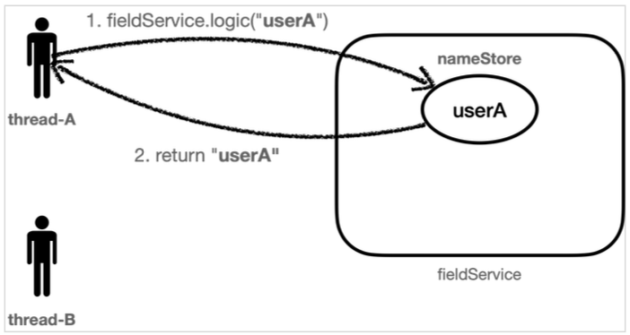
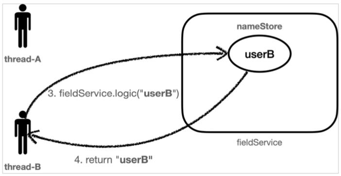
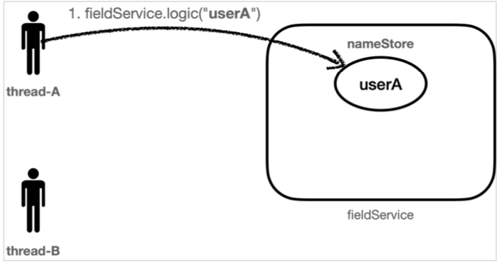
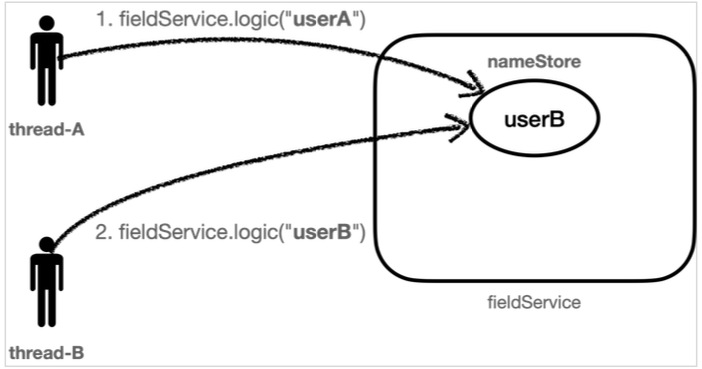
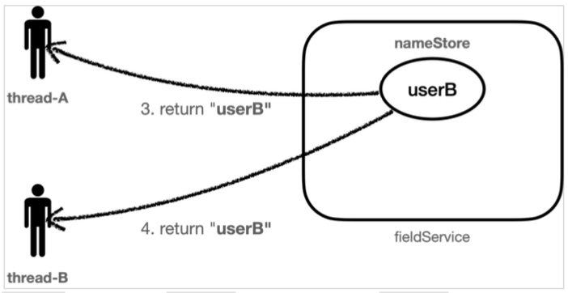
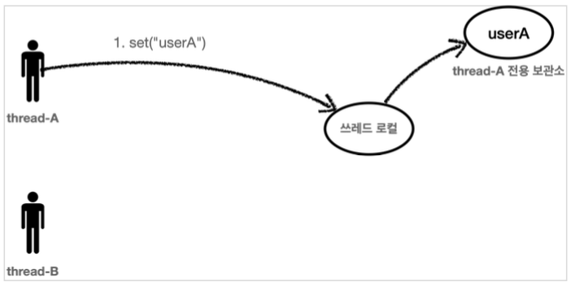
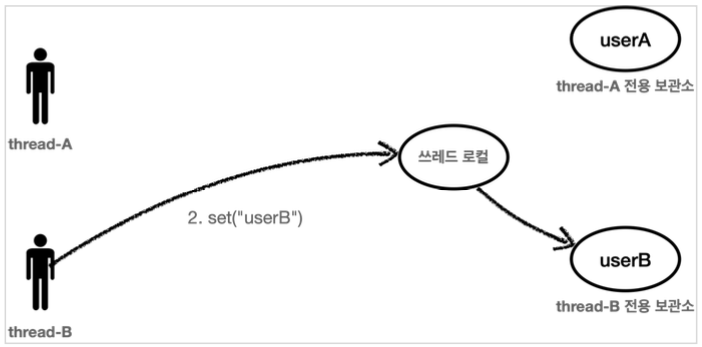
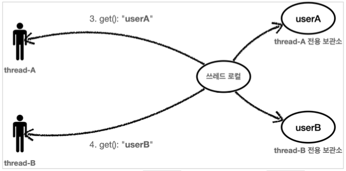

# Section 2. ThreadLocal

## 필드 동기화 - 개발

앞서 로그 추적기를 만들면서 다음 로그를 출력할 때 트랜잭션ID 와 level 을 동기화 하는 문제가 있었다.

이 문제를 해결하기 위해 TraceId 를 파라미터로 넘기도록 구현했다. 이렇게 해서 동기화는 성공했지만, 로그를 출력하는 모든 메서드에 TraceId 파라밑커를 추가해야 하는 문제가 발생했다. TraceId 를 파라미터로 넘기지 않고 이 문제를 해결할 수 있는 방법은 없을까?

이런 문제를 해결할 목적으로 새로운 로그 추적기를 만들어보자. 이제 프로토타입 버전이 아닌 정식 버전으로 제대로 개발해보자. 향후 다양한 구현체로 변경할 수 있도록 `LogTrace` 인터페이스를 먼저 만들어 구현해보자.


### LogTrace 인터페이스

``` java
package hello.advanced.trace.logtrace;

import hello.advanced.trace.TraceStatus;

public interface LogTrace {
    TraceStatus begin(String message);

    void end(TraceStatus status);

    void exception(TraceStatus status, Exception e);
}
```

`LogTrace` 인터페이스에는 로그 추적기를 위한 최소한의 기능인 begin(), end(), exception() 을 정의했다.

이제 파라미터를 넘기지 않고 TraceId 를 동기화 할 수 있는 FieldLogTrace 구현체를 만들어보자.


### FiledLogTrace

``` java
package hello.advanced.trace.logtrace;

import hello.advanced.trace.TraceId;
import hello.advanced.trace.TraceStatus;
import lombok.extern.slf4j.Slf4j;

@Slf4j
public class FieldLogTrace implements LogTrace{

    private static final String START_PREFIX = "-->";
    private static final String COMPLETE_PREFIX = "<--";
    private static final String EX_PREFIX = "<X-";

    private TraceId traceIdHolder; // traceId 동기화, 동시성 이슈 발생

    @Override
    public TraceStatus begin(String message) {
        syncTraceId();
        TraceId traceId = traceIdHolder;
        Long startTimeMs = System.currentTimeMillis();
        log.info("[{}] {}{}", traceId.getId(), addSpace(START_PREFIX,
                traceId.getLevel()), message);

        return new TraceStatus(traceId, startTimeMs, message);
    }

    @Override
    public void end(TraceStatus status) {
        complete(status, null);
    }

    @Override
    public void exception(TraceStatus status, Exception e) {
        complete(status, e);
    }

    private void complete(TraceStatus status, Exception e) {
        Long stopTimeMs = System.currentTimeMillis();
        long resultTimeMs = stopTimeMs - status.getStartTimeMs();
        TraceId traceId = status.getTraceId();
        if (e == null) {
            log.info("[{}] {}{} time={}ms", traceId.getId(),
                    addSpace(COMPLETE_PREFIX, traceId.getLevel()), status.getMessage(),
                    resultTimeMs);
        } else {
            log.info("[{}] {}{} time={}ms ex={}", traceId.getId(),
                    addSpace(EX_PREFIX, traceId.getLevel()), status.getMessage(), resultTimeMs,
                    e.toString());
        }

        releaseTraceId();
    }

    private void syncTraceId() {
        if (traceIdHolder == null) {
            traceIdHolder = new TraceId();
        } else {
            traceIdHolder = traceIdHolder.createNextId();
        }
    }

    private void releaseTraceId() {
        if (traceIdHolder.isFirstLevel()) {
            traceIdHolder = null; // destroy
        } else {
            traceIdHolder = traceIdHolder.createPreviousId();
        }
    }

    private static String addSpace(String prefix, int level) {
        StringBuilder sb = new StringBuilder();
        for (int i = 0; i < level; i++) {
            sb.append( (i == level - 1) ? "|" + prefix : "|   ");
        }
        return sb.toString();
    }
}
```

FieldLogTrace 는 기존에 만들었던 `HelloTraceV2` 와 거의 같은 기능을 한다. `TraceId` 를 동기화 하는 부분만 파라미터를 사용하는 것에서 `TraceId traceIdHolder` 필드를 사용하도록 변경되었다. 이제 직전 로그의 TraceId 는 파라미터로 전달되는 것이 아니라 `FieldLogTrace` 의 필드인 `traceIdHolder` 에 저장된다.

여기서 중요한 부분은 로그를 시작할 때 호출하는 `syncTraceId()` 와 로그를 종료할 때 호출하는 `releaseTraceId()` 이다.

- syncTraceId()
  - TraceId 를 새로 만들거나 앞선 로그의 TraceId 를 참고해서 동기화하고, level 도 증가한다.
  - 최초 호출이면 TraceId 를 새로 만든다.
  - 직전 로그가 있으면 해당 로그의 TraceId 를 참고해서 동기화하고, level 도 하나 증가한다.
  - 결과를 traceIdHolder에 보관한다.
- releaseTraceId()
  - 메서드를 추가로 호출할 때는 level 이 하나 증가해야 하지만, 메서드 호출이 끝나면 level이 하나 감소해야 한다.
  - releaseTraceId() 는 level을 하나 감소한다.
  - 만약 최초 호출(level == 0) 이면 내부에서 관리하는 traceId를 제거한다.

```
[c80f5dbb] OrderController.request() //syncTraceId(): 최초 호출 level=0 
[c80f5dbb] |-->OrderService.orderItem() //syncTraceId(): 직전 로그 있음 level=1 증가
[c80f5dbb] | |-->OrderRepository.save() //syncTraceId(): 직전 로그 있음 level=2 증가
[c80f5dbb] | |<--OrderRepository.save() time=1005ms // releaseTraceId():level=2->1 감소
[c80f5dbb] |<--OrderService.orderItem() time=1014ms // level=1->0 감소
[c80f5dbb] OrderController.request() time=1017ms    // level==0, traceId 제거
```


### FieldLogTraceTest

``` java
package hello.advanced.trace.logtrace;

import static org.junit.jupiter.api.Assertions.*;

import hello.advanced.trace.TraceStatus;
import org.junit.jupiter.api.Test;

class FieldLogTraceTest {

    FieldLogTrace trace = new FieldLogTrace();

    @Test
    void begin_end_level2() {
        TraceStatus status1 = trace.begin("hello1");
        TraceStatus status2 = trace.begin("hello2");
        trace.end(status2);
        trace.end(status1);
    }

    @Test
    void begin_exception_level2() {
        TraceStatus status1 = trace.begin("hello");
        TraceStatus status2 = trace.begin("hello2");
        trace.exception(status2, new IllegalStateException());
        trace.exception(status1, new IllegalStateException());
    }

}
```

실행 결과를 보면 트랜잭션ID 도 동일하게 나오고, level을 통한 깊이도 잘 표현된다. FieldLogTrace.traceIdHolder 필드를 사용해서 TraceId 가 잘 동기화 되는 것을 확인할 수 있다.

이제 불필요하게 TraceId 를 파라미터로 전달하지 않아도 되고, 애플리케이션의 메서드 파라미터도 변경하지 않아도 된다.


## 필드 동기화 - 적용

지금까지 만든 FieldLogTrace를 애플리케이션에 적용해보자.


### LogTrace 스프링 빈 등록

FieldLogTrace 를 수동으로 스프링 빈으로 등록하자. 수동으로 등록하면 향후 구현체를 편리하게 변경할 수 있다는 장점이 있다.

``` java
package hello.advanced;

import hello.advanced.trace.logtrace.FieldLogTrace;
import hello.advanced.trace.logtrace.LogTrace;
import org.springframework.context.annotation.Bean;
import org.springframework.context.annotation.Configuration;

@Configuration
public class LogTraceConfig {

    @Bean
    public LogTrace logTrace() {
        return new FieldLogTrace();
    }
}
```


### v2 -> v3 복사

로그 추적기 V3를 적용하기 전에 먼저 기존 코드를 복사하자. (소스코드 참고)

- OrderControllerV3

  ``` java
  package hello.advanced.app.v3;
  
  import hello.advanced.trace.TraceStatus;
  import hello.advanced.trace.hellotrace.HelloTraceV2;
  import hello.advanced.trace.logtrace.LogTrace;
  import lombok.RequiredArgsConstructor;
  import org.springframework.web.bind.annotation.GetMapping;
  import org.springframework.web.bind.annotation.RestController;
  
  @RestController
  @RequiredArgsConstructor
  public class OrderControllerV3 {
  
      private final OrderServiceV3 orderService;
      private final LogTrace trace;
  
      @GetMapping("/v3/request")
      public String request(String itemId) {
          TraceStatus status = null;
          try {
              status = trace.begin("OrderController.request()");
              orderService.orderItem(status.getTraceId(), itemId);
              trace.end(status);
              return "ok";
          } catch (Exception e) {
              trace.exception(status, e);
              throw e;
          }
      }
  }
  ```

- OrderServiceV3

  ``` java
  package hello.advanced.app.v3;
  
  import hello.advanced.trace.TraceId;
  import hello.advanced.trace.TraceStatus;
  import hello.advanced.trace.hellotrace.HelloTraceV2;
  import hello.advanced.trace.logtrace.LogTrace;
  import lombok.RequiredArgsConstructor;
  import org.springframework.stereotype.Service;
  
  @Service
  @RequiredArgsConstructor
  public class OrderServiceV3 {
  
      private final OrderRepositoryV3 orderRepository;
      private final LogTrace trace;
  
      public void orderItem(TraceId traceId, String itemId) {
          TraceStatus status = null;
          try {
              status = trace.begin("OrderService.orderItem()");
              orderRepository.save(status.getTraceId(), itemId);
              trace.end(status);
          } catch (Exception e) {
              trace.exception(status, e);
              throw e;
          }
      }
  }
  ```

- OrderRepositoryV3

  ``` java
  package hello.advanced.app.v3;
  
  import hello.advanced.trace.TraceId;
  import hello.advanced.trace.TraceStatus;
  import hello.advanced.trace.hellotrace.HelloTraceV2;
  import hello.advanced.trace.logtrace.LogTrace;
  import lombok.RequiredArgsConstructor;
  import org.springframework.stereotype.Repository;
  
  @Repository
  @RequiredArgsConstructor
  public class OrderRepositoryV3 {
  
      private final LogTrace trace;
  
      public void save(TraceId traceId, String itemId) {
  
          TraceStatus status = null;
          try {
              status = trace.begin("OrderService.orderItem()");
              // 저장 로직
              if (itemId.equals("ex")) {
                  throw new IllegalStateException("예외 발생!");
              }
              sleep(1000);
              trace.end(status);
          } catch (Exception e) {
              trace.exception(status, e);
              throw e;
          }
      }
  
      private void sleep(int millis) {
          try {
              Thread.sleep(millis);
          } catch (InterruptedException e) {
              e.printStackTrace();
          }
      }
  }
  ```


## 필드 동기화 - 동시성 문제

### 동시성 문제 확인

다음 로직을 1초 안에 2번 호출해보자.

- http://localhost:8080/v3/request?itemId=hello

- http://localhost:8080/v3/request?itemId=hello

- 기대결과

  ```
  [nio-8080-exec-3] [52808e46] OrderController.request()
  [nio-8080-exec-3] [52808e46] |-->OrderService.orderItem()
  [nio-8080-exec-3] [52808e46] |   |-->OrderRepository.save()
  [nio-8080-exec-4] [4568423c] OrderController.request()
  [nio-8080-exec-4] [4568423c] |-->OrderService.orderItem()
  [nio-8080-exec-4] [4568423c] |   |-->OrderRepository.save()
  [nio-8080-exec-3] [52808e46] |   |<--OrderRepository.save() time=1001ms
  [nio-8080-exec-3] [52808e46] |<--OrderService.orderItem() time=1001ms
  [nio-8080-exec-3] [52808e46] OrderController.request() time=1003ms
  [nio-8080-exec-4] [4568423c] |   |<--OrderRepository.save() time=1000ms
  [nio-8080-exec-4] [4568423c] |<--OrderService.orderItem() time=1001ms
  [nio-8080-exec-4] [4568423c] OrderController.request() time=1001ms
  ```

- 실제 결과

  ```
  [nio-8080-exec-1] [cb3fdfb0] OrderController.request()
  [nio-8080-exec-1] [cb3fdfb0] |-->OrderService.orderItem()
  [nio-8080-exec-1] [cb3fdfb0] |   |-->OrderService.orderItem()
  [nio-8080-exec-2] [cb3fdfb0] |   |   |-->OrderController.request()
  [nio-8080-exec-2] [cb3fdfb0] |   |   |   |-->OrderService.orderItem()
  [nio-8080-exec-2] [cb3fdfb0] |   |   |   |   |-->OrderService.orderItem()
  [nio-8080-exec-1] [cb3fdfb0] |   |<--OrderService.orderItem() time=1000ms
  [nio-8080-exec-1] [cb3fdfb0] |<--OrderService.orderItem() time=1003ms
  [nio-8080-exec-1] [cb3fdfb0] OrderController.request() time=1003ms
  [nio-8080-exec-2] [cb3fdfb0] |   |   |   |   |<--OrderService.orderItem() time=1004ms
  [nio-8080-exec-2] [cb3fdfb0] |   |   |   |<--OrderService.orderItem() time=1005ms
  [nio-8080-exec-2] [cb3fdfb0] |   |   |<--OrderController.request() time=1005ms
  ```

- 기대한 것과는 다르게 트랜잭션ID 도 동일하고, level도 뭔가 많이 꼬인듯이 로그가 찍힌다. 분명히 테스트 코드로 작성할 때는 문제가 없었는데 무엇이 문제일까?


### 동시성 문제

사실 이 문제는 동시성 문제이다.

`FieldLogTrace` 는 싱글톤으로 등록된 스프링 빈이다. 이 객체의 인스턴스가 애플리케이션에 딱 1개 존재한다는 뜻이다. 이렇게 하나만 있는 인스턴스의 FieldlogTrace.traceIdHolder 필드를 여러 쓰레드가 동시에 접근하기 때문에 문제가 발생한다.


## 동시성 문제 - 예제 코드

테스트에서도 lombok 을 사용하기 위해 다음 코드를 추가하자.

``` gradle
//테스트에서 lombok 사용
dependencies {
	...
	testCompileOnly 'org.projectlombok:lombok' 
	testAnnotationProcessor 'org.projectlombok:lombok'
}
```

- 이렇게 해야 테스트 코드에서 `@Slf4j` 어노테이션이 동작한다.


### FiledService - 테스트 패키지 하위에

``` java
package hello.advanced.trace.threadlocal.code;

import lombok.extern.slf4j.Slf4j;

@Slf4j
public class FieldService {
    
    private String nameStore;

    public String logic(String name) {
        log.info("저장 name={} -> nameStore", name, nameStore);
        nameStore = name;
        sleep(1000);
        log.info("조회 nameStore={}", nameStore);
        return nameStore;
    }

    private void sleep(int millis) {
        try {
            Thread.sleep(millis);
        } catch (InterruptedException e) {
            e.printStackTrace();
        }
    }
}
```

매우 단순한 로직이다. 파라미터로 넘어온 name 을 필드인 nameStore 에 저장한다. 그리고 1초간 쉰 다음 필드에 저장된 nameStore 를 반환한다.


### FiledServiceTest

``` java
package hello.advanced.trace.threadlocal;

import hello.advanced.trace.threadlocal.code.FieldService;
import lombok.extern.slf4j.Slf4j;
import org.junit.jupiter.api.Test;

@Slf4j
public class FieldServiceTest {

    private FieldService fieldService = new FieldService();
    
    @Test
    void field() {
        log.info("main start");
        Runnable userA = () -> {
            fieldService.logic("userA");
        };
        
        Runnable userB = () -> {
            fieldService.logic("userB");
        };

        Thread threadA = new Thread(userA);
        threadA.setName("thread-A");
        Thread threadB = new Thread(userB);
        threadB.setName("thread-B");
        
        threadA.start(); // A 실행
        sleep(2000); // 동시성 문제 발생X
        // sleep(100); // 동시성 문제 발생O
        threadB.start();; // B 실행

        sleep(3000);
        log.info("main exit");
    }

    private void sleep(int millis) {
        try {
            Thread.sleep(millis);
        } catch (InterruptedException e) {
            e.printStackTrace();
        }
    }
}
```

- 순서대로 실행

  - sleep(2000) 을 설정해서 thread-A 의 실행이 끝나고 나서 thread-B 가 실행되도록 해보자. 참고로 FieldService.logic() 메서드는 내부에 sleep(1000) 으로 1초의 지연이 있다. 따라서 1초 이후에 호출하면 순서대로 실행할 수 있다. 여기서는 넉넉하게 2초 (2000ms) 를 설정했다.

- 실행 결과

  ```
  [Test worker] main start
  [Thread-A] 	저장 name=userA -> nameStore=null 
  [Thread-A]	조회 nameStore=userA
  [Thread-B]	저장 name=userB -> nameStore=userA 
  [Thread-B]	조회 nameStore=userB
  [Test worker] main exit
  ```

  

  


### 동시성 문제 발생 코드

이번에는 sleep(100) 을 설정해서 thread-A 의 작업이 끝나기전에 thread-B 가 실행되도록 해보자. 참고로 FieldService.logic() 메서드는 내부에 sleep(1000) 으로 1초의 지연이 있다. 따라서 1초 이후에 호출하면 순서대로 실행할 수 있다. 다음에 설정할 100(ms) 는 0.1초이기 때문에 thread-A의 작업이 끝나기 전에 thread-B가 실행된다.

- 실행 결과

  ```
  [Test worker] main start
  [Thread-A]		저장 name=userA -> nameStore=null
  [Thread-B]		저장 name=userB -> nameStore=userA
  [Thread-A]		조회 nameStore=userB
  [Thread-B]		조회 nameStore=userB
  [Test worker] main exit
  ```

  - 저장하는 부분은 문제가 없지만 조회하는 부분에서 문제가 발생한다.



- 먼저 thread-A 가 userA 값을 nameStore 에 보관한다.



- 0.1초 이후에 thread-B가 userB의 값을 nameSotre에 보관한다. 기존에 nameStore에 보관되어 있던 userA 값은 제거되고 userB 값이 저장된다.



- thread-A 의 호출이 끝나면서 nameStore의 결과를 반환받는데, 이 때 nameStore 는 앞의 2번에서 userB의 값으로 대체되었다. 따라서 기대했던 userA 의 값이 아니라 userB 의 값이 반환된다.
- thread-B 의 호출이 끝나면서 nameStore 의 결과인 userB 를 반환 받는다.

순서는 다음과 같이 진행된다.

1. Thread-A는 userA 를 nameStore에 저장
2. Thread-B는 userB를 nameStore에 저장
3. Thread-A는 userB를 nameStore에서 조회
4. Thread-B는 userB를 nameStore에서 조회


### 동시성 문제

결과적으로 Thread-A 입장에서는 저장한 데이터와 조회한 데이터가 다른 문제가 발생한다. 이처럼 여러 쓰레드가 동시에 같은 인스턴스의 필드 값을 변경하면서 발생하는 문제를 동시성 문제라 한다. 이런 동시성 문제는 여러 쓰레드가 같은 인스턴스의 필드에 접근해야 하기 때문에 트래픽이 적은 상황에서는 확률상 잘 나타나지 않고 트래픽이 점점 많아질수록 자주 발생한다.

특히 스프링 빈 처럼 싱글톤 객체의 필드를 변경하며 사용할 때 이러한 동시성 문제를 조심해야 한다.

> [참고]
>
> 이런 동시성 문제는 지역 변수에서는 발생하지 않는다. 지역 변수는 쓰레드마다 각각 다른 메모리 영역이 할당된다.
>
> 동시성 문제가 발생하는 곳은 같은 인스턴스의 필드(주로 싱글톤에서 자주 발생), 또는 static 같은 공용 필드에 접근할 때 발생한다.
>
> 동시성 문제는 값을 읽기만 하면 발생하지 않는다. 어디선가 값을 변경하기 때문에 발생한다.

그렇다면 지금처럼 싱글톤 객체의 필드를 사용하면서 동시성 문제를 해결하려면 어떻게 해야할까? 다시 파라미터를 전달하는 방식으로 돌아가야 할까? 이럴 때 사용하는 것이 바로 쓰레드 로컬이다.


## ThreadLocal - 소개

쓰레드 로컬은 해당 쓰레드만 접근할 수 있는 특별한 저장소를 말한다. 쉽게 이야기해서 물건 보관 창구를 떠올리면 된다. 여러 사람이 같은 물건 보관 창구를 사용하더라도 창구 직원은 사용자를 인식해서 사용자별로 확실하게 물건을 구분해준다.

사용자 A, 사용자 B 모두 창구 직원을 통해서 물관을 보관하고 꺼내지만 창구 직원이 사용자에 따라 보관한 물건을 구분해주는 것이다.

- 일반적인 변수 필드: 여러 쓰레드가 같은 인스턴스의 필드에 접근하면 처음 쓰레드가 보관한 데이터가 사라질 수 있다.
- 쓰레드 로컬: 쓰레드 로컬을 사용하면 각 쓰레드마다 별도의 내부 저장소를 제공한다. 따라서 같은 인스턴스의 쓰레드 로컬 필드에 접근해도 문제 없다.




thread-A 가 userA 라는 값을 저장하면 쓰레드 로컬은 thread-A 전용 보관소에 데이터를 안전하게 보관한다.



thread-B가 userB 라는 값을 저장하면 쓰레드 로컬은 thread-B 전용 보관소에 데이터를 안전하게 보관한다.



쓰레드 로컬을 통해서 데이터를 조회할 때도 thread-A 가 조회하면 쓰레드 로컬은 thread-A 전용 보관소에서 userA 데이터를 반환해준다. 물론 thread-B 전용 보관소에서 userB 데이터를 반환해준다.

자바는 언어차원에서 쓰레드 로컬을 지원하기 위한 `java.lang.ThreadLocal` 클래스를 제공한다.


