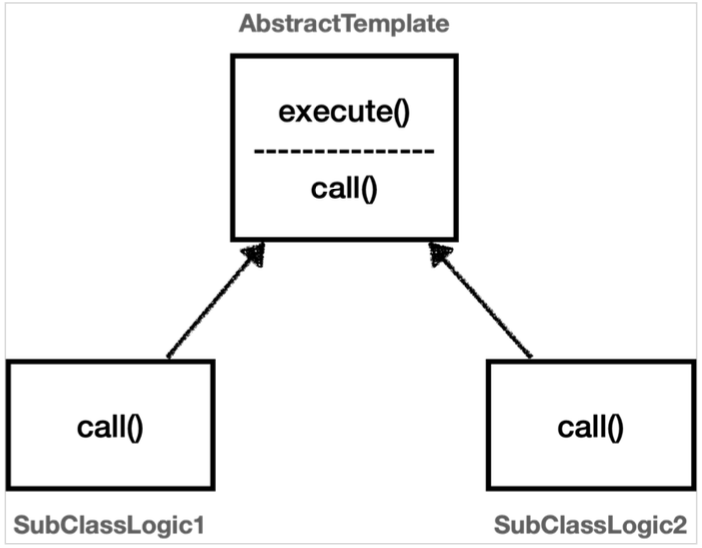
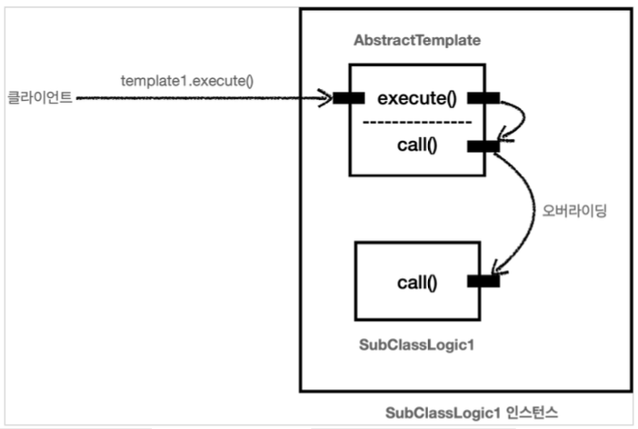

# Section 3. 템플릿 메서드 패턴과 콜백 패턴

## 템플릿 메서드 패턴 - 시작

`OrderServiceV0` 코드와 `OrderServiceV3` 코드를 비교해보면, V0는 해당 메서드가 실제 처리해야 하는 핵심 기능만 깔끔하게 남아있다. 반면에 V3에는 핵심 기능보다 로그를 출력해야 하는 부가 기능 코드가 훨씬 더 많고 복잡하다.


### 핵심 기능 vs 부가 기능

- **핵심 기능** 은 해당 객체가 제공하는 고유의 기능이다. 예를 들어서 `orderService` 의 핵심 기능은 주문 로직이다. 메서드 단위로 보면 `orderService.orderItem()` 의 핵심 기능은 주문 데이터를 저장하기 위해 리포지토리를 호출하는 `orderRepository.save(itemId)` 코드가 핵심 기능이다.
- **부가 기능** 은 핵심 기능을 보조하기 위해 제공되는 기능이다. 예를 들어서 로그 추적 로직, 트랜잭션 기능이 있다. 이러한 부가 기능은 단독으로 사용되지는 않고, 핵심 기능과 함께 사용된다. 예를 들어서 로그 추적 기능은 어떤 핵심 기능이 호출되었는지 로그를 남기기 위해 사용한다. 그러니까 핵심 기능을 보조하기 위해 존재한다.


V0는 핵심 기능만 있지만, 로그 추적기를 추가한 V3 코드는 핵심 기능과 부가 기능이 함께 섞여있다. V3를 보면 로그 추적기의 도입으로 핵심 기능 코드보다 부가 기능을 처리하기 위한 코드가 더 많아졌다. 이 문제를 좀 더 효율적으로 처리할 수 있는 방법이 있을까? V3 코드를 유심히 잘 살펴보면 다음과 같이 동일한 패턴이 있다.

``` java
TraceStatus status = null;
try {
  status = trace.begin("message");
  // 핵심 기능 호출
  trace.end(status);
} catch (Exception e) {
  trace.exception(status, e);
  throw e;
}
```

Controller, Service, Repository 의 코드를 잘보면, 로그 추적기를 사용하는 구조는 모두 동일하다. 중간에 핵심 기능을 사용하는 코드만 다를 뿐이다. 부가 기능과 관련된 코드가 중복이니 중복을 별도의 메서드로 뽑아내면 될 것 같다. 그런데 try catch 는 물론이고 핵심 기능 부분이 중간에 있어서 단순하게 메서드로 추출하는 것은 어렵다.


### 변하는 것과 변하지 않는 것을 분리

좋은 설계는 변하는 것과 변하지 않는 것을 분리하는 것이다.

**여기서 핵심 기능 부분은 변하고, 로그 추적기를 사용하는 부분은 변하지 않는 부분이다. 이 둘을 분리해서 모듈화해야 한다.**

템플릿 메서드 패턴은 이런 문제를 해결하는 디자인 패턴이다.


## 템플릿 메서드 패턴 - 예제1

### TemplateMethodTest

``` java
package hello.advanced.trace.trace;

import lombok.extern.slf4j.Slf4j;
import org.junit.jupiter.api.Test;

@Slf4j
public class TemplateMethodTest {
    
    @Test
    void templateMethodV0() {
        logic1();
        logic2();
    }
    
    private void logic1() {
        long startTime = System.currentTimeMillis();
        // 비즈니스 로직 실행
        log.info("비즈니스 로직1 실행");
        // 비즈니스 로직 종료
        long endTime = System.currentTimeMillis();
        long resultTime = endTime - startTime;
        log.info("resultTime={}", resultTime);
    }
    
    private void logic2() {
        long startTime = System.currentTimeMillis();
        // 비즈니스 로직 실행
        log.info("비즈니스 로직2 실행");
        // 비즈니스 로직 종료
        long endTime = System.currentTimeMillis();
        long resultTime = endTime - startTime;
        log.info("resultTime={}", resultTime);
    }   
}
```

- 변하는 부분: 비즈니스 로직
- 변하지 않는 부분: 시간 측정


## 템플릿 메서드 패턴 - 예제2

### 템플릿 메서드 패턴 구조 그림




### AbstractTemplate (테스트 코드 하위)

``` java
package hello.advanced.trace.template.code;

import lombok.extern.slf4j.Slf4j;

@Slf4j
public abstract class AbstractTemplate {

    public void execute() {
        long startTime = System.currentTimeMillis();
        // 비즈니스 로직 실행
        call(); // 상속
        long endTime = System.currentTimeMillis();
        long resultTime = endTime - startTime;
        log.info("resultTime={}", resultTime);
    }

    protected abstract void call();
}
```

템플릿 메서드 패턴은 이름 그대로 템플릿을 사용하는 방식이다. 템플릿은 기준이 되는 거대한 틀이다. 템플릿이라는 틀에 변하지 않는 부분을 몰아둔다. 그리고 일부 변하는 부분을 별도로 호출해서 해결한다.

`AbstractTemplate` 에서 변하지 않는 부분인 시간 측정 로직을 몰아둔 것을 확인할 수 있다. 이제 이것이 하나의 템플릿이 된다. 그리고 템플릿 안에서 변하는 부분은 `call()` 메서드를 호출해서 처리한다. 템플릿 메서드 패턴은 부모 클래스에 변하지 않는 템플릿 코드를 둔다. 그리고 변하는 부분은 자식 클래스에 두고 상속과 오버라이딩을 사용해서 처리한다.


### SubClassLogic1 (테스트 코드 하위)

``` java
package hello.advanced.trace.template.code;

import lombok.extern.slf4j.Slf4j;

@Slf4j
public class SubClassLogic1 extends AbstractTemplate {

    @Override
    protected void call() {
        log.info("비즈니스 로직1 실행");
    }
}
```

변하는 부분인 비즈니스 로직1을 처리하는 자식 클래스이다. 템플릿이 호출하는 대상인 `call()` 메서드를 오버라이딩 한다.


### SubClassLogic2 (테스트 코드 하위)

``` java
package hello.advanced.trace.template.code;

import lombok.extern.slf4j.Slf4j;

@Slf4j
public class SubClassLogic2 extends AbstractTemplate{
    
    @Override
    protected void call() {
        log.info("비즈니스 로직2 실행");
    }
}
```

변하는 부분인 비즈니스 로직2를 처리하는 자식 클래스. 템플릿이 호출하는 대상인 `call()` 메서드를 오버라이딩 한다.


### TemplateMethodTest - templateMethodV1() 추가

``` java
package hello.advanced.trace.template;

import hello.advanced.trace.template.code.AbstractTemplate;
import hello.advanced.trace.template.code.SubClassLogic1;
import hello.advanced.trace.template.code.SubClassLogic2;
import lombok.extern.slf4j.Slf4j;
import org.junit.jupiter.api.Test;

@Slf4j
public class TemplateMethodTest {

    @Test
    void templateMethodV0() {
        logic1();
        logic2();
    }

    private void logic1() {
        long startTime = System.currentTimeMillis();
        // 비즈니스 로직 실행
        log.info("비즈니스 로직1 실행");
        // 비즈니스 로직 종료
        long endTime = System.currentTimeMillis();
        long resultTime = endTime - startTime;
        log.info("resultTime={}", resultTime);
    }

    private void logic2() {
        long startTime = System.currentTimeMillis();
        // 비즈니스 로직 실행
        log.info("비즈니스 로직2 실행");
        // 비즈니스 로직 종료
        long endTime = System.currentTimeMillis();
        long resultTime = endTime - startTime;
        log.info("resultTime={}", resultTime);
    }

    /**
     * 템플릿 메서드 패턴 적용
     */
    @Test
    void templateMethodV1() {
        AbstractTemplate template1 = new SubClassLogic1();
        template1.execute();

        AbstractTemplate template2 = new SubClassLogic2();
        template2.execute();
    }
}
```


### 템플릿 메서드 패턴 인스턴스 호출 그림



`template1.execute()` 를 호출하면 템플릿 로직인 `AbstractTemplate.excute()` 를 실행한다. 여기서 중간에 `call()` 메서드를 호출하는데, 이 부분이 오버라이딩 되어있다. 따라서 현재 인스턴스인 SubClassLogic1 인스턴스의 SubClassLogic1.call() 메서드가 호출된다.

템플릿 메서드 패턴은 이렇게 다형성을 사용해서 변하는 부분과 변하지 않는 부분을 분리하는 방법이다.
