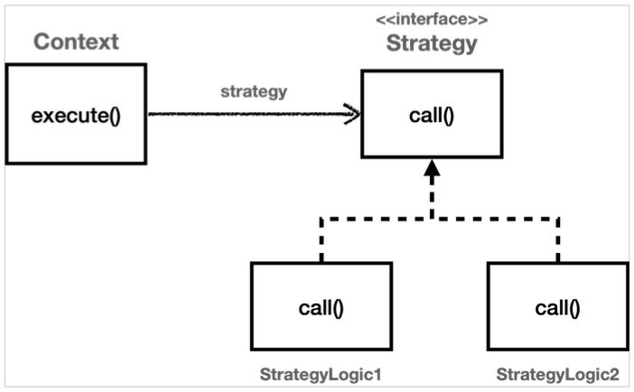
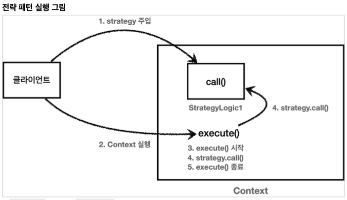
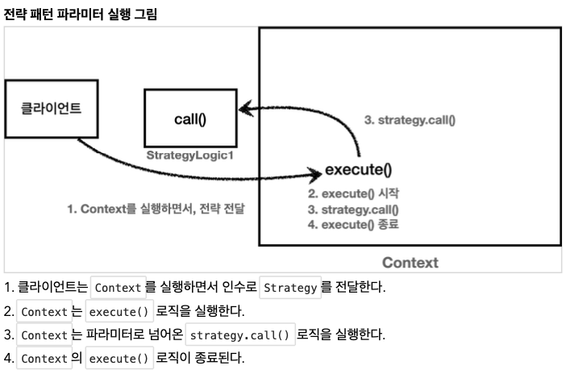

# Section 3. 템플릿 메서드 패턴과 콜백 패턴

## 템플릿 메서드 패턴 - 시작

`OrderServiceV0` 코드와 `OrderServiceV3` 코드를 비교해보면, V0는 해당 메서드가 실제 처리해야 하는 핵심 기능만 깔끔하게 남아있다. 반면에 V3에는 핵심 기능보다 로그를 출력해야 하는 부가 기능 코드가 훨씬 더 많고 복잡하다.


### 핵심 기능 vs 부가 기능

- **핵심 기능** 은 해당 객체가 제공하는 고유의 기능이다. 예를 들어서 `orderService` 의 핵심 기능은 주문 로직이다. 메서드 단위로 보면 `orderService.orderItem()` 의 핵심 기능은 주문 데이터를 저장하기 위해 리포지토리를 호출하는 `orderRepository.save(itemId)` 코드가 핵심 기능이다.
- **부가 기능** 은 핵심 기능을 보조하기 위해 제공되는 기능이다. 예를 들어서 로그 추적 로직, 트랜잭션 기능이 있다. 이러한 부가 기능은 단독으로 사용되지는 않고, 핵심 기능과 함께 사용된다. 예를 들어서 로그 추적 기능은 어떤 핵심 기능이 호출되었는지 로그를 남기기 위해 사용한다. 그러니까 핵심 기능을 보조하기 위해 존재한다.


V0는 핵심 기능만 있지만, 로그 추적기를 추가한 V3 코드는 핵심 기능과 부가 기능이 함께 섞여있다. V3를 보면 로그 추적기의 도입으로 핵심 기능 코드보다 부가 기능을 처리하기 위한 코드가 더 많아졌다. 이 문제를 좀 더 효율적으로 처리할 수 있는 방법이 있을까? V3 코드를 유심히 잘 살펴보면 다음과 같이 동일한 패턴이 있다.

``` java
TraceStatus status = null;
try {
  status = trace.begin("message");
  // 핵심 기능 호출
  trace.end(status);
} catch (Exception e) {
  trace.exception(status, e);
  throw e;
}
```

Controller, Service, Repository 의 코드를 잘보면, 로그 추적기를 사용하는 구조는 모두 동일하다. 중간에 핵심 기능을 사용하는 코드만 다를 뿐이다. 부가 기능과 관련된 코드가 중복이니 중복을 별도의 메서드로 뽑아내면 될 것 같다. 그런데 try catch 는 물론이고 핵심 기능 부분이 중간에 있어서 단순하게 메서드로 추출하는 것은 어렵다.


### 변하는 것과 변하지 않는 것을 분리

좋은 설계는 변하는 것과 변하지 않는 것을 분리하는 것이다.

**여기서 핵심 기능 부분은 변하고, 로그 추적기를 사용하는 부분은 변하지 않는 부분이다. 이 둘을 분리해서 모듈화해야 한다.**

템플릿 메서드 패턴은 이런 문제를 해결하는 디자인 패턴이다.


## 템플릿 메서드 패턴 - 예제1

### TemplateMethodTest

``` java
package hello.advanced.trace.trace;

import lombok.extern.slf4j.Slf4j;
import org.junit.jupiter.api.Test;

@Slf4j
public class TemplateMethodTest {
    
    @Test
    void templateMethodV0() {
        logic1();
        logic2();
    }
    
    private void logic1() {
        long startTime = System.currentTimeMillis();
        // 비즈니스 로직 실행
        log.info("비즈니스 로직1 실행");
        // 비즈니스 로직 종료
        long endTime = System.currentTimeMillis();
        long resultTime = endTime - startTime;
        log.info("resultTime={}", resultTime);
    }
    
    private void logic2() {
        long startTime = System.currentTimeMillis();
        // 비즈니스 로직 실행
        log.info("비즈니스 로직2 실행");
        // 비즈니스 로직 종료
        long endTime = System.currentTimeMillis();
        long resultTime = endTime - startTime;
        log.info("resultTime={}", resultTime);
    }   
}
```

- 변하는 부분: 비즈니스 로직
- 변하지 않는 부분: 시간 측정


## 템플릿 메서드 패턴 - 예제2

### 템플릿 메서드 패턴 구조 그림


### AbstractTemplate (테스트 코드 하위)

``` java
package hello.advanced.trace.template.code;

import lombok.extern.slf4j.Slf4j;

@Slf4j
public abstract class AbstractTemplate {

    public void execute() {
        long startTime = System.currentTimeMillis();
        // 비즈니스 로직 실행
        call(); // 상속
        long endTime = System.currentTimeMillis();
        long resultTime = endTime - startTime;
        log.info("resultTime={}", resultTime);
    }

    protected abstract void call();
}
```

템플릿 메서드 패턴은 이름 그대로 템플릿을 사용하는 방식이다. 템플릿은 기준이 되는 거대한 틀이다. 템플릿이라는 틀에 변하지 않는 부분을 몰아둔다. 그리고 일부 변하는 부분을 별도로 호출해서 해결한다.

`AbstractTemplate` 에서 변하지 않는 부분인 시간 측정 로직을 몰아둔 것을 확인할 수 있다. 이제 이것이 하나의 템플릿이 된다. 그리고 템플릿 안에서 변하는 부분은 `call()` 메서드를 호출해서 처리한다. 템플릿 메서드 패턴은 부모 클래스에 변하지 않는 템플릿 코드를 둔다. 그리고 변하는 부분은 자식 클래스에 두고 상속과 오버라이딩을 사용해서 처리한다.


### SubClassLogic1 (테스트 코드 하위)

``` java
package hello.advanced.trace.template.code;

import lombok.extern.slf4j.Slf4j;

@Slf4j
public class SubClassLogic1 extends AbstractTemplate {

    @Override
    protected void call() {
        log.info("비즈니스 로직1 실행");
    }
}
```

변하는 부분인 비즈니스 로직1을 처리하는 자식 클래스이다. 템플릿이 호출하는 대상인 `call()` 메서드를 오버라이딩 한다.


### SubClassLogic2 (테스트 코드 하위)

``` java
package hello.advanced.trace.template.code;

import lombok.extern.slf4j.Slf4j;

@Slf4j
public class SubClassLogic2 extends AbstractTemplate{
    
    @Override
    protected void call() {
        log.info("비즈니스 로직2 실행");
    }
}
```

변하는 부분인 비즈니스 로직2를 처리하는 자식 클래스. 템플릿이 호출하는 대상인 `call()` 메서드를 오버라이딩 한다.


### TemplateMethodTest - templateMethodV1() 추가

``` java
package hello.advanced.trace.template;

import hello.advanced.trace.template.code.AbstractTemplate;
import hello.advanced.trace.template.code.SubClassLogic1;
import hello.advanced.trace.template.code.SubClassLogic2;
import lombok.extern.slf4j.Slf4j;
import org.junit.jupiter.api.Test;

@Slf4j
public class TemplateMethodTest {

    @Test
    void templateMethodV0() {
        logic1();
        logic2();
    }

    private void logic1() {
        long startTime = System.currentTimeMillis();
        // 비즈니스 로직 실행
        log.info("비즈니스 로직1 실행");
        // 비즈니스 로직 종료
        long endTime = System.currentTimeMillis();
        long resultTime = endTime - startTime;
        log.info("resultTime={}", resultTime);
    }

    private void logic2() {
        long startTime = System.currentTimeMillis();
        // 비즈니스 로직 실행
        log.info("비즈니스 로직2 실행");
        // 비즈니스 로직 종료
        long endTime = System.currentTimeMillis();
        long resultTime = endTime - startTime;
        log.info("resultTime={}", resultTime);
    }

    /**
     * 템플릿 메서드 패턴 적용
     */
    @Test
    void templateMethodV1() {
        AbstractTemplate template1 = new SubClassLogic1();
        template1.execute();

        AbstractTemplate template2 = new SubClassLogic2();
        template2.execute();
    }
}
```


### 템플릿 메서드 패턴 인스턴스 호출 그림


`template1.execute()` 를 호출하면 템플릿 로직인 `AbstractTemplate.excute()` 를 실행한다. 여기서 중간에 `call()` 메서드를 호출하는데, 이 부분이 오버라이딩 되어있다. 따라서 현재 인스턴스인 SubClassLogic1 인스턴스의 SubClassLogic1.call() 메서드가 호출된다.

템플릿 메서드 패턴은 이렇게 다형성을 사용해서 변하는 부분과 변하지 않는 부분을 분리하는 방법이다.


## 템플릿 메서드 패턴 - 예제3

### 익명 내부 클래스 사용하기

템플릿 메서드 패턴은 SubClassLogic1, SubClassLogic2 처럼 클래스를 계속 만들어야 하는 단점이 있다. 익명 내부 클래스를 사용하면 이런 단점을 보완할 수 있다.

익명 내부 클래스를 사용하면 객체 인스턴스를 생성하면서 동시에 생성할 클래스를 상속 받은 자식 클래스를 정의할 수 있다. 이 클래스는 SubClassLogic1 처럼 직접 지정하는 이름이 없고 클래스 내부에 선언되는 클래스여서 익명 내부 클래스라 한다.


### TemplateMethodTest - templateMethodV2() 추가

``` java
/**
 * 템플릿 메서드 패턴, 익명 내부 클래스 사용
 */
@Test
void templateMethodV2() {
  AbstractTemplate template1 = new AbstractTemplate() {
    @Override
    protected void call() {
      log.info("비즈니스 로직1 실행");
    }
  };
  log.info("클래스 이름1={}", template1.getClass());
  template1.execute();

  AbstractTemplate template2 = new AbstractTemplate() {
    @Override
    protected void call() {
      log.info("비즈니스 로직2 실행");
    }
  };
  log.info("클래스 이름2={}", template2.getClass());
  template2.execute();
}
```

실행 결과를 보면 자바가 임의로 만들어주는 익명 내부 클래스 이름은 `TemplateMethodTest$1`, `TemplateMethodTest$2` 인 것을 확인할 수 있다.


## 템플릿 메서드 패턴 - 적용1

로그 추적기 로직에 템플릿 메서드 패턴을 적용해보자.


### AbstractTemplate

``` java
package hello.advanced.trace.template;

import hello.advanced.trace.TraceStatus;
import hello.advanced.trace.logtrace.LogTrace;

public abstract class AbstractTemplate<T> {

    private final LogTrace trace;

    public AbstractTemplate(LogTrace trace) {
        this.trace = trace;
    }

    public T execute(String message) {
        TraceStatus status = null;
        try {
            status = trace.begin(message);
            // 로직 호출
            T result = call();

            trace.end(status);
            return result;
        } catch (Exception e) {
            trace.exception(status, e);
            throw e;
        }
    }
    
    protected abstract T call();
}

```

- `AbstractTemplate` 은 템플릿 메서드 페턴에서 부모 클래스이고, 템플릿 역할을 한다.
- `<T>` 제네릭을 사용했다. 반환 타입을 정의한다.
- 객체를 생성할 때 내부에서 사용할 `LogTrace trace` 를 전달받는다.
- 로그에 출력할 message 를 외부에서 파라미터로 전달받는다.
- 템플릿 코드 중간에 call() 메서드를 통해서 변하는 부분을 처리한다.
- abstract T call() 은 변하는 부분을 처리하는 메서드이다. 이 부분은 상속으로 구현해야 한다.


### OrderControllerV4

``` java
package hello.advanced.app.v4;

import hello.advanced.trace.logtrace.LogTrace;
import hello.advanced.trace.template.AbstractTemplate;
import lombok.RequiredArgsConstructor;
import org.springframework.web.bind.annotation.GetMapping;
import org.springframework.web.bind.annotation.RestController;

@RestController
@RequiredArgsConstructor
public class OrderControllerV4 {

    private final OrderServiceV4 orderService;
    private final LogTrace trace;

    @GetMapping("/v4/request")
    public String request(String itemId) {

        AbstractTemplate<String> template = new AbstractTemplate<String>(trace) {
            @Override
            protected String call() {
                orderService.orderItem(itemId);
                return "ok";
            }
        };
        return template.execute("OrderController.request()");
    }   
}
```

- `AbstractTemplate<String>`
  - 제네릭을 String 으로 설정했다. 따라서 AbstractTemplate 의 반환 타입은 String 이 된다.
- 익명 내부 클래스
  - 익명 내부 클래스를 사용한다. 객체를 생성하면서 AbstractTemplate 를 상속받은 자식 클래스를 정의 했다.
  - 따라서 별도의 자식 클래스를 직접 만들지 않아도 된다.
- `template.execute("OrderController.request()")`
  - 템플릿을 실행하면서 로그로 남길 message를 전달한다.


### OrderServiceV4

``` java
package hello.advanced.app.v4;

import hello.advanced.trace.logtrace.LogTrace;
import hello.advanced.trace.template.AbstractTemplate;
import lombok.RequiredArgsConstructor;
import org.springframework.stereotype.Service;

@Service
@RequiredArgsConstructor
public class OrderServiceV4 {

    private final OrderRepositoryV4 orderRepository;
    private final LogTrace trace;

    public void orderItem(String itemId) {
        AbstractTemplate<Void> template = new AbstractTemplate<Void>(trace) {
            @Override
            protected Void call() {
                orderRepository.save(itemId);
                return null;
            }
        };
        template.execute("OrderService.orderItem()");
    }
}
```

- `AbstractTemplate<Void>`
  - 제네릭에서 반화내 타입이 필요한데, 반환할 내용이 없으면 Void 타입을 사용하고 null 을 반환하면 된다. 참고로 제네릭은 기본타입인 void, int 등을 선언할 수 없다.


### OrderRepositoryV4

``` java
package hello.advanced.app.v4;

import hello.advanced.trace.TraceId;
import hello.advanced.trace.TraceStatus;
import hello.advanced.trace.logtrace.LogTrace;
import hello.advanced.trace.template.AbstractTemplate;
import lombok.RequiredArgsConstructor;
import org.springframework.stereotype.Repository;

@Repository
@RequiredArgsConstructor
public class OrderRepositoryV4 {

    private final LogTrace trace;

    public void save(String itemId) {
        AbstractTemplate<Void> template = new AbstractTemplate<>(trace) {
            @Override
            protected Void call() {
                // 저장 로직
                if (itemId.equals("ex")) {
                    throw new IllegalStateException("예외 발생!");
                }
                sleep(1000);
                return null;
            }
        };
        System.out.println("OrderRepositoryV4.save");
    }

    private void sleep(int millis) {
        try {
            Thread.sleep(millis);
        } catch (InterruptedException e) {
            e.printStackTrace();
        }
    }
}
```

- 실행: http://localhost:8080/v4/request?itemId=hello


## 템플릿 메서드 패턴 - 적용2

템플릿 메서드 패턴 덕분에 변하는 코드와 변하지 않는 코드를 명확하게 분리했다. 로그를 출력하는 템플릿 역할을 하는 변하지 않는 코드는 모두 `AbstractTemplate` 에 담아두고, 변하는 코드는 자식 클래스를 만들어서 분리했다.

``` java
// OrderServiceV0  코드
public void orderItem(String itemId) {
  orderRepository.save(itemId);
}

// OrderServiceV3 코드
public void orderItem(String itemId) {
  TraceStatus status = null;
  try {
    status = trace.begin("OrderService.orderItem()");
    orderRepository.save(itemId);
  } catch(Exception e) {
    trace.exception(status, e);
    throw e;
  }
}

// OrderServiceV4 코드
AbstractTemplate<Void> template = new AbstractTemplate<>(trace) {
  @Override
  protected Void call() {
    orderRepository.save(itemId);
    return null;
  }
};
template.execute("OrderService.orderItem()");
```

- `OrderServiceV0`: 핵심 기능만 있다.
- `OrderServiceV3` : 핵심 기능과 부가 기능이 함께 섞여 있다.
- `OrderServiceV4` : 핵심 기능과 템플릿을 호출하는 코드가 섞여 있다. (부가 기능은 템플릿 안에 있다)


### 좋은 설계란?

진정한 좋은 설계는 바로 변경이 일어날 때 자연스럽게 드러난다.

지금까지 로그를 남기는 부분을 모아서 하나로 모듈화하고, 비즈니스 로직 부분을 분리했다. 여기서 만약 로그를 남기는 로직을 변경해야 한다고 생각해보자. 그래서 `AbstractTemplate` 코드를 변경해야 한다고 가정해보자. 단순히 `AbstractTemplate` 코드만 변경하면 된다.

템플릿이 없는 `V3` 상태에서 로그를 남기는 로직을 변경해야 한다고 생각해보자. 이 경우 모든 클래스를 다 찾아서 고쳐야 한다.


### 단일 책임 원칙(SRP)

`V4` 는 단순히 템플릿 메서드 패턴을 적용해서 소스코드 몇줄을 줄인 것이 전부가 아니다. 로그를 남기는 부분에 단일 책임 원칙(SRP)를 지킨 것이다. 변경 지점을 하나로 모아서 변경에 쉽게 대처할 수 있는 구조를 만든 것이다.


## 템플릿 메서드 패턴 - 정의

GOF 디자인 패턴에서는 템플릿 메서드 패턴을 다음과 같이 정의했다.

> 템플릿 메서드 디자인 패턴의 목적은 다음과 같습니다.
>
> "작업에서 알고리즘의 골격을 정의하고 일부 단계를 하위 클래스로 연기합니다. 템플릿 메서드를 사용하면 하위 클래스가 알고리즘의 구조를 변경하지 않고도 알고리즘의 특정 단계를 재정의할 수 있습니다." [GOF]


부모 클래스에 알고리즘의 골격인 템플릿을 정의하고, 일부 변경되는 로직은 자식 클래스에 정의하는 것이다. 이렇게 하면 자식 클래스가 알고리즘의 전체 구조를 변경하지 않고, 특정 부분만 재정의할 수 있다. 결국 상속과 오버라이딩을 통한 다형성으로 문제를 해결하는 것이다.

**하지만** 템플릿 메서드 패턴은 상속을 사용한다. 따라서 상속에서 오는 단점들을 그대로 안고간다. 특히 자식 클래스가 부모 클래스와 컴파일 시점에 강하게 결합되는 문제가 있다. 이것은 의존관계에 대한 문제이다. 자식 클래스 입장에서는 부모 클래스의 기능을 전혀 사용하지 않는다.

그럼에도 불구하고 템플릿 메서드 패턴을 위해 자식 클래스는 부모 클래스를 상속 받고 있다.

상속을 받는다는 것은 특정 부모 클래스를 의존하고 있다는 것이다. 자식 클래스의 `extends` 다음에 바로 부모 클래스가 코드상에 지정되어 있다. 따라서 부모 클래스의 기능을 사용하든 사용하지 않든 간에 부모 클래스를 강하게 의존하게 된다. 여기서 강하게 의존한다는 뜻은 자식 클래스의 코드에 부모 클래스의 코드가 명확하게 적혀 있다는 뜻이다. UML 에서 상속을 받으면 삼각형 화살표가 `자식 -> 부모`를 향하고 있는 것은 이런 의존관계를 반영하는 것이다.

자식 클래스 입장에서는 부모 클래스의 기능을 전혀 사용하지 않는데, 부모 클래스를 알아야 한다. 이것은 좋은 설계가 아니다. 그리고 이런 잘못된 의존관계 때문에 부모 클래스를 수정하면, 자식 클래스에도 영향을 줄 수 있다.

추가로 템플릿 메서드 패턴은 상속 구조를 사용하기 때문에, 별도의 클래스나 익명 내부 클래스를 만들어야 하는 부분도 복잡하다.

이러한 부분들(상속의 단점)을 개선했지만 비슷한 역할을 하는 디자인 패턴이 바로 전략 패턴(Strategy Pattern)이다.


## 전략 패턴 - 시작

전략 패턴의 이해를 돕기 위해 템플릿 메서드 패턴에서 만들었던 동일한 예제를 사용해보자.


### ConvertV1Test

``` java
package hello.advanced.trace.strategy;

import lombok.extern.slf4j.Slf4j;
import org.junit.jupiter.api.Test;

@Slf4j
public class ContextV1Test {

    @Test
    void strategyV0() {
        logic1();
        logic2();
    }

    private void logic1() {
        long startTime = System.currentTimeMillis();
        // 비즈니스 로직 실행
        log.info("비즈니스 로직1 실행");
        // 비즈니스 로직 종료
        long endTime = System.currentTimeMillis();
        long resultTime = endTime - startTime;
        log.info("resultTime = {}", resultTime);
    }

    private void logic2() {
        long startTime = System.currentTimeMillis();
        // 비즈니스 로직 실행
        log.info("비즈니스 로직2 실행");
        // 비즈니스 로직 종료
        long endTime = System.currentTimeMillis();
        long resultTime = endTime - startTime;
        log.info("resultTime={}", resultTime);
    }
}
```


## 전략 패턴 - 예제1

이번에는 동일한 문제를 전략 패턴을 사용해서 해결해보자.

템플릿 메서드 패턴은 부모 클래스에 변하지 않는 템플릿을 두고, 변하는 부분을 자식 클래스에 두어서 상속을 사용해서 문제를 해결했다.

전략 패턴은 변하지 않는 부분을 `Context` 라는 곳에 두고, 변하는 부분을 `Strategy` 라는 인터페이스를 만들고 해당 인터페이스를 구현하도록 해서 문제를 해결한다. 상속이 아니라 위임으로 문제를 해결하는 것이다.

전략 패턴에서 `Context` 는 변하지 않는 템플릿 역할을 하고, `Strategy` 는 변하는 알고리즘 역할을 한다.


GOF 디자인 패턴에서 정의한 전략 패턴의 의도는 다음과 같다.

> 알고리즘 제품군을 정의하고 각각을 캡슐화하여 상호 교환 가능하게 만들자. 전략을 사용하면 알고리즘을 사용하는 클라이언트와 독립적으로 알고리즘을 변경할 수 있다.




### Strategy 인터페이스 (테스트 코드 하위)

``` java
package hello.advanced.trace.strategy.code.strategy;

public interface Strategy {
    void call();
}
```

이 인터페이스는 변하는 알고리즘 역할을 한다.


### StrategyLogic1 (테스트 코드 하위)

``` java
package hello.advanced.trace.strategy.code.strategy;

import lombok.extern.slf4j.Slf4j;

@Slf4j
public class StrategyLogic1 implements Strategy {

    @Override
    public void call() {
        log.info("비즈니스 로직1 실행");
    }
}
```

변하는 알고리즘은 Strategy 인터페이스를 구현하면 된다. 여기서는 비즈니스 로직1을 구현했다.


### StrategyLogic2 (테스트 코드 하위)

``` java
package hello.advanced.trace.strategy.code.strategy;

import lombok.extern.slf4j.Slf4j;

@Slf4j
public class StrategyLogic2 implements Strategy{

    @Override
    public void call() {
        log.info("비즈니스 로직2 실행");
    }
}
```


### ContextV1 (테스트 코드 하위)

``` java
package hello.advanced.trace.strategy.code.strategy;

import lombok.extern.slf4j.Slf4j;

/**
 * 필드에 전략을 보관하는 방식
 */
@Slf4j
public class ContextV1 {
    
    private Strategy strategy;

    public ContextV1(Strategy strategy) {
        this.strategy = strategy;
    }
    
    public void execute() {
        long startTime = System.currentTimeMillis();
        // 비즈니스 로직 실행
        strategy.call(); // 위임
        // 비즈니스 로직 종료
        long endTime = System.currentTimeMillis();
        long resultTime = endTime - startTime;
        log.info("resultTime={}", resultTime);
    }
}
```

`ContextV1` 은 변하지 않는 로직을 가지고 있는 템플릿 역할을 하는 코드이다. 전략 패턴에서는 이것을 컨텍스트(문맥)이라 한다.

쉽게 이야기해서 컨텍스트(문맥)는 크게 변하지 않지만, 그 문맥 속에서 strategy 를 통해 일부 전략이 변경된다 생각하면 된다.


Context는 내부에 Strategy strategy 필드를 가지고 있다. 이 필드에 변하는 부분인 Strategy 의 구현체를 주입하면 된다.

전략 패턴의 핵심은 `Context` 는 `Strategy` 인터페이스에만 의존한다는 점이다. 덕분에 Strategy 의 구현체를 변경하거나 새로 만들어도 Context 코드에는 영향을 주지 않는다.

**바로 스프링에서 의존관계 주입에서 사용하는 방식이 바로 전략 패턴이다.**


### ContextV1Test - 추가

``` java
/**
 * 전략 패턴 적용
 */
@Test
void strategyV1() {
  Strategy strategyLogic1 = new StrategyLogic1();
  ContextV1 context1 = new ContextV1(strategyLogic1);
  context1.execute();

  Strategy strategyLogic2 = new StrategyLogic2();
  ContextV1 context2 = new ContextV1(strategyLogic2);
  context2.execute();
}
```

실제 전략 패턴을 사용한 예시를 보자.

코드를 보면 의존관계 주입을 통해 `ContextV1` 에 `Strategy` 의 구현체인 `strategyLogic1` 를 주입하는 것을 확인할 수 있다. 이렇게해서 `Context` 안에 원하는 전략을 주입한다. 이렇게 원하는 모양으로 조립을 완료하고 난 다음에 `context1.execute()` 를 호출해서 `context` 를 실행한다.




1. `Context` 에 원하는 `Strategy` 구현체를 주입한다.
2. 클라이언트는 context를 실행한다.
3. context는 context 로직을 시작한다.
4. context 로직 중간에 strategy.call() 을 호출해서 주입받은 strategy 로직을 실행한다.
5. context 는 나머지 로직을 실행한다.


## 전략 패턴 - 예제2

전략 패턴도 익명 내부 클래스를 사용할 수 있다.

### ContextV1Test - 추가

``` java
/**
* 전략 패턴 익명 내부 클래스1
*/
@Test
void strategyV2() {
  Strategy strategyLogic1 = new Strategy() {
    @Override
    public void call() {
      log.info("비즈니스 로직1 실행");
    }
  };

  log.info("strategyLogic1={}", strategyLogic1.getClass());
  ContextV1 context1 = new ContextV1(strategyLogic1);
  context1.execute();

  Strategy strategyLogic2 = new Strategy() {
    @Override
    public void call() {
      log.info("비즈니스 로직2 실행");
    }
  };

  log.info("strategyLogic2={}", strategyLogic2.getClass());
  ContextV1 context2 = new ContextV1(strategyLogic2);
  context2.execute();
}
```

```
## 실행결과

ContextV1Test - strategyLogic1=class hello.advanced.trace.strategy.ContextV1Test$1 ContextV1Test - 비즈니스 로직1 실행
ContextV1 - resultTime=0
ContextV1Test - strategyLogic2=class hello.advanced.trace.strategy.ContextV1Test$2 ContextV1Test - 비즈니스 로직2 실행
ContextV1 - resultTime=0
```

실행 결과를 보면 `ContextV1Test$1`, `ContextV1Test$2` 와 같이 익명 내부 클래스가 생성된 것을 확인할 수 있다.


### ContextV1Test - 추가

``` java
/**
* 전략 패턴 익명 내부 클래스2
*/
@Test
void strategyV3() {
  ContextV1 context1 = new ContextV1(new Strategy() {
    @Override
    public void call() {
      log.info("비즈니스 로직1 실행");
    }
  });
  context1.execute();

  ContextV1 context2 = new ContextV1(new Strategy() {
    @Override
    public void call() {
      log.info("비즈니스 로직2 실행");
    }
  });
  context2.execute();
}
```

익명 내부 클래스를 변수에 담아두지 말고, 생성하면서 바로 ContextV1에 전달해도 된다.


### ContextV1Test - 추가

``` java
/**
* 전략 패턴, 람다
*/
@Test
void strategyV4() {
  ContextV1 context1 = new ContextV1(() -> log.info("비즈니스 로직1 실행"));
  context1.execute();
  ContextV1 context2 = new ContextV1(() -> log.info("비즈니스 로직2 실행"));
  context2.execute();
}
```

익명 내부 클래스를 자바8부터 제공하는 람다로 변경할 수 있다. 람다로 변경하려면 인터페이스에 메서드가 1개만 있으면 되는데, 여기에서 제공하는 Strategy 인터페이스는 메서드가 1개만 있으므로 람다로 사용할 수 있다.


### 정리

지금까지 일반적으로 이야기하는 전략 패턴에 대해서 알아보았다. 변하지 않는 부분을 `Context` 에 두고 변하는 부분을 `Strategy` 를 구현해서 만든다. 그리고 Context 의 내부 필드에 Strategy 를 주입해서 사용했다.


### 선 조립 후 실행

여기서 이야기하고 싶은 부분은 Context 의 내부 필드에 Streategy 를 두고 사용하는 부분이다. 이 방식은 Context와 Strategy를 실행 전에 원하는 모양으로 조립해두고, 그 다음에 Context 를 실행하는 선 조립, 후 실행 방식에서 매우 유용하다.

Context와 Strategy 를 한번 조립하고 나면 이후로는 Context 를 실행하기만 하면 된다. 우리가 스프링으로 애플리케이션을 개발할 때 애플리케이션 로딩 시점에 의존관계 주입을 통해 필요한 의존관계를 모두 맺어두고 난 다음에 실제 요청을 처리하는 것과 같은 원리이다.

이 방식의 단점은 Context와 Strategy를 조립한 이후에는 전략을 변경하기가 번거롭다는 점이다. 물론 Context에 Setter 를 제공해서 Strategy를 넘겨 받아 변경하면 되지만, Context를 싱글톤으로 사용할 때는 동시성 이슈 등 고려할 점이 많다. 그래서 전략을 실시간으로 변경해야 하면 차라리 이전에 개발한 테스트 코드처럼 Context를 하나 더 생성하고 그곳에 다른 Strategy 를 주입하는 것이 더 나은 선택일 수 있다.

혹시 더 유연하게 전략 패턴을 사용하는 방법은 없을까?


## 전략 패턴 - 예제3

이번에는 전략 패턴을 조금 다르게 사용해보자. 이전에는 Context의 필드에 Srategy를 주입해서 사용했다. 이번에는 전략을 실행할 때 직접 파라미터로 전달해서 사용해보자.


### ContextV2 (테스트 코드 하위)

``` java
package hello.advanced.trace.strategy.code.strategy;

import lombok.extern.slf4j.Slf4j;

/**
 * 전략을 파라미터로 전달 받는 방식
 */
@Slf4j
public class ContextV2 {
    public void execute(Strategy strategy) {
        long startTime = System.currentTimeMillis();
        // 비즈니스 로직 실행
        strategy.call(); // 위임
        // 비즈니스 로직 종료
        long endTime = System.currentTimeMillis(); 
        long resultTime = endTime - startTime; 
        log.info("resultTime={}", resultTime);
    }
}
```

`ContextV2` 는 전략을 필드로 가지지 않는다. 대신에 전략을 execute(..) 가 호출될 때 마다 항상 파라미터로 전달 받는다.


### ContextV2Test

``` java
package hello.advanced.trace.strategy.code.strategy;

import lombok.extern.slf4j.Slf4j;
import org.junit.jupiter.api.Test;

@Slf4j
public class ContextV2Test {
    /**
     * 전략 패턴 적용
     */
    @Test
    void strategyV1() {
        ContextV2 context = new ContextV2();
        context.execute(new StrategyLogic1());
        context.execute(new StrategyLogic2());
    }
}
```

Context와 Strategy 를 '선 조립 후 실행' 하는 방식이 아니라 Context를 실행할 때 마다 전략을 인수로 전달한다.

클라이언트는 Context를 실행하는 시점에 원하는 Strategy 를 전달할 수 있다. 따라서 이전 방식과 비교해서 원하는 전략을 더욱 유연하게 변경할 수 있다.

테스트 코드를 보면 하나의 Context 만 생성한다. 그리고 하나의 Context에 실행 시점에 여러 전략을 인수로 전달해서 유연하게 실행하는 것을 확인할 수 있다.





### ContextV2Test - 추가

``` java
/**
* 전략 패턴 익명 내부 클래스
*/
@Test
void strategyV2() {
  ContextV2 context = new ContextV2();
  context.execute(new Strategy() {
    @Override
    public void call() {
      log.info("비즈니스 로직1 실행");
    }
  });
  context.execute(new Strategy() {
    @Override
    public void call() {
      log.info("비즈니스 로직2 실행");
    }
  });
}
```

여기도 물론 익명 내부 클래스를 사용할 수 있다. 코드 조각을 파라미터로 넘긴다고 생각하면 더 자연스럽다.


### ContextV2Test - 추가

``` java
/**
 * 전략 패턴 익명 내부 클래스2, 람다
 */
@Test
void strategyV3() {
  ContextV2 context = new ContextV2();
  context.execute(() -> log.info("비즈니스 로직1 실행"));
  context.execute(() -> log.info("비즈니스 로직2 실행"));
}
```

람다를 사용해서 코드를 더 단순하게 만들 수 있다.


### 정리

- `ContextV1` 은 필드에 `Strategy` 를 저장하는 방식으로 전략 패턴을 구사했다.
  - 선 조립 후 실행 방법에 적합하다
  - Context 를 실행하는 시점에는 이미 조립이 끝났기 때문에 전략을 신경쓰지 않고 단순히 실행만 하면 된다.
- `ContextV2` 는 파라미터에 `Strategy` 를 전달받는 방식으로 전략 패턴을 구사했다.
  - 실행할 떄마다 전략을 유연하게 변경할 수 있다.
  - 단점 역시 실행할 때 마다 전략을 계속 지정해주어야 한다는 점이다.


### 템플릿

지금 우리가 해결하고 싶은 문제는 변하는 부분과 변하지 않는 부분을 분리하는 것이다.

변하지 않는 부분을 템플릿이라고 하고, 그 템플릿 안에서 변하는 부분에 약간 다른 코드 조각을 넘겨서 실행하는 것이 목적이다.

`ContextV1`, `ContextV2` 두 가지 방식 다 문제를 해결할 수 있지만, 어떤 방식이 조금 더 나아 보이는가? 지금 우리가 원하는 것은 애플리케이션 의존 관계를 설정하는 것처럼 선 조립, 후 실행이 아니다. 단순히 코드를 실행할 때 변하지 않는 템플릿이 있고, 그 템플릿 안에서 원하는 부분만 살짝 다른 코드를 실행하고 싶을 뿐이다.

따라서 우리가 고민하는 문제는 실행 시점에 유연하게 실행 코드 조각을 전달하는 ContextV2 가 더 적합하다.


## 템플릿 콜백 패턴 - 시작

`ContextV2` 는 변하지 않는 템플릿 역할을 한다. 그리고 변하는 부분은 파라미터로 넘어온 Strategy 코드를 실행해서 처리한다. 이렇게 다른 코드의 인수로서 넘겨주는 실행 가능한 코드를 콜백(callback) 이라 한다.

> [콜백 정의]
>
> 프로그래밍에서 콜백 또는 콜애프터 함수 는 다른 코드의 인수로서 넘겨주는 실행 가능한 코드를 말한다. 콜백을 넘겨받는 코드는 이 콜백을 필요에 따라 즉시 실행할 수도 있고, 아니면 나중에 실행할 수도 있다. - 위키백과

쉽게 이야기해서 callback은 코드가 호출(call)은 되는데 코드를 넘겨준 곳의 뒤(back) 에서 실행된다는 뜻이다.

- `ContextV2` 에서 콜백은 `Strategy` 이다.
- 여기에서는 클라이언트에서 직접 Strategy 를 실행하는 것이 아니라, 클라이언트가 `Contextv2.execute(..)` 를 실행할 때 Strategy를 넘겨주고, ContextV2 뒤에서 Strategy가 실행된다.


### 자바 언어에서 콜백

- 자바 언어에서 실행 가능한 코드를 인수로 넘기려면 객체가 필요하다. 자바 8부터는 람다를 사용할 수 있다.
- 자바 8 이전에는 보통 하나의 메소드를 가진 인터페이스를 구현하고, 주로 익명 내부 클래스를 사용했다.
- 최근에는 주로 람다를 사용한다.


### 템플릿 콜백 패턴

- 스프링에서는 `ContextV2` 와 같은 방식의 전략 패턴을 템플릿 콜백 패턴이라 한다. 전략 패턴에서 `Context` 가 템플릿 역할을 하고, `Strategy` 부분이 콜백으로 넘어온다 생각하면 된다.
- **참고로 템플릿 콜백 패턴은 GOF 패턴은 아니고, 스프링 내부에서 이런 방식을 자주 사용하기 떄문에 스프링 안에서만 이렇게 부른다. 전략 패턴에서 템플릿과 콜백 부분이 강조된 패턴이라 생각하면 된다.**
- 스프링에서는 JdbcTemplate, RestTempalte, TransactionTemplate, RedisTemplate 처럼 다양한 템플릿 콜백 패턴이 사용된다. 스프링에서 이름에 `XXXTemplate` 가 있다면 템플릿 콜백 패턴으로 만들어져 있다 생각하면 된다.


## 템플릿 콜백 패턴 - 예제

템플릿 콜백 패턴을 구현해보자. `ContextV2`와 내용이 같고 이름만 다르므로 크게 어려움은 없을 것이다.

- `Context` -> `Template`
- `Strategy` -> `Callback`


### Callback - 인터페이스 (테스트 코드 하위)

``` java
package hello.advanced.trace.strategy.code.template;

public interface Callback {
  void call();
}
```

콜백 로직을 전달할 인터페이스다.


### TimeLogTemplate (테스트 코드 하위)

``` java
package hello.advanced.trace.strategy.code.template;

import lombok.extern.slf4j.Slf4j;

@Slf4j
public class TimeLogTemplate {
    public void execute(Callback callback) {
        long startTime = System.currentTimeMillis();
        // 비즈니스 로직 실행
        callback.call();
        // 비즈니스 로직 종료
        long endTime = System.currentTimeMillis();
        long resultTime = endTime - startTime;
        log.info("resultTime={}", resultTime);
    }
}

```


### TemplateCallbackTest

``` java
package hello.advanced.trace.strategy;

import hello.advanced.trace.strategy.code.template.Callback;
import hello.advanced.trace.strategy.code.template.TimeLogTemplate;
import lombok.extern.slf4j.Slf4j;
import org.junit.jupiter.api.Test;

@Slf4j
public class TemplateCallbackTest {
  
  /**
   * 템플릿 콜백 패턴 - 익명 내부 클래스
   */
  @Test
  void callbackV1() {
    TimeLogTempalte template = new TimeLogTemplate();
    
    template.exceute(new Callback() {
      @Override
      public void call() {
        log.info("비즈니스 로직1 실행");
      }
    });
    
    template.exceute(new Callback() {
      @Override
      public void call() {
        log.info("비즈니스 로직2 실행");
      }
    });
  }
  
  /**
   * 템플릿 콜백 패턴 - 람다
   */
  @Test
  void callbackV2() {
    TimeLogTemplate template = new TimeLogTemplate();
    template.execute(() -> log.info("비즈니스 로직1 실행"));
    template.execute(() -> log.info("비즈니스 로직2 실행"));
  }
}
```

별도의 클래스를 만들어서 전달해도 되지만, 콜백을 사용할 경우 익명 내부 클래스나 람다를 사용하는 것이 편리하다.

물론 여러곳에서 함께 사용되는 경우 재사용을 위해 콜백을 별도의 클래스로 만들어도 된다.


## 템플릿 콜백 패턴 - 적용

이제 템플릿 콜백 패턴을 애플리케이션에 적용해보자.

### TraceCallback 인터페이스

``` java
package hello.advanced.trace.callback;

public interface TraceCallback<T> {
    T call();
}
```

- 콜백을 전달하는 인터페이스다.
- `<T>` 제네릭을 사용했다. 콜백의 반환 타입을 정의했다.


### TraceTemplate

``` java
package hello.advanced.trace.callback;

import hello.advanced.trace.TraceStatus;
import hello.advanced.trace.logtrace.LogTrace;

public class TraceTemplate {
    
    private final LogTrace trace;

    public TraceTemplate(LogTrace trace) {
        this.trace = trace;
    }

    public <T> T execute(String message, TraceCallback<T> callback) {
        TraceStatus status = null;
        try {
            status = trace.begin(message);
            // 로직 호출
            T result = callback.call();
            trace.end(status);
            return result;
        } catch (Exception e) {
            trace.exception(status, e);
            throw e;
        }
    }
}
```

- `TraceTemplate` 는 템플릿 역할을 한다.
- `execute(..)` 를 보면 `message` 데이터와 콜백인 `TraceCallback callback` 을 전달 받는다.
- `<T>` 제네릭을 사용했다. 반환 타입을 정의한다.


### OrderControllerV5

``` java
package hello.advanced.app.v5;

import hello.advanced.trace.callback.TraceCallback;
import hello.advanced.trace.callback.TraceTemplate;
import hello.advanced.trace.logtrace.LogTrace;
import org.springframework.web.bind.annotation.GetMapping;
import org.springframework.web.bind.annotation.RestController;

@RestController
public class OrderControllerV5 {

    private final OrderServiceV5 orderService;
    private final TraceTemplate template;

    public OrderControllerV5(OrderServiceV5 orderService, LogTrace trace) {
        this.orderService = orderService;
        this.template = new TraceTemplate(trace);
    }

    @GetMapping("/v5/request")
    public String request(String itemId) {
        return template.execute("OrderController.request()", new TraceCallback<>() {
            @Override
            public String call() {
                orderService.orderItem(itemId);
                return "ok";
            }
        });
    }
}
```

- `this.template = new TraceTemplate(trace)` : trace 의존관계 주입을 받으면서 필요한 TraceTemplate 템플릿을 생성한다. 참고로 TraceTemplate 를 처음부터 스프링 빈으로 등록하고 주입받아도 된다. 이 부분은 선택이다.


### OrderServiceV5

``` java
package hello.advanced.app.v5;

import hello.advanced.trace.callback.TraceTemplate;
import hello.advanced.trace.logtrace.LogTrace;
import hello.advanced.trace.template.AbstractTemplate;
import org.springframework.stereotype.Service;

@Service
public class OrderServiceV5 {

    private final OrderRepositoryV5 orderRepository;
    private final TraceTemplate template;

    public OrderServiceV5(OrderRepositoryV5 orderRepository, LogTrace trace) {
        this.orderRepository = orderRepository;
        this.template = new TraceTemplate(trace);
    }

    public void orderItem(String itemId) {
        template.execute("OrderService.request()", () -> {
            orderRepository.save(itemId);
            return null;
        });
    }
}
```

- `template.execute(.., new TraceCallback(){..})`: 템플릿을 실행하면서 콜백을 전달한다. 여기서는 콜백으로 람다를 전달했다.


### OrderRepositoryV5

``` java
package hello.advanced.app.v5;

import hello.advanced.trace.callback.TraceTemplate;
import hello.advanced.trace.logtrace.LogTrace;
import org.springframework.stereotype.Repository;

@Repository
public class OrderRepositoryV5 {
    
    private final TraceTemplate template;

    public OrderRepositoryV5(LogTrace trace) {
        this.template = new TraceTemplate(trace);
    }

    public void save(String itemId) {
        template.execute("OrderRepository.save()", () -> {
           // 저장 로직
            if (itemId.equals("ex")) {
                throw new IllegalStateException("예외 발생!");
            }
            sleep(1000);
            return null;
        });
    }

    private void sleep(int millis) {
        try {
            Thread.sleep(millis);
        } catch (InterruptedException e) {
            e.printStackTrace();
        }
    }
}
```

- 정상 실행: http://localhost:8080/v5/request?itemId=hello

- 결과

  ```
  [aaaaaaaa] OrderController.request()
  [aaaaaaaa] |-->OrderService.orderItem()
  [aaaaaaaa] |   |-->OrderRepository.save()
  [aaaaaaaa] |   |<--OrderRepository.save() time=1001ms
  [aaaaaaaa] |<--OrderService.orderItem() time=1003ms
  [aaaaaaaa] OrderController.request() time=1004ms
  ```


### 정리

지금까지 우리는 변하는 코드와 변하지 않는 코드를 분리하고, 더 적은 코드로 로그 추적기를 적용하기 위해 고군분투 했다.

템플릿 메서드 패턴, 전략 패턴, 그리고 템플릿 콜백 패턴까지 진행하면서 변하는 코드와 변하지 않는 코드를 분리했다. 그리고 최종적으로 템플릿 콜백 패턴을 적용하고 콜백으로 람다를 사용해서 코드 사용도 최소화 할 수 있었다.

- 한계
  - 그런데 지금까지 설명한 방식의 한계는 아무리 최적화를 해도 결국 로그 추적기를 적용하기 위해서 원본 코드를 수정해야 한다는 점이다. 클래스가 수백개이면 수백개를 더 힘들게 수정하는가 조금 덜 힘들게 수정하는가의 차이가 있을 뿐, 본질적으로 코드를 다 수정해야 하는 것은 마찬가지다.


개발자의 게으름에 대한 욕심은 끝이 없다. 수많은 개발자가 이문제에 대해서 집요하게 고민해왔고, 여러가지 방향으로 해결책을 만들어왔다. 지금부터 원본 코드를 손대지 않고 로그 추적기를 적용할 수 있는 방법을 알ㅇ바ㅗ자. 그러기 위해서 프록시 개념을 먼저 이해해야 한다.


> [참고]
>
> 지금까지 설명한 방식은 실제 스프링 안에서 많이 사용되는 방식이다. `XXXTemplate` 를 만나면 이번에 학습한 내용을 떠올려보면 어떻게 돌아가는지 쉽게 이해할 수 있을 것이다.
