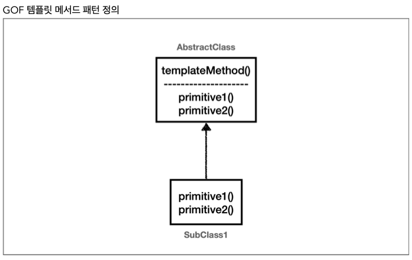

# Section 3. 템플릿 메서드 패턴과 콜백 패턴

## 템플릿 메서드 패턴 - 시작

`OrderServiceV0` 코드와 `OrderServiceV3` 코드를 비교해보면, V0는 해당 메서드가 실제 처리해야 하는 핵심 기능만 깔끔하게 남아있다. 반면에 V3에는 핵심 기능보다 로그를 출력해야 하는 부가 기능 코드가 훨씬 더 많고 복잡하다.


### 핵심 기능 vs 부가 기능

- **핵심 기능** 은 해당 객체가 제공하는 고유의 기능이다. 예를 들어서 `orderService` 의 핵심 기능은 주문 로직이다. 메서드 단위로 보면 `orderService.orderItem()` 의 핵심 기능은 주문 데이터를 저장하기 위해 리포지토리를 호출하는 `orderRepository.save(itemId)` 코드가 핵심 기능이다.
- **부가 기능** 은 핵심 기능을 보조하기 위해 제공되는 기능이다. 예를 들어서 로그 추적 로직, 트랜잭션 기능이 있다. 이러한 부가 기능은 단독으로 사용되지는 않고, 핵심 기능과 함께 사용된다. 예를 들어서 로그 추적 기능은 어떤 핵심 기능이 호출되었는지 로그를 남기기 위해 사용한다. 그러니까 핵심 기능을 보조하기 위해 존재한다.


V0는 핵심 기능만 있지만, 로그 추적기를 추가한 V3 코드는 핵심 기능과 부가 기능이 함께 섞여있다. V3를 보면 로그 추적기의 도입으로 핵심 기능 코드보다 부가 기능을 처리하기 위한 코드가 더 많아졌다. 이 문제를 좀 더 효율적으로 처리할 수 있는 방법이 있을까? V3 코드를 유심히 잘 살펴보면 다음과 같이 동일한 패턴이 있다.

``` java
TraceStatus status = null;
try {
  status = trace.begin("message");
  // 핵심 기능 호출
  trace.end(status);
} catch (Exception e) {
  trace.exception(status, e);
  throw e;
}
```

Controller, Service, Repository 의 코드를 잘보면, 로그 추적기를 사용하는 구조는 모두 동일하다. 중간에 핵심 기능을 사용하는 코드만 다를 뿐이다. 부가 기능과 관련된 코드가 중복이니 중복을 별도의 메서드로 뽑아내면 될 것 같다. 그런데 try catch 는 물론이고 핵심 기능 부분이 중간에 있어서 단순하게 메서드로 추출하는 것은 어렵다.


### 변하는 것과 변하지 않는 것을 분리

좋은 설계는 변하는 것과 변하지 않는 것을 분리하는 것이다.

**여기서 핵심 기능 부분은 변하고, 로그 추적기를 사용하는 부분은 변하지 않는 부분이다. 이 둘을 분리해서 모듈화해야 한다.**

템플릿 메서드 패턴은 이런 문제를 해결하는 디자인 패턴이다.


## 템플릿 메서드 패턴 - 예제1

### TemplateMethodTest

``` java
package hello.advanced.trace.trace;

import lombok.extern.slf4j.Slf4j;
import org.junit.jupiter.api.Test;

@Slf4j
public class TemplateMethodTest {
    
    @Test
    void templateMethodV0() {
        logic1();
        logic2();
    }
    
    private void logic1() {
        long startTime = System.currentTimeMillis();
        // 비즈니스 로직 실행
        log.info("비즈니스 로직1 실행");
        // 비즈니스 로직 종료
        long endTime = System.currentTimeMillis();
        long resultTime = endTime - startTime;
        log.info("resultTime={}", resultTime);
    }
    
    private void logic2() {
        long startTime = System.currentTimeMillis();
        // 비즈니스 로직 실행
        log.info("비즈니스 로직2 실행");
        // 비즈니스 로직 종료
        long endTime = System.currentTimeMillis();
        long resultTime = endTime - startTime;
        log.info("resultTime={}", resultTime);
    }   
}
```

- 변하는 부분: 비즈니스 로직
- 변하지 않는 부분: 시간 측정


## 템플릿 메서드 패턴 - 예제2

### 템플릿 메서드 패턴 구조 그림


### AbstractTemplate (테스트 코드 하위)

``` java
package hello.advanced.trace.template.code;

import lombok.extern.slf4j.Slf4j;

@Slf4j
public abstract class AbstractTemplate {

    public void execute() {
        long startTime = System.currentTimeMillis();
        // 비즈니스 로직 실행
        call(); // 상속
        long endTime = System.currentTimeMillis();
        long resultTime = endTime - startTime;
        log.info("resultTime={}", resultTime);
    }

    protected abstract void call();
}
```

템플릿 메서드 패턴은 이름 그대로 템플릿을 사용하는 방식이다. 템플릿은 기준이 되는 거대한 틀이다. 템플릿이라는 틀에 변하지 않는 부분을 몰아둔다. 그리고 일부 변하는 부분을 별도로 호출해서 해결한다.

`AbstractTemplate` 에서 변하지 않는 부분인 시간 측정 로직을 몰아둔 것을 확인할 수 있다. 이제 이것이 하나의 템플릿이 된다. 그리고 템플릿 안에서 변하는 부분은 `call()` 메서드를 호출해서 처리한다. 템플릿 메서드 패턴은 부모 클래스에 변하지 않는 템플릿 코드를 둔다. 그리고 변하는 부분은 자식 클래스에 두고 상속과 오버라이딩을 사용해서 처리한다.


### SubClassLogic1 (테스트 코드 하위)

``` java
package hello.advanced.trace.template.code;

import lombok.extern.slf4j.Slf4j;

@Slf4j
public class SubClassLogic1 extends AbstractTemplate {

    @Override
    protected void call() {
        log.info("비즈니스 로직1 실행");
    }
}
```

변하는 부분인 비즈니스 로직1을 처리하는 자식 클래스이다. 템플릿이 호출하는 대상인 `call()` 메서드를 오버라이딩 한다.


### SubClassLogic2 (테스트 코드 하위)

``` java
package hello.advanced.trace.template.code;

import lombok.extern.slf4j.Slf4j;

@Slf4j
public class SubClassLogic2 extends AbstractTemplate{
    
    @Override
    protected void call() {
        log.info("비즈니스 로직2 실행");
    }
}
```

변하는 부분인 비즈니스 로직2를 처리하는 자식 클래스. 템플릿이 호출하는 대상인 `call()` 메서드를 오버라이딩 한다.


### TemplateMethodTest - templateMethodV1() 추가

``` java
package hello.advanced.trace.template;

import hello.advanced.trace.template.code.AbstractTemplate;
import hello.advanced.trace.template.code.SubClassLogic1;
import hello.advanced.trace.template.code.SubClassLogic2;
import lombok.extern.slf4j.Slf4j;
import org.junit.jupiter.api.Test;

@Slf4j
public class TemplateMethodTest {

    @Test
    void templateMethodV0() {
        logic1();
        logic2();
    }

    private void logic1() {
        long startTime = System.currentTimeMillis();
        // 비즈니스 로직 실행
        log.info("비즈니스 로직1 실행");
        // 비즈니스 로직 종료
        long endTime = System.currentTimeMillis();
        long resultTime = endTime - startTime;
        log.info("resultTime={}", resultTime);
    }

    private void logic2() {
        long startTime = System.currentTimeMillis();
        // 비즈니스 로직 실행
        log.info("비즈니스 로직2 실행");
        // 비즈니스 로직 종료
        long endTime = System.currentTimeMillis();
        long resultTime = endTime - startTime;
        log.info("resultTime={}", resultTime);
    }

    /**
     * 템플릿 메서드 패턴 적용
     */
    @Test
    void templateMethodV1() {
        AbstractTemplate template1 = new SubClassLogic1();
        template1.execute();

        AbstractTemplate template2 = new SubClassLogic2();
        template2.execute();
    }
}
```


### 템플릿 메서드 패턴 인스턴스 호출 그림


`template1.execute()` 를 호출하면 템플릿 로직인 `AbstractTemplate.excute()` 를 실행한다. 여기서 중간에 `call()` 메서드를 호출하는데, 이 부분이 오버라이딩 되어있다. 따라서 현재 인스턴스인 SubClassLogic1 인스턴스의 SubClassLogic1.call() 메서드가 호출된다.

템플릿 메서드 패턴은 이렇게 다형성을 사용해서 변하는 부분과 변하지 않는 부분을 분리하는 방법이다.


## 템플릿 메서드 패턴 - 예제3

### 익명 내부 클래스 사용하기

템플릿 메서드 패턴은 SubClassLogic1, SubClassLogic2 처럼 클래스를 계속 만들어야 하는 단점이 있다. 익명 내부 클래스를 사용하면 이런 단점을 보완할 수 있다.

익명 내부 클래스를 사용하면 객체 인스턴스를 생성하면서 동시에 생성할 클래스를 상속 받은 자식 클래스를 정의할 수 있다. 이 클래스는 SubClassLogic1 처럼 직접 지정하는 이름이 없고 클래스 내부에 선언되는 클래스여서 익명 내부 클래스라 한다.


### TemplateMethodTest - templateMethodV2() 추가

``` java
/**
 * 템플릿 메서드 패턴, 익명 내부 클래스 사용
 */
@Test
void templateMethodV2() {
  AbstractTemplate template1 = new AbstractTemplate() {
    @Override
    protected void call() {
      log.info("비즈니스 로직1 실행");
    }
  };
  log.info("클래스 이름1={}", template1.getClass());
  template1.execute();

  AbstractTemplate template2 = new AbstractTemplate() {
    @Override
    protected void call() {
      log.info("비즈니스 로직2 실행");
    }
  };
  log.info("클래스 이름2={}", template2.getClass());
  template2.execute();
}
```

실행 결과를 보면 자바가 임의로 만들어주는 익명 내부 클래스 이름은 `TemplateMethodTest$1`, `TemplateMethodTest$2` 인 것을 확인할 수 있다.


## 템플릿 메서드 패턴 - 적용1

로그 추적기 로직에 템플릿 메서드 패턴을 적용해보자.


### AbstractTemplate

``` java
package hello.advanced.trace.template;

import hello.advanced.trace.TraceStatus;
import hello.advanced.trace.logtrace.LogTrace;

public abstract class AbstractTemplate<T> {

    private final LogTrace trace;

    public AbstractTemplate(LogTrace trace) {
        this.trace = trace;
    }

    public T execute(String message) {
        TraceStatus status = null;
        try {
            status = trace.begin(message);
            // 로직 호출
            T result = call();

            trace.end(status);
            return result;
        } catch (Exception e) {
            trace.exception(status, e);
            throw e;
        }
    }
    
    protected abstract T call();
}

```

- `AbstractTemplate` 은 템플릿 메서드 페턴에서 부모 클래스이고, 템플릿 역할을 한다.
- `<T>` 제네릭을 사용했다. 반환 타입을 정의한다.
- 객체를 생성할 때 내부에서 사용할 `LogTrace trace` 를 전달받는다.
- 로그에 출력할 message 를 외부에서 파라미터로 전달받는다.
- 템플릿 코드 중간에 call() 메서드를 통해서 변하는 부분을 처리한다.
- abstract T call() 은 변하는 부분을 처리하는 메서드이다. 이 부분은 상속으로 구현해야 한다.


### OrderControllerV4

``` java
package hello.advanced.app.v4;

import hello.advanced.trace.logtrace.LogTrace;
import hello.advanced.trace.template.AbstractTemplate;
import lombok.RequiredArgsConstructor;
import org.springframework.web.bind.annotation.GetMapping;
import org.springframework.web.bind.annotation.RestController;

@RestController
@RequiredArgsConstructor
public class OrderControllerV4 {

    private final OrderServiceV4 orderService;
    private final LogTrace trace;

    @GetMapping("/v4/request")
    public String request(String itemId) {

        AbstractTemplate<String> template = new AbstractTemplate<String>(trace) {
            @Override
            protected String call() {
                orderService.orderItem(itemId);
                return "ok";
            }
        };
        return template.execute("OrderController.request()");
    }   
}
```

- `AbstractTemplate<String>`
  - 제네릭을 String 으로 설정했다. 따라서 AbstractTemplate 의 반환 타입은 String 이 된다.
- 익명 내부 클래스
  - 익명 내부 클래스를 사용한다. 객체를 생성하면서 AbstractTemplate 를 상속받은 자식 클래스를 정의 했다.
  - 따라서 별도의 자식 클래스를 직접 만들지 않아도 된다.
- `template.execute("OrderController.request()")`
  - 템플릿을 실행하면서 로그로 남길 message를 전달한다.


### OrderServiceV4

``` java
package hello.advanced.app.v4;

import hello.advanced.trace.logtrace.LogTrace;
import hello.advanced.trace.template.AbstractTemplate;
import lombok.RequiredArgsConstructor;
import org.springframework.stereotype.Service;

@Service
@RequiredArgsConstructor
public class OrderServiceV4 {

    private final OrderRepositoryV4 orderRepository;
    private final LogTrace trace;

    public void orderItem(String itemId) {
        AbstractTemplate<Void> template = new AbstractTemplate<Void>(trace) {
            @Override
            protected Void call() {
                orderRepository.save(itemId);
                return null;
            }
        };
        template.execute("OrderService.orderItem()");
    }
}
```

- `AbstractTemplate<Void>`
  - 제네릭에서 반화내 타입이 필요한데, 반환할 내용이 없으면 Void 타입을 사용하고 null 을 반환하면 된다. 참고로 제네릭은 기본타입인 void, int 등을 선언할 수 없다.


### OrderRepositoryV4

``` java
package hello.advanced.app.v4;

import hello.advanced.trace.TraceId;
import hello.advanced.trace.TraceStatus;
import hello.advanced.trace.logtrace.LogTrace;
import hello.advanced.trace.template.AbstractTemplate;
import lombok.RequiredArgsConstructor;
import org.springframework.stereotype.Repository;

@Repository
@RequiredArgsConstructor
public class OrderRepositoryV4 {

    private final LogTrace trace;

    public void save(String itemId) {
        AbstractTemplate<Void> template = new AbstractTemplate<>(trace) {
            @Override
            protected Void call() {
                // 저장 로직
                if (itemId.equals("ex")) {
                    throw new IllegalStateException("예외 발생!");
                }
                sleep(1000);
                return null;
            }
        };
        System.out.println("OrderRepositoryV4.save");
    }

    private void sleep(int millis) {
        try {
            Thread.sleep(millis);
        } catch (InterruptedException e) {
            e.printStackTrace();
        }
    }
}
```

- 실행: http://localhost:8080/v4/request?itemId=hello


## 템플릿 메서드 패턴 - 적용2

템플릿 메서드 패턴 덕분에 변하는 코드와 변하지 않는 코드를 명확하게 분리했다. 로그를 출력하는 템플릿 역할을 하는 변하지 않는 코드는 모두 `AbstractTemplate` 에 담아두고, 변하는 코드는 자식 클래스를 만들어서 분리했다.

``` java
// OrderServiceV0  코드
public void orderItem(String itemId) {
  orderRepository.save(itemId);
}

// OrderServiceV3 코드
public void orderItem(String itemId) {
  TraceStatus status = null;
  try {
    status = trace.begin("OrderService.orderItem()");
    orderRepository.save(itemId);
  } catch(Exception e) {
    trace.exception(status, e);
    throw e;
  }
}

// OrderServiceV4 코드
AbstractTemplate<Void> template = new AbstractTemplate<>(trace) {
  @Override
  protected Void call() {
    orderRepository.save(itemId);
    return null;
  }
};
template.execute("OrderService.orderItem()");
```

- `OrderServiceV0`: 핵심 기능만 있다.
- `OrderServiceV3` : 핵심 기능과 부가 기능이 함께 섞여 있다.
- `OrderServiceV4` : 핵심 기능과 템플릿을 호출하는 코드가 섞여 있다. (부가 기능은 템플릿 안에 있다)


### 좋은 설계란?

진정한 좋은 설계는 바로 변경이 일어날 때 자연스럽게 드러난다.

지금까지 로그를 남기는 부분을 모아서 하나로 모듈화하고, 비즈니스 로직 부분을 분리했다. 여기서 만약 로그를 남기는 로직을 변경해야 한다고 생각해보자. 그래서 `AbstractTemplate` 코드를 변경해야 한다고 가정해보자. 단순히 `AbstractTemplate` 코드만 변경하면 된다.

템플릿이 없는 `V3` 상태에서 로그를 남기는 로직을 변경해야 한다고 생각해보자. 이 경우 모든 클래스를 다 찾아서 고쳐야 한다.


### 단일 책임 원칙(SRP)

`V4` 는 단순히 템플릿 메서드 패턴을 적용해서 소스코드 몇줄을 줄인 것이 전부가 아니다. 로그를 남기는 부분에 단일 책임 원칙(SRP)를 지킨 것이다. 변경 지점을 하나로 모아서 변경에 쉽게 대처할 수 있는 구조를 만든 것이다.


## 템플릿 메서드 패턴 - 정의

GOF 디자인 패턴에서는 템플릿 메서드 패턴을 다음과 같이 정의했다.

> 템플릿 메서드 디자인 패턴의 목적은 다음과 같습니다.
>
> "작업에서 알고리즘의 골격을 정의하고 일부 단계를 하위 클래스로 연기합니다. 템플릿 메서드를 사용하면 하위 클래스가 알고리즘의 구조를 변경하지 않고도 알고리즘의 특정 단계를 재정의할 수 있습니다." [GOF]



부모 클래스에 알고리즘의 골격인 템플릿을 정의하고, 일부 변경되는 로직은 자식 클래스에 정의하는 것이다. 이렇게 하면 자식 클래스가 알고리즘의 전체 구조를 변경하지 않고, 특정 부분만 재정의할 수 있다. 결국 상속과 오버라이딩을 통한 다형성으로 문제를 해결하는 것이다.

**하지만** 템플릿 메서드 패턴은 상속을 사용한다. 따라서 상속에서 오는 단점들을 그대로 안고간다. 특히 자식 클래스가 부모 클래스와 컴파일 시점에 강하게 결합되는 문제가 있다. 이것은 의존관계에 대한 문제이다. 자식 클래스 입장에서는 부모 클래스의 기능을 전혀 사용하지 않는다.

그럼에도 불구하고 템플릿 메서드 패턴을 위해 자식 클래스는 부모 클래스를 상속 받고 있다.

상속을 받는다는 것은 특정 부모 클래스를 의존하고 있다는 것이다. 자식 클래스의 `extends` 다음에 바로 부모 클래스가 코드상에 지정되어 있다. 따라서 부모 클래스의 기능을 사용하든 사용하지 않든 간에 부모 클래스를 강하게 의존하게 된다. 여기서 강하게 의존한다는 뜻은 자식 클래스의 코드에 부모 클래스의 코드가 명확하게 적혀 있다는 뜻이다. UML 에서 상속을 받으면 삼각형 화살표가 자식 -> 부모를 향하고 있는 것은 이런 의존관계를 반영하는 것이다.

자식 클래스 입장에서는 부모 클래스의 기능을 전혀 사용하지 않는데, 부모 클래스를 알아야 한다. 이것은 좋은 설계가 아니다. 그리고 이런 잘못된 의존관계 때문에 부모 클래스를 수정하면, 자식 클래스에도 영향을 줄 수 있다.

추가로 템플릿 메서드 패턴은 상속 구조를 사용하기 때문에, 별도의 클래스나 익명 내부 클래스를 만들어야 하는 부분도 복잡하다.

이러한 부분들(상속의 단점)을 개선했지만 비슷한 역할을 하는 디자인 패턴이 바로 전략 패턴(Strategy Pattern)이다.


