# Section 4. 프록시 패턴과 데코레이터 패턴

## 예제 프로젝트 만들기 V1

예제는 크게 3가지 상황으로 만든다.

- v1: 인터페이스와 구현 클래스 - 스프링 빈으로 수동 등록
- v2: 인터페이스 없는 구현체 클레스 - 스프링 빈으로 수동 등록
- v3: 컴포넌트 스캔트로 스프링 빈 자동 등록

실무에서는 스프링 빈으로 등록할 클래스는 인터페이스가 있는 경우도 있고 없는 경우도 있다. 그리고 스프링 빈을 수동으로 직접 등록하는 경우도 있고, 컴포넌트 스캔으로 자동으로 등록하는 경우도 있다. 이런 다양한 케이스에 프록시를 어떻게 적용하는지 알아보기 위해 다양한 예제를 준비해보자.


### v1 - 인터페이스와 구현 클래스 - 스프링 빈으로 수동 등록

지금까지 보아왔던 `Controller`, `Service`, `Repository` 에 인터페이스를 도입하고, 스프링 빈으로 수동 등록해보자.


#### OrderRepositoryV1

``` java
package hello.proxy.app.v1;

public interface OrderRepositoryV1 {
    void save(String itemId);
}
```


#### OrderRepositoryV1Impl

``` java
package hello.proxy.app.v1;

public class OrderRepositoryV1Impl implements OrderRepositoryV1 {

    @Override
    public void save(String itemId) {
        // 저장 로직
        if (itemId.equals("ex")) {
            throw new IllegalStateException("예외 발생!");
        }
        sleep(1000);
    }

    private void sleep(int millis) {
        try {
            Thread.sleep(millis);
        } catch (InterruptedException e) {
            e.printStackTrace();
        }
    }
}
```


#### OrderServiceV1

``` java
package hello.proxy.app.v1;

public interface OrderServiceV1 {
    void orderItem(String itemId);
}
```


#### OrderServiceV1Impl

``` java
package hello.proxy.app.v1;

public class OrderServiceV1Impl implements OrderServiceV1 {

    private final OrderRepositoryV1 orderRepository;

    public OrderServiceV1Impl(OrderRepositoryV1 orderRepositoryV1) {
        this.orderRepository = orderRepositoryV1;
    }

    @Override
    public void orderItem(String itemId) {
        orderRepository.save(itemId);
    }
}
```


#### OrderControllerV1

``` java
package hello.proxy.app.v1;

import org.springframework.web.bind.annotation.GetMapping;
import org.springframework.web.bind.annotation.RequestMapping;
import org.springframework.web.bind.annotation.RequestParam;
import org.springframework.web.bind.annotation.ResponseBody;

@RequestMapping // 스프링은 @Controller 또는 @RequestMapping 이 있어야 스프링 컨트롤러로 인식
@ResponseBody
public interface OrderControllerV1 {

    @GetMapping("/v1/request")
    String request(@RequestParam("itemId") String itemId);

    @GetMapping("/v1/no-log")
    String noLog();
}
```

- `@RequestMapping`: 스프링 MVC는 타입에 `@Controller` 또는 `@RequestMapping` 어노테이션이 있어야 스프링 컨트롤러로 인식한다. 그리고 스프링 컨트롤러로 인식해야 HTTP URL이 매핑되고 동작한다. 이 어노테이션은 인터페이스에 사용해도 된다.
- `@ResponseBody`: HTTP 메시지 컨버터를 사용해서 응답한다. 이 어노테이션은 인터페이스에 사용해도 된다.
- `@RequestParam("itemId") String itemId`: 인터페이스에는 `@RequestParam("itemId")` 의 값을 생략하면 itemId 단어를 컴파일 이후 자바 버전에 따라 인식하지 못할 수 있다. 인터페이스에서는 꼭 넣어주자. 클래스에는 생략해도 대부분 잘 지원된다.
- 코드를 보면 `request()`, `noLog()` 두 가지 메서드가 있다. `request()` 는 `LogTrace` 를 적용할 대상이고, `noLog()` 는 단순히 `LogTrace` 를 적용하지 않을 대상이다.


#### OrderControllerV1Impl

``` java
package hello.proxy.app.v1;

import lombok.extern.slf4j.Slf4j;

@Slf4j
public class OrderControllerV1Impl implements OrderControllerV1{

    private final OrderServiceV1 orderService;

    public OrderControllerV1Impl(OrderServiceV1 orderService) {
        this.orderService = orderService;
    }


    @Override
    public String request(String itemId) {
        orderService.orderItem(itemId);
        return "ok";
    }

    @Override
    public String noLog() {
        return "ok";
    }
}
```

- 컨트롤러 구현체이다. `OrderControllerV1` 인터페이스에 스프링 MVC 관련 어노테이션이 정의되어 있다.


#### AppV1Config

스프링 빈으로 수동 등록

``` java
package hello.proxy.config;

import hello.proxy.app.v1.OrderControllerV1;
import hello.proxy.app.v1.OrderControllerV1Impl;
import hello.proxy.app.v1.OrderRepositoryV1;
import hello.proxy.app.v1.OrderRepositoryV1Impl;
import hello.proxy.app.v1.OrderServiceV1;
import hello.proxy.app.v1.OrderServiceV1Impl;
import org.springframework.context.annotation.Bean;
import org.springframework.context.annotation.Configuration;

@Configuration
public class AppV1Config {

    @Bean
    public OrderControllerV1 orderControllerV1() {
        return new OrderControllerV1Impl(orderServiceV1());
    }
    
    @Bean
    public OrderServiceV1 orderServiceV1() {
        return new OrderServiceV1Impl(orderRepositoryV1());
    }
    
    @Bean
    public OrderRepositoryV1 orderRepositoryV1() {
        return new OrderRepositoryV1Impl();
    }
}
```


#### ProxyApplication - 코드 추가

``` java
package hello.proxy;

import hello.proxy.config.AppV1Config;
import org.springframework.boot.SpringApplication;
import org.springframework.boot.autoconfigure.SpringBootApplication;
import org.springframework.context.annotation.Import;

@Import(AppV1Config.class)
@SpringBootApplication(scanBasePackages = "hello.proxy.app") // 주의
public class ProxyApplication {

	public static void main(String[] args) {
		SpringApplication.run(ProxyApplication.class, args);
	}
}
```

- `@Import(AppV1Config.class)` : 클래스를 스프링 빈으로 등록한다. 여기서는 `AppV1Config.class` 를 스프링 빈으로 등록한다. 일반적으로 `@Configuration` 같은 설정파일을 등록할 때 사용하지만, 스프링 빈을 등록할 때도 사용할 수 있다.
- `@SpringBootApplication(scanBasePackages = "hello.proxy.app")` : `@ComponentScan` 의 기능과 같다. 컴포넌트 스캔을 시작할 위치를 지정한다. 이 값을 설정하면 해당 패키지와 그 하위 패키지를 컴포넌트 스캔한다. 이 값을 사용하지 않으면 ProxyApplication 이 있는 패키지와 그 하위 패키지를 스캔한다. 참고로 V3 에서 지금 설정한 컴포넌트 스캔 기능을 사용한다.

> [주의]
>
> 강의에서는 `@Configuration` 을 사용한 수동 빈 등록 설정을 `hello.proxy.config` 위치에 두고 점진적으로 변경할 예정이다. 지금은 `AppV1Config.class` 를 `@Import` 를 사용해서 설정하지만 이후에 다른 것을 설정한다는 이야기이다.
>
> `@Confgiuration` 은 내부에 @Component 어노테이션을 포함하고 있어서 컴포넌트 스캔의 대상이 된다. 따라서 컴포넌트 스캔에 의해 hello.proxy.config 위치의 설정 파일들이 스프링 빈으로 자동 등록 되지 않도록 컴포넌트 스캔의 시작 위치를 `scanBasePackages=hello.proxy.app` 으로 설정해야 한다.

- 실행: http://localhost:8080/v1/request?itemId=hello


## 예제 프로젝트 만들기 v2

### v2 - 인터페이스 없는 구체 클래스 - 스프링 빈으로 수동 등록

이번에는 인터페이스가 없는 Controller, Service, Repository 를 스프링 빈으로 수동 등록해보자.


#### OrderRepositoryV2

``` java
package hello.proxy.app.v2;

public class OrderRepositoryV2 {
    public void save(String itemId) {
        // 저장 로직
        if (itemId.equals("ex")) {
            throw new IllegalStateException("예외 발생!");
        }
        sleep(1000);
    }
    
    private void sleep(int millis) {
        try {
            Thread.sleep(millis);
        } catch (InterruptedException e) {
            e.printStackTrace();
        }
    }
}
```


#### OrderServiceV2

``` java
package hello.proxy.app.v2;

public class OrderServiceV2 {

    private final OrderRepositoryV2 orderRepository;

    public OrderServiceV2(OrderRepositoryV2 orderRepository) {
        this.orderRepository = orderRepository;
    }

    public void orderItem(String itemId) {
        orderRepository.save(itemId);
    }
}
```


#### OrderControllerV2

``` java
package hello.proxy.app.v2;

import lombok.extern.slf4j.Slf4j;
import org.springframework.web.bind.annotation.GetMapping;
import org.springframework.web.bind.annotation.RequestMapping;
import org.springframework.web.bind.annotation.ResponseBody;

@Slf4j
@RequestMapping
@ResponseBody
public class OrderControllerV2 {

    private final OrderServiceV2 orderService;

    public OrderControllerV2(OrderServiceV2 orderService) {
        this.orderService = orderService;
    }

    @GetMapping("/v2/request")
    public String request(String itemId) {
        orderService.orderItem(itemId);
        return "ok";
    }

    @GetMapping("/v2/no-log")
    public String noLog() {
        return "ok";
    }
}
```

- `@RequestMapping` : 스프링MVC는 타입에 @Controller 또는 @RequestMapping 어노테이션이 있어야 스프링 컨트롤러로 인식된다. 그런데 여기서는 @RequestMapping 을 사용하였는데, @Controller 를 사용하게 되면 자동 컴포넌트 스캔의 대상이 되기 때문이다. 여기서는 컴포넌트 스캔을 통한 자동 빈 등록이 아니라 수동 빈 등록을 하는 것이 목표다. 따라서 컴포넌트 스캔과 관계 없는 @RequestMapping 를 타입에 사용했다.


#### AppV2Config

``` java
package hello.proxy.config;

import hello.proxy.app.v2.OrderControllerV2;
import hello.proxy.app.v2.OrderRepositoryV2;
import hello.proxy.app.v2.OrderServiceV2;
import org.springframework.context.annotation.Bean;
import org.springframework.context.annotation.Configuration;

@Configuration
public class AppV2Config {

    @Bean
    public OrderControllerV2 orderControllerV2() {
        return new OrderControllerV2(orderServiceV2());
    }

    @Bean
    public OrderServiceV2 orderServiceV2() {
        return new OrderServiceV2(orderRepositoryV2());
    }

    @Bean
    public OrderRepositoryV2 orderRepositoryV2() {
        return new OrderRepositoryV2();
    }
}
```


#### ProxyApplication

``` java
package hello.proxy;

import hello.proxy.config.AppV1Config;
import hello.proxy.config.AppV2Config;
import org.springframework.boot.SpringApplication;
import org.springframework.boot.autoconfigure.SpringBootApplication;
import org.springframework.context.annotation.Import;

@Import({AppV1Config.class, AppV2Config.class})
@SpringBootApplication(scanBasePackages = "hello.proxy.app") // 주의
public class ProxyApplication {

	public static void main(String[] args) {
		SpringApplication.run(ProxyApplication.class, args);
	}
}
```


## 예제 프로젝트 만들기 v3

### v3 - 컴포넌트 스캔으로 스프링 빈 자동 등록

#### OrderRepositoryV3

``` java
package hello.proxy.app.v3;

import org.springframework.stereotype.Repository;

@Repository
public class OrderRepositoryV3 {

    public void save(String itemId) {
        // 저장 로직
        if (itemId.equals("ex")) {
            throw new IllegalStateException("예외 발생");
        }
        sleep(1000);
    }

    private void sleep(int millis) {
        try {
            Thread.sleep(millis);
        } catch (InterruptedException e) {
            e.printStackTrace();
        }
    }
}
```


#### OrderServiceV3

``` java
package hello.proxy.app.v3;

import org.springframework.stereotype.Service;

@Service
public class OrderServiceV3 {

    private final OrderRepositoryV3 orderRepository;

    public OrderServiceV3(OrderRepositoryV3 orderRepository) {
        this.orderRepository = orderRepository;
    }

    public void orderItem(String itemId) {
        orderRepository.save(itemId);
    }
}
```


#### OrderControllerV3

``` java
package hello.proxy.app.v3;

import lombok.extern.slf4j.Slf4j;
import org.springframework.web.bind.annotation.GetMapping;
import org.springframework.web.bind.annotation.RestController;

@Slf4j
@RestController
public class OrderControllerV3 {

    private final OrderServiceV3 orderService;

    public OrderControllerV3(OrderServiceV3 orderService) {
        this.orderService = orderService;
    }

    @GetMapping("/v3/request")
    public String request(String itemId) {
        orderService.orderItem(itemId);
        return "ok";
    }

    @GetMapping("/v3/no-log")
    public String noLog() {
        return "ok";
    }
}
```

`ProxyApplication` 에서 `@SpringBootApplication(scanBasePackages = "hello.proxy.app")` 를 사용했고, 각각 `@RestController`, `@Service`, `@Repostiory` 어노테이션을 가지고 있기 때문에 컴포넌트 스캔의 대상이 된다.


## 요구사항 추가

### 기존 요구사항

- 모든 PUBLIC 메서드의 호출과 응답 정보를 로그로 출력
- 애플리케이션의 흐름을 변경하면 안됨
  - 로그를 남긴다고 해서 비즈니스 로직의 동작에 영향을 주면 안됨
- 메서드 호출에 걸린 시간
- 정상 흐름과 예외 흐름 구분
  - 예외 발생시 예외 정보가 남아야 함
- 메서드 호출의 깊이 표현
- HTTP 요청을 구분
  - HTTP 요청 단위로 특정 ID를 남겨서 어떤 HTTP 요청에서 시작된 것인지 명확하게 구분이 가능해야 함
  - 트랜잭션 ID (DB 트랜잭션X)

- 예시

  ```
  정상 요청
  [796bccd9] OrderController.request()
  [796bccd9] |-->OrderService.orderItem()
  [796bccd9] |   |-->OrderRepository.save()
  [796bccd9] |   |<--OrderRepository.save() time=1004ms
  [796bccd9] |<--OrderService.orderItem() time=1014ms
  [796bccd9] OrderController.request() time=1016ms
  
  예외 발생
  [b7119f27] OrderController.request()
  [b7119f27] |-->OrderService.orderItem()
  [b7119f27] | |-->OrderRepository.save() 
  [b7119f27] | |<X-OrderRepository.save() time=0ms ex=java.lang.IllegalStateException: 예외 발생! 
  [b7119f27] |<X-OrderService.orderItem() time=10ms ex=java.lang.IllegalStateException: 예외 발생!
  ```

하지만 이 요구사항을 만족하기 위해서 기존 코드를 많이 수정해야 한다. 코드 수정을 최소화 하기 위해 템플릿 메서드 패턴과 콜백 패턴도 사용했지만, 결과적으로 로그를 남기고 싶은 클래스가 수백개라면 수백개의 클래스를 모두 고쳐야 한다. 로그를 남길 때 기존 원본 코드를 변경해야 한다는 사실 그 자체가 개발자에게는 가장 큰 문제로 남는다.


### 요구사항 추가

- 원본 코드를 전혀 수정하지 않고, 로그 추적기를 적용해라.
- 특정 메서드는 로그를 출력하지 않는 기능
  - 보안상 일부는 로그를 출력하면 안된다.
- 다음과 같은 다양한 케이스에 적용할 수 있어야 한다.
  - v1 - 인터페이스가 있는 구현 클래스에 적용
  - v2 - 인터페이스가 없는 구현체 클래스에 적용
  - v3 - 컴포넌트 스캔 대상에 기능 적용

가장 어려운 문제는 원본 코드를 전혀 수정하지 않고, 로그 추적기를 도입하는 것이다. 이 문제를 해결하려면 프록시(Proxy)의 개념을 먼저 이해해야 한다.


## 프록시, 프록시 패턴, 데코레이터 패턴 소개


클라이언트와 서버라고 하면 개발자들은 보통 서버 컴퓨터를 생각한다.

사실 클라이언트와 서버의 개념은 상당히 넓게 사용된다. 클라이언트는 의뢰인이라는 뜻이고, 서버는 '서비스나 상품을 제공하는 사람이나 물건' 을 뜻한다. 따라서 클라이언트와 서버의 기본 개념을 정의하면 클라이언트는 서버에 필요한 것을 요청하고, 서버는 클라이언트의 요청을 처리하는 것이다.

이 개념을 우리가 익숙한 컴퓨터 네트워크에 도입하면 클라이언트는 웹 브라우저가 되고, 요청을 처리하는 서버는 웹 서버가 된다. 이 개념을 객체에 도입하면, 요청하는 객체는 클라이언트가 되고, 요청을 처리하는 객체는 서버가 된다.


### 직접 호출과 간접 호출


클라이언트와 서버 개념에서 일반적으로 클라이언트가 서버를 직접 호출하고, 처리 결과를 직접 받는다. 이것을 직접 호출이라 한다.


그런데 클라이언트가 요청한 결과를 서버에 직접 요청하는 것이 아니라 어떤 대리자를 통해서 대신 간접적으로 서버에 요청할 수 있다. 예를 들어서 내가 직접 마트에서 장을 볼 수도 있지만, 누군가에게 대신 장을 봐달라고 부탁할 수도 있다. 여기서 대신 장을 보는 대리자를 영어로 프록시라 한다.

- 예시
  - 엄마에게 라면을 사달라고 부탁 했는데, 엄마는 그 라면은 이미 집에 있다고 할 수도 있다. 그러면 기대한 것보다 더 빨리 라면을 먹을 수 있다.(접근 제어, 캐싱)
  - 아버지께 자동차 주유를 부탁했는데, 아버지가 주유 뿐만 아니라 새차까지 하고 왔다. 클라이언트가 기대한 것 외에 새차라는 부가 기능까지 얻게 되었다. (부가 기능 추가)
  - 그리고 대리자가 또 다른 대리자를 부를 수도 있다. 예를 들어서 내가 동생에게 라면을 사달라고 했는데, 동생은 또 다른 누군가에게 라면을 사달라고 다시 요청할 수도 있다. 중요한 점은 클라이언트는 대리자를 통해서 요청했기 떄문에 그 이후 과정은 모른다는 점이다. 동생을 통해서 라면이 나에게 도착하기만 하면 된다. (프록시 체인)


### 대체 가능

그런데 여기까지 듣고 보면 아무 객체나 프록시가 될 수 있는 것 같다.

객체에서 프록시가 되려면, 클라이언트는 서버에게 요청을 한 것인지, 프록시에게 요청을 한 것인지 조차 몰라야 한다.

**<u>쉽게 이야기해서 서버와 프록시는 같은 인터페이스를 사용해야 한다.</u>** 그리고 클라이언트가 사용하는 서버 객체를 프록시 객체로 변경해도 클라이언트 코드를 변경하지 않고 동작할 수 있어야 한다.


클래스와 의존 관계를 보면 클라이언트는 서버 인터페이스(ServerInterface) 에만 의존한다. 그리고 서버와 프록시가 같은 인터페이스를 사용한다. 따라서 DI를 사용해서 대체 가능하다.


이번에는 런타임 객체 의존 관계를 살펴보자. 런타임(애플리케이션 실행 시점)에 클라이언트 객체에 DI를 사용해서 Client -> Server 에서 Client -> Proxy 로 객체 의존관계를 변경해도 클라이언트 코드를 전혀 변경하지 않아도 된다. 클라이언트 입장에서는 변경 사실 조차 모른다. DI를 사용하면 클라이언트 코드의 변경 없이 유연하게 프록시를 주입할 수 있다.


### 프록시의 주요 기능

프록시를 통해서 할 수 있는 일은 크게 2가지로 구분할 수 있다.

- 접근 제어
  - 권한에 따른 접근 차단
  - 캐싱
  - 지연 로딩 (클라이언트가 프록시를 가져다가 사용하다가 실제 요청이 있을 때 그 때 서버로 조회하는 것)
- 부가 기능 추가
  - 원래 서버가 제공하는 기능에 더해서 부가 기능을 수행한다.
  - 예) 요청 값이나, 응답 값을 중간에 변형한다.
  - 예) 실행 시간을 측정해서 추가 로그를 남긴다.

프록시 객체가 중간에 있으면 크게 접근 제어와 부가 기능 추가를 수행할 수 있다.


#### GOF 디자인 패턴

둘 다 프록시를 사용하는 방법이지만 GOF 디자인 패턴에슨 이 둘을 의도(intent)에 따라서 프록시 패턴과 데코레이터 패턴으로 구분한다.

- 프록시 패턴: 접근 제어가 목적
- 데코레이터 패턴: 새로운 기능 추가가 목적

둘 다 프록시를 사용하지만, 의도가 다르다는 점이 핵심이다. 용어가 프록시 패턴이라고 해서 이 패턴만 프록시를 사용하는 것은 아니다. 데코레이터 패턴도 프록시를 사용한다.

> [참고]
>
> 프록시라는 개념은 클라이언트 서버라는 큰 개념안에서 자연스럽게 발생할 수 있다. 프록시는 객체 안에서의 개념도 있고, 웹 서버에서의 프록시도 있다. 객체안에서 객체로 구현되어 있는가, 웹 서버로 구현되어 있는가 처럼 규모의 차이가 있을 뿐 근본적인 역할은 같다.


## 프록시 패턴 - 예제 코드1

### 프록시 패턴 - 예제 코드 작성

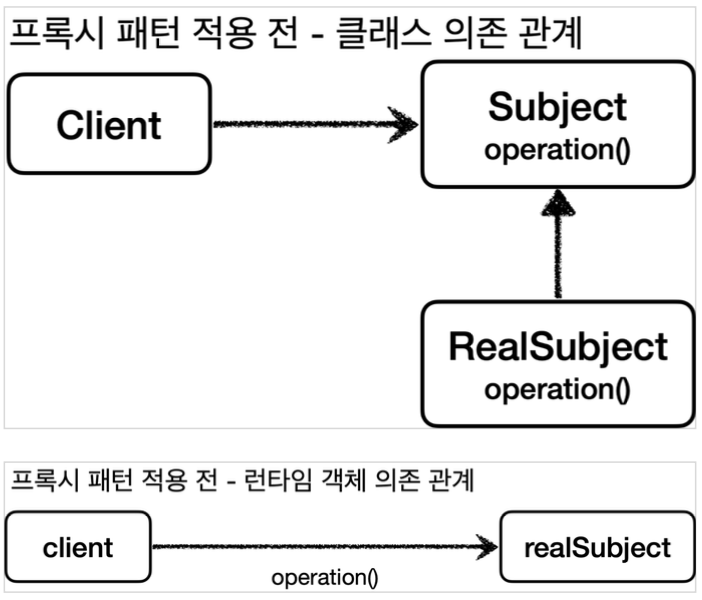


#### Subject 인터페이스 (테스트 코드 하위)

``` java
package hello.proxy.code;

public interface Subject {
    String operation();
}
```

예제에서 Subject 인터페이스는 단순히 operation() 메서드 하나만 가지고 있다.


#### RealSubject (테스트 코드 하위)

``` java
package hello.proxy.code;

import lombok.extern.slf4j.Slf4j;

@Slf4j
public class RealSubject implements Subject {
    
    @Override
    public String operation() {
        log.info("실제 객체 호출");
        sleep(1000);
        return "data";
    }

    private void sleep(int millis) {
        try {
            Thread.sleep(millis);
        } catch (InterruptedException e) {
            e.printStackTrace();
        }
    }
}
```

`RealSubject` 는 `Subject` 인터페이스를 구현했다. `operation()` 은 데이터 조회를 시뮬레이션 하기 위해 1초 쉬도록 했다. 예를 들어서 데이터를 DBsㅏ 외부에서 조회하는데 1초가 걸린다고 생각하면 된다. 호출할 때 마다 시스템에 큰 부하를 주는 데이터 조회라고 가정하자.


#### ProxyPatternClient (테스트 코드 하위)

``` java
package hello.proxy.code;

public class ProxyPatternClient {
    
    private Subject subject;

    public ProxyPatternClient(Subject subject) {
        this.subject = subject;
    }
    
    public void execute() {
        subject.operation();
    }
}
```

Subject 인터페이스에 의존하고, Subject 를 호출하는 클라이언트 코드이다. execute() 를 실행하면 subject.opertaion() 를 호출한다.


#### ProxyPatternTest

```java
package hello.proxy;

import hello.proxy.code.ProxyPatternClient;
import hello.proxy.code.RealSubject;
import org.junit.jupiter.api.Test;

public class ProxyPatternTest {
    
    @Test
    void noProxyTest() {
        RealSubject realSubject = new RealSubject();
        ProxyPatternClient client = new ProxyPatternClient(realSubject);
        client.execute();
        client.execute();
        client.execute();
    }
}
```

테스트 코드에서는 client.execute() 를 3번 호출한다. 데이터를 조회하는데 1초가 소모되므로 총 3초의 시간이 걸린다.

조회하는 데이터가 한번 조회하면 변하지 않는 데이터라면 어딘가에 보관해두고 이미 조회한 데이터를 사용하는 것이 성능상 좋다. 이런 것을 캐시라고 한다.

프록시 패턴의 주요 기능은 접근 제어이다. 캐시도 접근 자체를 제어하는 기능 중 하나이다.

이미 개발된 로직을 전혀 수정하지 않고, 프록시 객체를 통해서 캐시를 적용해보자.


## 프록시 패턴 - 예제 코드2

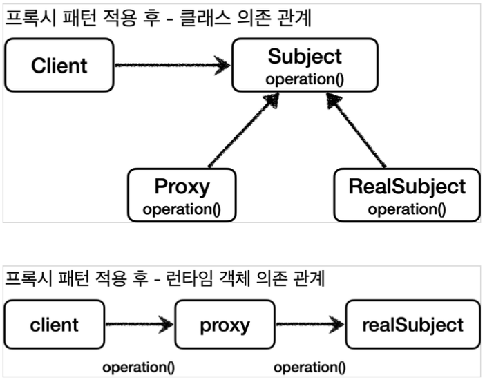


#### CacheProxy (테스트 코드 하위)

``` java
package hello.proxy.code;

import lombok.extern.slf4j.Slf4j;

@Slf4j
public class CacheProxy implements Subject{
    
    private Subject target;
    private String cacheValue;

    public CacheProxy(Subject target) {
        this.target = target;
    }

    @Override
    public String operation() {
        log.info("프록시 호출");
        if (cacheValue == null) {
            cacheValue = target.operation();
        }
        return cacheValue;
    }
}
```

앞서 설명한 것처럼 프록시도 실제 객체와 그 모양이 같아야 하기 때문에 Subject 인터페이스를 구현해야 한다.

- `private Subject target` : 클라이언트가 프록시를 호출하면 프록시가 최종적으로 실제 객체를 호출해야 한다. 따라서 내부에 실제 객체의 참조를 가지고 있어야 한다. 이렇게 프록시가 호출하는 대상을 target 이라 한다.
- `operation()` : 구현한 코드를 보면 `cacheValue` 에 값이 없으면 실제 객체(target)를 호출해서 값을 구한다. 그리고 구한 값을 `cacheValue` 에 저장하고 반환한다. 만약 `cacheValue` 에 값이 있으면 실제 객체를 전혀 호출하지 않고, 캐시 값을 그대로 반환한다. 따라서 처음 조회 이후에는 캐시(`cacheValue`)에서 매우 빠르게 데이터를 조회할 수 있다.


#### ProxyPatternTest - cacheProxyTest() 추가

``` java
@Test
void cacheProxyTest() {
  Subject realSubject = new RealSubject();
  Subject cacheProxy = new CacheProxy(realSubject);
  ProxyPatternClient client = new ProxyPatternClient(cacheProxy);
  client.execute();
  client.execute();
  client.execute();
}
```

`realSubject` 와 `cacheProxy` 를 생성하고 둘을 연결한다. 결과적으로 `cacheProxy` 가 `realSubject` 를 참조하는 런타임 객체 의존관계가 완성된다. 그리고 마지막으로 client에 realSubject가 아닌 `cacheProxy` 를 주입한다. 이 과정을 통해서 `client -> cacheProxy -> realSubject` 런타임 객체 의존 관계가 완성된다.

`cacheProxyTest()` 는 `client.execute()` 을 총 3번 호출한다. 이번에는 클라이언트가 실제 `realSubject` 를 호출하는 것이 아니라 cacheProxy 를 호출하게 된다.

```
## 실행 결과
CacheProxy - 프록시 호출
RealSubject - 실제 객체 호출
CacheProxy - 프록시 호출
CacheProxy - 프록시 호출
```

 

client.execute() 을 3번 호출하면 다음과 같이 처리된다.

1. client의 cacheProxy 호출 -> cacheProxy에 캐시 값이 없다 -> realSubject를 호출, 결과를 캐시에 저장
2. client의 cacheProxy 호출 -> cacheProxy에 캐시 값이 있다 -> cacheProxy 에서 즉시 반환 (0초)
3. client의 cacheProxy 호출 -> cacheProxy에 캐시 값이 있다 -> cacheProxy 에서 즉시 반환 (0초)

결과적으로 캐시 프록시를 도입하기 전에는 3초가 걸렸지만, 캐시 프록시 도입 이후에는 최초에 한번만 1초가 걸리고, 이후에는 거의 즉시 반환한다.


#### 정리

프록시 패턴의 핵심은 `RealSubject` 코드와 클라이언트 코드를 전혀 변경하지 않고, 프록시를 도입해서 접근 제어를 했다는 점이다. 그리고 클라이언트 코드의 변경없이 자유롭게 프록시를 넣고 뺼 수 있다. 실제 클라이언트 입장에서는 프록시 객체가 주입되었는지, 실제 객체가 주입되었는지 알지 못한다.


## 데코레이터 패턴 - 예제 코드1

데코레이터 패턴을 이해하기 위한 예제 코드를 작성해보자. 먼저 데코레이터 패턴을 도입하기 전 코드를 아주 단순하게 만들어보자.

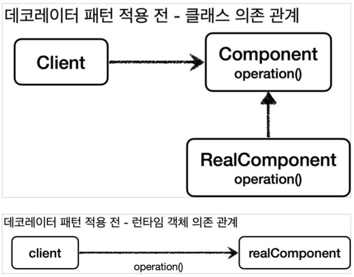


#### Component 인터페이스 (테스트 코드 하위)

``` java
package hello.decorator.code;

public interface Component {
    String operation();
}
```


#### RealComponent (테스트 코드 하위)

``` java
package hello.decorator.code;

import lombok.extern.slf4j.Slf4j;

@Slf4j
public class RealComponent implements Component{

    @Override
    public String operation() {
        log.info("RealComponent 실행");
        return "data";
    }
}
```

- RealComponent 는 Component 인터페이스를 구현한다.
- `operation()`: 단순히 로그를 남기고 "data" 문자를 반환한다.


#### DecoratorPatternClient (테스트 코드 하위)

``` java
package hello.decorator.code;

import lombok.extern.slf4j.Slf4j;

@Slf4j
public class DecoratorPatternClient {

    private Component component;

    public DecoratorPatternClient(Component component) {
        this.component = component;
    }
    
    public void execute() {
        String result = component.operation();
        log.info("result={}", result);
    }
} 
```

- 클라이언트 코드는 단순히 Component 인터페이스를 의존한다.
- execute() 를 실행하면 component.opertaion() 을 호출하고, 그 결과를 출력한다.


#### DecoratorPatternTest

``` java
package hello.decorator;

import hello.decorator.code.Component;
import hello.decorator.code.DecoratorPatternClient;
import hello.decorator.code.RealComponent;
import lombok.extern.slf4j.Slf4j;
import org.junit.jupiter.api.Test;

@Slf4j
public class DecoratorPatternTest {
    
    @Test
    void noDecorator() {
        Component realComponent = new RealComponent();
        DecoratorPatternClient client = new DecoratorPatternClient(realComponent);
        client.execute();
    }
}
```

테스트 코드는 client -> realComponent 의 의존관계를 설정하고, `client.execute()` 를 호출한다.

```
## 실행결과
RealComponent - RealComponent 실행
DecoratorPatternClient - result = data
```

여기까지는 앞서 프록시 패턴에서 설명한 내용과 유사하고 단순해서 이해하는데 어려움은 없을 것이다.


## 데코레이터 패턴 - 예제 코드2

#### 부가 기능 추가

앞서 설명한 것 처럼 프록시를 통해서 할 수 있는 기능은 크게 접근 제어와 부가 기능 추가라는 2가지로 구분한다. 앞서 프록시 패턴에서 캐시를 통한 접근 제어를 알아보았다. 이번에는 프록시를 활용해서 부가 기능을 추가해보자. 이렇게 프록시로 부가 기능을 추가하는 것을 데코레이터 패턴이라 한다.

데코레이터 패턴: 원래 서버가 제공하는 기능에 더해서 부가 기능을 수행한다.

- 예) 요청 값이나, 응답 값을 중간에 변형한다.
- 예) 실행 시간을 측정해서 추가 로그를 남긴다.


#### 응답 값을 꾸며주는 데코레이터

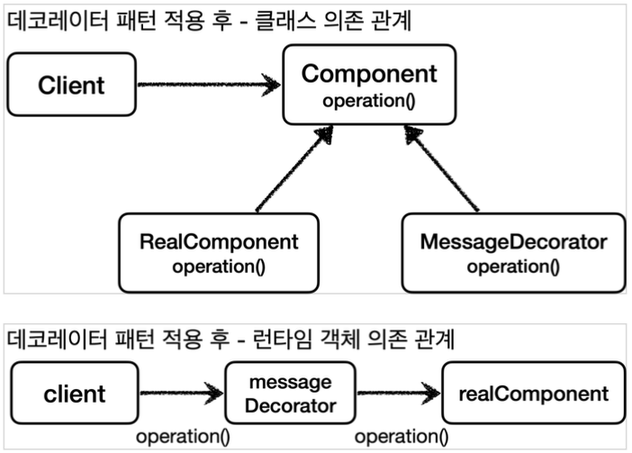


#### MessageDecorator (테스트 코드 하위)

``` java
package hello.proxy.pureproxy.decorator.code;

import lombok.extern.slf4j.Slf4j;

@Slf4j
public class MessageDecorator implements Component{

    private Component component;

    public MessageDecorator(Component component) {
        this.component = component;
    }

    @Override
    public String operation() {
        log.info("MessageDecorator 실행");

        String result = component.operation();
        String decoResult = "*****" + result + "*****";
        log.info("MessageDecorator 꾸미기 전용 전={}, 적용 후={}", result, decoResult);
        
        return decoResult;
    }
   
}
```

MessageDecorator는 Component 인터페이스를 구현한다.

프록시가 호출해야 하는 대상을 component 에 저장한다.

opertaion() 을 호출하면 프록시와 연결된 대상을 호출(component.operation()) 하고, 그 응답값에 `*****` 을 더해서 꾸며준 다음 반환한다.

예를 들어서 응답 값이 data 라면 다음과 같다.

- 꾸미기 전: `data`
- 꾸민 후: `*****data*****`


#### DecoratorPatternTest - 추가

``` java
@Test
void decorator1() {
  Component realComponent = new RealComponent();
  Component messageDecorator = new MessageDecorator(realComponent);
  DecoratorPatternClient client = new DecoratorPatternClient(messageDecorator);
  client.execute();
}
```

`client -> messageDecorator -> realComponent` 의 객체 의존 관계를 만들고 `client.execute()` 를 호출한다.

```
## 실행결과
MessageDecorator - MessageDecorator 실행
RealComponent - RealComponent 실행
MessageDecorator - MessageDecorator 꾸미기 전용 전=data, 적용 후=*****data*****
DecoratorPatternClient - result=*****data*****
```

실행 결과를 보면 `MessageDecorator` 가 `RealComponent` 를 호출하고 반환한 응답 메시지를 꾸며서 반환한 것을 확인할 수 있다.


## 데코레이터 패턴 - 예제 코드3

#### 실행 시간을 측정하는 데코레이터

이번에는 기존 데코레이터에 더해서 실행 시간을 측정하는 기능까지 추가해보자.

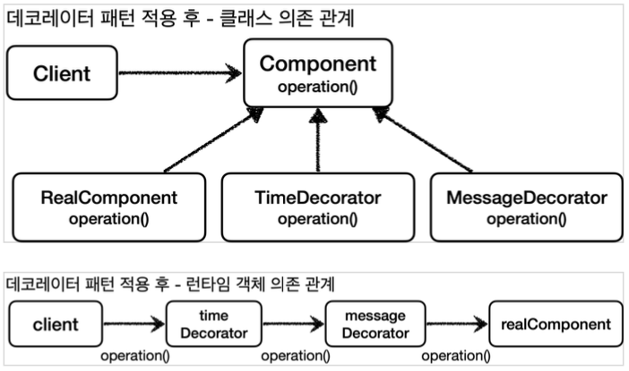


#### TimeDecorator (테스트 코드 하위)

``` java
package hello.proxy.pureproxy.decorator.code;

import lombok.extern.slf4j.Slf4j;

@Slf4j
public class TimeDecorator implements Component{

    private Component component;

    public TimeDecorator(Component component) {
        this.component = component;
    }

    @Override
    public String operation() {
        log.info("TimeDecorator 실행");
        long startTime = System.currentTimeMillis();

        String result = component.operation();

        long endTime = System.currentTimeMillis();
        long resultTime = endTime - startTime;
        log.info("TimeDecorator 종료 resultTime={}ms", resultTime);
        return result;
    }
}
```

TimeDecorator 는 실행 시간을 측정하는 부가 기능을 제공한다. 대상을 호출하기 전에 시간을 가지고 있다가, 대상의 호출이 끝나면 호출 시간을 로그로 남겨준다.


#### DecoratorPatternTest - 추가

``` java
@Test
void decorator2() {
  Component realComponent = new RealComponent();
  Component messageDecorator = new MessageDecorator(realComponent);
  Component timeDecorator = new TimeDecorator(messageDecorator);
  DecoratorPatternClient client = new DecoratorPatternClient(timeDecorator);
  client.execute();
}
```

`client -> timeDecorator -> messageDecorator -> realComponent` 의 객체 의존관계를 설정하고 실행한다.


```
## 실행결과
TimeDecorator - TimeDecorator 실행
MessageDecorator - MessageDecorator 실행
RealComponent - RealComponent 실행
MessageDecorator - MessageDecorator 꾸미기 전용 전=data, 적용 후=*****data*****
TimeDecorator - TimeDecorator 종료 resultTime=4ms
DecoratorPatternClient - result=*****data*****
```

실행 결과를 보면 TimeDecorator가 MessageDecorator 를 실행하고 실행 시간을 측정해서 출력한 것을 확인할 수 있다.


## 프록시 패턴과 데코레이터 패턴 정리

### GOF 데코레이터 패턴

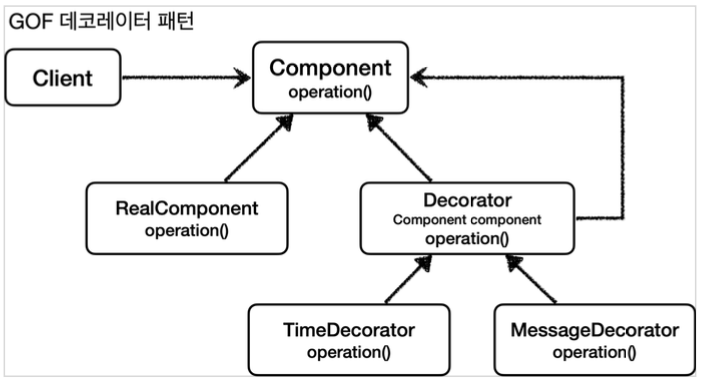

여기서 생각해보면 `Decorator` 기능에 일부 중복이 있다. 꾸며주는 역할을 하는 `Decorator` 들은 스스로 존재할 수 없다. 항상 꾸며줄 대상이 있어야 한다. 따라서 내부에 호출 대상인 component 를 가지고 있어야 한다. 그리고 component를 항상 호출해야 한다. 이 부분이 중복이다. 이런 중복을 제거하기 위해 component를 속성으로 가지고 있는 `Decorator` 라는 추상 클래스를 만드는 방법도 고민할 수 있다. 이렇게 하면 추가로 클래스 다이어그램에서 어떤 것이 실제 컴포넌트 인지, 데코레이터인지 명확하게 구분할 수 있다. 여기까지 고민한 것이 바로 GOF 에서 설명하는 데코레이터 패턴의 기본 예제이다.


#### 프록시 패턴 vs 데코레이터 패턴

- Decorator 라는 추상 클래스를 만들어야 데코레이터 패턴일까?
- 프록시 패턴과 데코레이터 패턴은 그 모양이 거의 비슷한 것 같은데?


#### 의도(intent)

사실 프록시 패턴과 데코레이터 패턴은 그 모양이 거의 같고, 상황에 따라 정말 똑같을 때도 있다. 그러면 둘을 어떻게 구분하는 것일까?

디자인 패턴에서 중요한 것은 해당 패턴의 겉모양이 아니라 그 패턴을 만든 의도가 더 중요하다. 따라서 의도에 따라 패턴을 구분한다.

- 프록시 패턴 의도: 다른 개체에 대한 접근을 제어하기 위해 대리자를 제공
- 데코레이터 패턴의 의도: 객체에 추가 책임(기능)을 동적으로 추가하고, 기능 확장을 위한 유연한 대안 제공


#### 정리

프록시를 사용하고 해당 프록시가 접근 제어가 목적이라면 프록시 패턴이고, 새로운 기능을 추가하는 것이 목적이라면 데코레이터 패턴이 된다.


## 인터페이스 기반 프록시 - 적용

인터페이스와 구현체가 있는 V1 App에 지금까지 학습한 프록시를 도입해서 `LogTrace` 를 사용해보자.

프록시를 사용하면 기존 코드를 전혀 수정하지 않고 로그 추적 기능을 도입할 수 있다.


#### V1 기본 클래스 의존 관계

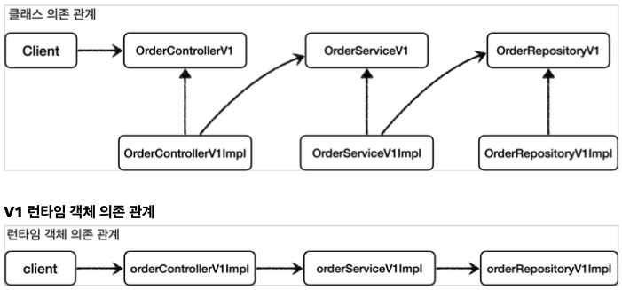


여기에 로그 추적용 프록시를 추가하면 다음과 같다.

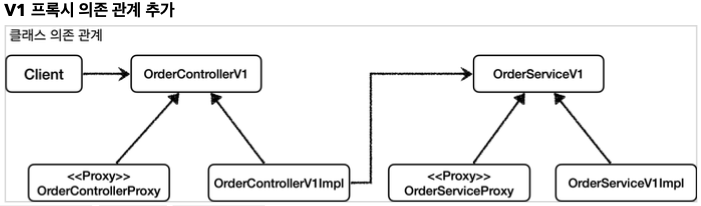

Controller, Service, Repository 각각 인터페이스에 맞는 프록시 구현체를 추가한다. (그림에서 리포지토리는 생략했다.)


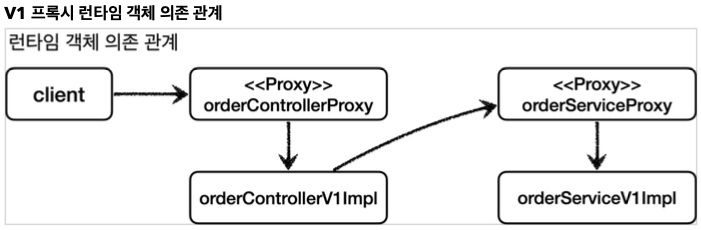

그리고 애플리케이션 실행 시점에 프록시를 사용하도록 의존 관계를 설정해주어야 한다. 이 부분은 빈을 등록하는 설정 파일을 활용하면 된다. (그림에서 리포지토리는 생략했다.)


#### OrderRepositoryInterfaceProxy

``` java
package hello.proxy.config.v1_proxy.interface_proxy;

import hello.proxy.app.v1.OrderRepositoryV1;
import hello.proxy.trace.TraceStatus;
import hello.proxy.trace.logtrace.LogTrace;
import lombok.RequiredArgsConstructor;

@RequiredArgsConstructor
public class OrderRepositoryInterfaceProxy implements OrderRepositoryV1 {

    private final OrderRepositoryV1 target;
    private final LogTrace logTrace;

    @Override
    public void save(String itemId) {

        TraceStatus status = null;
        try {
            status = logTrace.begin("OrderRepository.svae()");
            // target 호출
            target.save(itemId);
            logTrace.end(status);
        } catch (Exception e) {
            logTrace.exception(status, e);
            throw e;
        }
    }
}
```

- 프록시를 만들기 위해 인터페이스를 구현하고 구현한 메서드에 `LogTrace` 를 사용하는 로직을 추가한다. 지금까지는 `OrderRepositoryImpl` 에 이런 로직을 모두 추가해야했다. 프록시를 사용한 덕분에 이 부분을 프록시가 대신 처리해준다. 따라서 `OrderRepositoryImpl` 코드를 변경하지 않아도 된다.
- `OrderRepositoryV1 target` : 프록시가 실제 호출할 원본 리포지토리의 참조를 가지고 있어야 한다.


#### OrderServiceInterfaceProxy

``` java
package hello.proxy.config.v1_proxy.interface_proxy;

import hello.proxy.app.v1.OrderServiceV1;
import hello.proxy.trace.TraceStatus;
import hello.proxy.trace.logtrace.LogTrace;
import lombok.RequiredArgsConstructor;

@RequiredArgsConstructor
public class OrderServiceInterfaceProxy implements OrderServiceV1 {

    private final OrderServiceV1 target;
    private final LogTrace logTrace;
    
    @Override
    public void orderItem(String itemId) {

        TraceStatus status = null;
        try {
            status = logTrace.begin("OrderService.orderItem()");
            // target 호출
            target.orderItem(itemId);
            logTrace.end(status);
        } catch (Exception e) {
            logTrace.exception(status, e);
            throw e;
        }
    }
}
```


#### OrderControllerInterfaceProxy

``` java
package hello.proxy.config.v1_proxy.interface_proxy;

import hello.proxy.app.v1.OrderControllerV1;
import hello.proxy.trace.TraceStatus;
import hello.proxy.trace.logtrace.LogTrace;
import lombok.RequiredArgsConstructor;

@RequiredArgsConstructor
public class OrderControllerInterfaceProxy implements OrderControllerV1 {
    
    private final OrderControllerV1 target;
    private final LogTrace logTrace;
    
    @Override
    public String request(String itemId) {

        TraceStatus status = null;
        try {
            status = logTrace.begin("OrderController.request()");
            // target 호출
            String result = target.request(itemId);
            logTrace.end(status);
            return result;
        } catch (Exception e) {
            logTrace.exception(status, e);
            throw e;
        }
    }

    @Override
    public String noLog() {
        return target.noLog();
    }
}
```

- `noLog()` 메서드는 로그를 남기지 않아야 한다. 따라서 별도의 로직 없이 단순히 target 을 호출하면 된다.


#### InterfaceProxyConfig

``` java
package hello.proxy.config.v1_proxy;

import hello.proxy.app.v1.OrderControllerV1;
import hello.proxy.app.v1.OrderControllerV1Impl;
import hello.proxy.app.v1.OrderRepositoryV1;
import hello.proxy.app.v1.OrderRepositoryV1Impl;
import hello.proxy.app.v1.OrderServiceV1;
import hello.proxy.app.v1.OrderServiceV1Impl;
import hello.proxy.config.v1_proxy.interface_proxy.OrderControllerInterfaceProxy;
import hello.proxy.config.v1_proxy.interface_proxy.OrderRepositoryInterfaceProxy;
import hello.proxy.config.v1_proxy.interface_proxy.OrderServiceInterfaceProxy;
import hello.proxy.trace.logtrace.LogTrace;
import org.springframework.context.annotation.Bean;
import org.springframework.context.annotation.Configuration;

@Configuration
public class InterfaceProxyConfig {

    @Bean
    public OrderControllerV1 orderController(LogTrace logTrace) {
        OrderControllerV1Impl controllerImpl = new OrderControllerV1Impl(orderService(logTrace));
        return new OrderControllerInterfaceProxy(controllerImpl, logTrace);
    }

    @Bean
    public OrderServiceV1 orderService(LogTrace logTrace) {
        OrderServiceV1Impl serviceImpl = new OrderServiceV1Impl(orderRepository(logTrace));
        return new OrderServiceInterfaceProxy(serviceImpl, logTrace);
    }

    @Bean
    public OrderRepositoryV1 orderRepository(LogTrace logTrace) {
        OrderRepositoryV1Impl repositoryImpl = new OrderRepositoryV1Impl();
        return new OrderRepositoryInterfaceProxy(repositoryImpl, logTrace);
    }
}
```

LogTrace 가 아직 스프링 빈으로 등록되어 있지 않은데, 이 부분은 바로 다음에 등록할 것이다.


#### V1 프록시 런타임 객체 의존 관계 설정

- 이제 프록시의 런타임 객체 의존 관계를 설정하면 된다. 기존에는 스프링 빈이 `orderControllerV1Impl`, `orderServiceImpl` 같은 실제 객체를 반환했다. 하지만 이제는 프록시를 사용해야한다. 따라서 프록시를 생성하고 프록시를 실제 스프링 빈 대신 등록한다. 실제 객체는 스프링 빈으로 등록하지 않는다.
- 프록시는 내부에 실제 객체를 참조하고 있다. 예를 들어서 `OrderServiceInterfaceProxy` 는 내부에 실제 대상 객체인 `OrderServiceV1Impl` 을 가지고 있다.
- 정리하면 다음과 같은 의존 관계를 가지고 있다.
  - proxy -> target
  - orderServiceInterfaceProxy -> orderServiceV1Impl
- 스프링 빈으로 실제 객체 대신에 프록시 객체를 등록했기 떄문에 앞으로 스프링 빈을 주입 받으면 실제 객체 대신에 프록시 객체가 주입된다.
- 실제 객체가 스프링 빈으로 등록되지 않는다고 해서 사라지는 것은 아니다. 프록시 객체가 실제 객체를 참조하기 떄문에 프록시를 통해서 실제 객체를 호출한다. 쉽게 이야기해서 프록시 객체 안에 실제 객체가 있는 것이다.

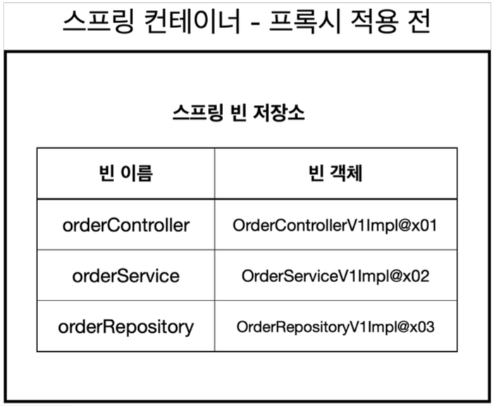

`AppV1Config` 를 통해 프록시를 적용하기 전

- 실제 객체가 스프링 빈으로 등록된다. 빈 객체의 마지막에 `@x0..` 라고 해둔 것은 인스턴스라는 뜻이다.


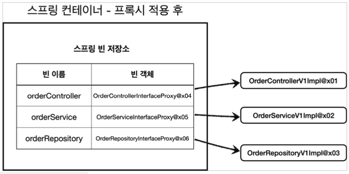

`InterfaceProxyConfig` 를 통해 프록시를 적용한 후

- **스프링 컨테이너에 프록시 객체가 등록된다. 스프링 컨테이너는 이제 실제 객체가 아니라 프록시 객체를 스프링 빈으로 관리한다.**
- 이제 실제 객체는 스프링 컨테이너와는 상관 없다. 실제 객체는 프록시 객체를 통해서 참조될 뿐이다.
- 프ㅁ록시 객체는 스프링 컨테이너가 관리하고 자바 힙 메모리에도 올라간다. 반면에 실제 객체는 자바 힙 메모리에는 올라가지만 스프링 컨테이너가 관리하지는 않는다.


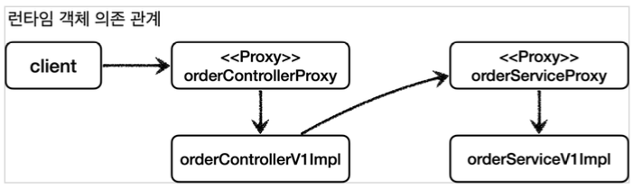

최종적으로 이런 런타임 객체 의존관계가 발생한다. (리포지토리는 생략)


#### ProxyApplication

``` java
package hello.proxy;

import hello.proxy.config.v1_proxy.InterfaceProxyConfig;
import hello.proxy.trace.logtrace.LogTrace;
import hello.proxy.trace.logtrace.ThreadLocalLogTrace;
import org.springframework.boot.SpringApplication;
import org.springframework.boot.autoconfigure.SpringBootApplication;
import org.springframework.context.annotation.Bean;
import org.springframework.context.annotation.Import;

//@Import({AppV1Config.class, AppV2Config.class})
@Import(InterfaceProxyConfig.class)
@SpringBootApplication(scanBasePackages = "hello.proxy.app") // 주의
public class ProxyApplication {

	public static void main(String[] args) {
		SpringApplication.run(ProxyApplication.class, args);
	}

	@Bean
	public LogTrace logTrace() {
		return new ThreadLocalLogTrace();
	}
}
```

- @Bean: 먼저 LogTrace 스프링 빈 추가를 먼저 해주어야 한다. 이것을 여기에 등록한 이유는 앞으로 사용할 모든 예제에서 함께 사용하기 위해서다.
- `@Import(InterfaceProxyConfig.class)` : 프록시를 적용한 설정 파일을 사용하자.
- 실행 : http://localhost:8080/v1/request?itemId=hello


#### 실행 결과 - 로그

```
[65b39db2] OrderController.request()
[65b39db2] |-->OrderService.orderItem()
[65b39db2] |   |-->OrderRepository.save()
[65b39db2] |   |<--OrderRepository.save() time=1002ms
[65b39db2] |<--OrderService.orderItem() time=1002ms
[65b39db2] OrderController.request() time=1003ms
```


### 정리

추가된 요구사항

- ~~원본 코드를 전혀 수정하지 않고, 로그 추적기를 적용해라~~
- ~~특정 메서드는 로그를 출력하지 않는 기능~~
  - ~~보안상 일부는 로그를 출력하면 안된다.~~
- 다음과 같은 다양한 케이스에 적용할 수 있어야 한다.
  - ~~v1 - 인터페이스가 있는 구현 클래스에 적용~~
  - v2 - 인터페이스가 없는 구체 클래스에 적용
  - v3 - 컴포넌트 스캔 대상에 기능 적용

프록시와 DI 덕분에 원본 코드를 전혀 수정하지 않고 로그 추적기를 도입할 수 있었다. 물론 너무 많은 프록시 클래스를 만들어야하는 단점이 있기는 하다. 이 부분은 나중에 해결하기로 하고, 우선은 v2 - 인터페이스가 없는 구체 클래스에 프록시를 어떻게 적용할 수 있는지 알아보자.


## 구체 클래스 기반 프록시 - 예제1

다음에 보이는 `ConcreteLogic` 은 인터페이스가 없고 구체 클래스만 있다. 이렇게 인터페이스가 없어도 프록시를 적용할 수 있을까?

먼저 프록시를 도입하기 전에 기본 코드를 작성해보자.


#### ConcreteLogic (테스트 코드 하위)

``` java
package hello.proxy.pureproxy.concreteproxy.code;

import lombok.extern.slf4j.Slf4j;

@Slf4j
public class ConcreteLogic {
    public String operation() {
        log.info("ConcreteLogic 실행");
        return "data";
    }
}
```

`ConcreteLogic` 은 인터페이스가 없고, 구체 클래스만 있다. 여기에 프록시를 도입해야 한다.

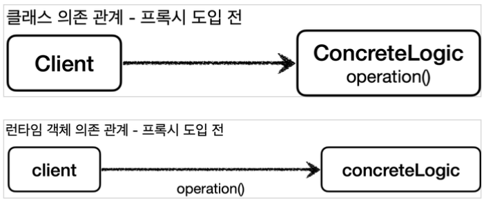


#### ConcreteClient (테스트 코드 하위)

``` java
package hello.proxy.pureproxy.concreteproxy.code;

public class ConcreteClient {

    private ConcreteLogic concreteLogic;

    public ConcreteClient(ConcreteLogic concreteLogic) {
        this.concreteLogic = concreteLogic;
    }
    
    public void execute() {
        concreteLogic.operation();
    }
}
```


#### ConcreteProxyTest

``` java
package hello.proxy.pureproxy.concreteproxy;

import hello.proxy.pureproxy.concreteproxy.code.ConcreteClient;
import hello.proxy.pureproxy.concreteproxy.code.ConcreteLogic;
import org.junit.jupiter.api.Test;

public class ConcreteProxyTest {
    
    @Test
    void noProxy() {
        ConcreteLogic concreteLogic = new ConcreteLogic();
        ConcreteClient client = new ConcreteClient(concreteLogic);
        client.execute();
    }
}
```


## 구체 클래스 기반 프록시 - 예제2

### 클래스 기반 프록시 도입

지금까지 인터페이스를 기반으로 프록시를 도입했다. 그런데 자바의 다형성은 인터페이스를 구현하든, 아니면 클래스를 상속하든 상위 타입만 맞으면 다형성이 적용된다. 쉽게 이야기해서 인터페이스가 없어도 프록시를 만들 수 있다는 뜻이다. 그래서 이번에는 인터페이스가 아니라 클래스를 기반으로 상속을 받아서 프록시를 만들어보겠다.

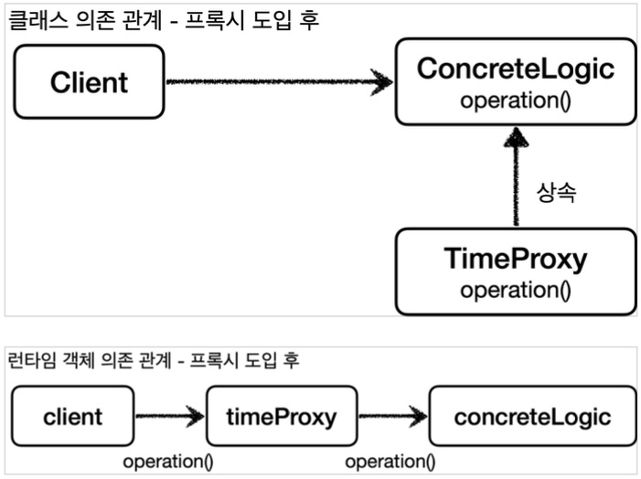


#### TimeProxy (테스트 코드 하위)

``` java
package hello.proxy.pureproxy.concreteproxy.code;

import lombok.extern.slf4j.Slf4j;

@Slf4j
public class TimeProxy extends ConcreteLogic{
    private ConcreteLogic realLogic;

    public TimeProxy(ConcreteLogic realLogic) {
        this.realLogic = realLogic;
    }

    @Override
    public String operation() {
        log.info("TimeDecorator 실행");
        long startTime = System.currentTimeMillis();

        String result = realLogic.operation();
        
        long endTime = System.currentTimeMillis();
        long resultTime = endTime - startTime;
        log.info("TimeDecorator 종료 resultTime={}", resultTime);
        return result;
    }
}
```

`TimeProxy` 프록시는 시간을 측정하는 부가 기능을 제공한다. 그리고 인터페이스가 아니라 클래스인 `ConcretLogic` 를 상속 받아서 만든다.


#### ConcreteProxyTest - addProxy() 추가

``` java
@Test
void addProxy() {
  ConcreteLogic concreteLogic = new ConcreteLogic();
  TimeProxy timeProxy = new TimeProxy(concreteLogic);
  ConcreteClient client = new ConcreteClient(timeProxy);
  client.execute();
}
```

여기서 핵심은 `ConcreteClient` 의 생성자에 `concreteLogic` 이 아니라 `timeProxy` 를 주입하는 부분이다.

`ConcreteClient` 는 `ConcreteLogic` 을 의존하는데, 다형성에 의해 `ConcreteLogic` 에 `concreteLogic` 도 들어갈 수 있고, `timeProxy` 도 들어갈 수 있다.


#### ConcretLogic 에 할당할 수 있는 객체

- ConcreteLogic = concreteLogic (본인과 같은 타입을 할당)
- ConcreteLogic = timeProxy (자식 타입을 할당)


#### ConcreteClient 참고

``` java
public class ConcreteClient {
  private ConcreteLogic concreteLogic; // ConcreteLogic, TimeProxy 모두 주입 가능
  
  public ConcreteClient(ConcreteLogic concreteLogic) {
    this.concreteLogic = concreteLogic;
  }
  
  public void execute() {
    concreteLogic.opertaion();
  }
}
```

```
## 실행결과
TimeDecorator 실행
ConcreteLogic 실행
TimeDecorator 종료 resultTime=1
```

실행 결과를 보면 인터페이스가 없어도 클래스 기반의 프록시가 잘 적용된 것을 확인할 수 있다.

> [참고]
>
> 자바 언어에서 다형성은 인터페이스나 클래스를 구분하지 않고 모두 적용된다. 해당 타입과 그 탕비의 하위 타입은 모두 다형성의 대상이 된다. 자바 언어의 너무 기본적인 내용을 이야기했지만, 인터페이스가 없어도 프록시가 가능하다는 것을 확실하게 집고 넘어갈 필요가 있어서 자세히 설명했다.


## 구체 클래스 기반 프록시 - 적용

구체 클래스만 있는 V2 애플리케이션에 프록시 기능을 적용해보자.

#### OrderRepositoryConcreteProxy

``` java
package hello.proxy.config.v1_proxy.concrete_proxy;

import hello.proxy.app.v2.OrderRepositoryV2;
import hello.proxy.trace.TraceStatus;
import hello.proxy.trace.logtrace.LogTrace;

public class OrderRepositoryConcreteProxy extends OrderRepositoryV2 {

    private final OrderRepositoryV2 target;
    private final LogTrace logTrace;

    public OrderRepositoryConcreteProxy(OrderRepositoryV2 target, LogTrace logTrace) {
        this.target = target;
        this.logTrace = logTrace;
    }

    @Override
    public void save(String itemId) {
        TraceStatus status = null;

        try {
            status = logTrace.begin("OrderRepository.save()");
            // target 호출
            target.save(itemId);
            logTrace.end(status);
        } catch (Exception e) {
            logTrace.exception(status, e);
            throw e;
        }
    }
}
```

인터페이스가 아닌 `OrderRepositoryV2` 클래스를 상속 받아서 프록시를 만든다.


#### OrderServiceConcreteProxy

``` java
package hello.proxy.config.v1_proxy.concrete_proxy;

import hello.proxy.app.v2.OrderRepositoryV2;
import hello.proxy.app.v2.OrderServiceV2;
import hello.proxy.trace.TraceStatus;
import hello.proxy.trace.logtrace.LogTrace;

public class OrderServiceConcreteProxy extends OrderServiceV2 {
    
    private final OrderServiceV2 target;
    private final LogTrace logTrace;

    public OrderServiceConcreteProxy(OrderServiceV2 target, LogTrace logTrace) {
        super(null);
        this.target = target;
        this.logTrace = logTrace;
    }

    @Override
    public void orderItem(String itemId) {
        TraceStatus status = null;
        try {
            status = logTrace.begin("OrderService.orderItem()");
            // target 호출
            target.orderItem(itemId);
            logTrace.end(status);
        } catch (Exception e) {
            logTrace.exception(status, e);
            throw e;
        }
    }
}
```

- 인터페이스가 아닌 `OrderServiceV2` 클래스를 상속 받아서 프록시를 만든다.


### 클래스 기반 프록시의 단점

- `super(null)` : 자바 기본 문법에 의해 자식 클래스를 생성할 때는 항상 super() 로 부모 클래스의 생성자를 호출해야 한다. 이 부분을 생략하면 기본 생성자가 호출된다. 그런데 부모 클래스인 OrderServiceV2 는 기본 생성자가 없고, 생성자에서 파라미터 1개를 필수로 받는다. 따라서 파라미터를 넣어서 super(..) 를 호출해야 한다.
- 프록시는 부모 객체의 기능을 사용하지 않기 때문에 super(null) 을 입력해도 된다.
- 인터페이스 기반 프록시는 이런 고민을 하지 않아도 된다.


#### OrderServiceV2 의 생성자 - 참고

``` java
public OrderServiceV2(OrderRepositoryV2 orderRepository) {
  this.orderRepository = orderRepository;
}
```


#### OrderControllerConcreteProxy

``` java
package hello.proxy.config.v1_proxy.concrete_proxy;

import hello.proxy.app.v2.OrderControllerV2;
import hello.proxy.trace.TraceStatus;
import hello.proxy.trace.logtrace.LogTrace;

public class OrderControllerConcreteProxy extends OrderControllerV2 {
    
    private final OrderControllerV2 target;
    private final LogTrace logTrace;

    public OrderControllerConcreteProxy(OrderControllerV2 target, LogTrace logTrace) {
        super(null);
        this.target = target;
        this.logTrace = logTrace;
    }

    @Override
    public String request(String itemId) {
        TraceStatus status = null;
        try {
            status = logTrace.begin("OrderController.request()");
            // target 호출
            String result = target.request(itemId);
            logTrace.end(status);
            return result;
        } catch (Exception e) {
            logTrace.exception(status, e);
            throw e;
        }
    }
}
```


#### ConcreteProxyConfig

``` java
package hello.proxy.config.v1_proxy;

import hello.proxy.app.v2.OrderControllerV2;
import hello.proxy.app.v2.OrderRepositoryV2;
import hello.proxy.app.v2.OrderServiceV2;
import hello.proxy.config.v1_proxy.concrete_proxy.OrderControllerConcreteProxy;
import hello.proxy.config.v1_proxy.concrete_proxy.OrderRepositoryConcreteProxy;
import hello.proxy.config.v1_proxy.concrete_proxy.OrderServiceConcreteProxy;
import hello.proxy.trace.logtrace.LogTrace;
import org.springframework.context.annotation.Bean;
import org.springframework.context.annotation.Configuration;

@Configuration
public class ConcreteProxyConfig {

    @Bean
    public OrderControllerV2 orderControllerV2(LogTrace logTrace) {
        OrderControllerV2 controllerImpl = new OrderControllerV2(orderServiceV2(logTrace));
        return new OrderControllerConcreteProxy(controllerImpl, logTrace);
    }

    @Bean
    public OrderServiceV2 orderServiceV2(LogTrace logTrace) {
        OrderServiceV2 serviceImpl = new OrderServiceV2(orderRepositoryV2(logTrace));
        return new OrderServiceConcreteProxy(serviceImpl, logTrace);
    }

    @Bean
    public OrderRepositoryV2 orderRepositoryV2(LogTrace logTrace) {
        OrderRepositoryV2 repositoryImpl = new OrderRepositoryV2();
        return new OrderRepositoryConcreteProxy(repositoryImpl, logTrace);
    }
}
```


#### ProxyApplication

``` java
package hello.proxy;

import hello.proxy.config.v1_proxy.ConcreteProxyConfig;
import hello.proxy.config.v1_proxy.InterfaceProxyConfig;
import hello.proxy.trace.logtrace.LogTrace;
import hello.proxy.trace.logtrace.ThreadLocalLogTrace;
import org.springframework.boot.SpringApplication;
import org.springframework.boot.autoconfigure.SpringBootApplication;
import org.springframework.context.annotation.Bean;
import org.springframework.context.annotation.Import;

//@Import({AppV1Config.class, AppV2Config.class})
//@Import(InterfaceProxyConfig.class)
@Import(ConcreteProxyConfig.class)
@SpringBootApplication(scanBasePackages = "hello.proxy.app") // 주의
public class ProxyApplication {

	public static void main(String[] args) {
		SpringApplication.run(ProxyApplication.class, args);
	}

	@Bean
	public LogTrace logTrace() {
		return new ThreadLocalLogTrace();
	}
}
```

- 실행: http://localhost:8080/v2/request?itemId=hello


## 인터페이스 기반 프록시와 클래스 기반 프록시

### 프록시

프록시를 사용한 덕분에 원본 코드를 전혀 변경하지 않고, V1, V2 애플리케이션에 LogTrace 기능을 적용할 수 있었다.


### 인터페이스 기반 프록시 vs 클래스 기반 프록시

- 인터페이스가 없어도 클래스 기반으로 프록시를 생성할 수 있다.
- 클래스 기반 프록시는 해당 클래스에만 적용할 수 있다. 인터페이스 기반 프록시는 인터페이스만 같으면 모든 곳에 적용할 수 있다.
- 클래스 기반 프록시는 상속을 사용하기 때문에 몇 가지 제약이 있다.
  - 부모 클래스의 생성자를 호출해야 한다.
  - 클래스에 final 키워드가 붙으면 상속이 불가능하다.
  - 메서드에 final 키워드가 붙으면 해당 메서드를 오버라이딩 할 수 있다.

이렇게 보면 인터페이스 기반의 프록시가 더 좋아보인다. 맞다. 인터페이스 기반의 프록시는 상속이라는 제약에서 자유롭다. 프로그래밍 관점에서도 인터페이스를 사용하는 것이 역할과 구현을 명확하게 나누기 때문에 더 좋다.

인터페이스 기반 프록시의 단점은 인터페이스가 필요하다는 그 자체이다. 인터페이스가 없으면 인터페이스 기반 프록시를 만들 수 없다.

> [참고]
>
> 인터페이스 기반 프록시는 캐스팅 관련해서 단점이 있는데, 이 내용은 뒷부분에...

이론적으로는 모든 객체에 인터페이스를 도입해서 역할과 구현을 나누는 것이 좋다. 이렇게 하면 역할과 구현을 나눠서 구현체를 매우 편리하게 변경할 수 있다. 하지만 실제로는 구현을 거의 변경할 일이 없는 클래스도 많다.

인터페이스를 도입하는 것은 구현을 변경할 가능성이 있을 때 효과적인데, 구현을 변경할 가능성이 거의 없는 코드에 무작정 인터페이스를 사용하는 것은 번거롭고 그렇게 실용적이지 않다. 이런곳에는 실용적인 관점에서 인터페이스를 사용하지 않고 구체 클래스를 바로 사용하는 것이 좋다 생각한다. (물론 인터페이스를 도입하는 다양한 이유가 있다. 여기서 핵심은 인터페이스가 항상 필요하지 않다는 것이다.)


### 결론

실무에서는 프록시를 적용할 때 V1 처럼 인터페이스도 있고, V2처럼 구체 클래스도 있다. 따라서 2가지 상황을 모두 대응할 수 있어야 한다.


### 너무 많은 프록시 클래스

지금까지 프록시를 사용해서 기존 코드를 변경하지 않고, 로그 추적기라는 부가 기능을 적용할 수 있었다. 그런데 문제는 프록시 클래스를 너무 많이 만들어야 한다는 점이다. 잘 보면 프록시 클래스가 하는 일은 LogTrace 를 사용하는 것인데, 그 로직이 모두 똑같다. 대상 클래스만 다를 뿐이다. 만약 적용해야 하는 대상 클래스가 100개라면 프록시 클래스도 100개를 만들어야 한다. 이는 바로 다음 강의인 동적 프록시 기술이 이 문제를 해결해준다.

