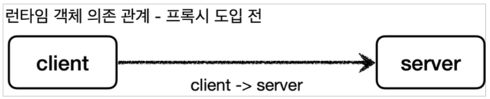

# Section 4. 프록시 패턴과 데코레이터 패턴

## 예제 프로젝트 만들기 V1

예제는 크게 3가지 상황으로 만든다.

- v1: 인터페이스와 구현 클래스 - 스프링 빈으로 수동 등록
- v2: 인터페이스 없는 구현체 클레스 - 스프링 빈으로 수동 등록
- v3: 컴포넌트 스캔트로 스프링 빈 자동 등록

실무에서는 스프링 빈으로 등록할 클래스는 인터페이스가 있는 경우도 있고 없는 경우도 있다. 그리고 스프링 빈을 수동으로 직접 등록하는 경우도 있고, 컴포넌트 스캔으로 자동으로 등록하는 경우도 있다. 이런 다양한 케이스에 프록시를 어떻게 적용하는지 알아보기 위해 다양한 예제를 준비해보자.


### v1 - 인터페이스와 구현 클래스 - 스프링 빈으로 수동 등록

지금까지 보아왔던 `Controller`, `Service`, `Repository` 에 인터페이스를 도입하고, 스프링 빈으로 수동 등록해보자.


#### OrderRepositoryV1

``` java
package hello.proxy.app.v1;

public interface OrderRepositoryV1 {
    void save(String itemId);
}
```


#### OrderRepositoryV1Impl

``` java
package hello.proxy.app.v1;

public class OrderRepositoryV1Impl implements OrderRepositoryV1 {

    @Override
    public void save(String itemId) {
        // 저장 로직
        if (itemId.equals("ex")) {
            throw new IllegalStateException("예외 발생!");
        }
        sleep(1000);
    }

    private void sleep(int millis) {
        try {
            Thread.sleep(millis);
        } catch (InterruptedException e) {
            e.printStackTrace();
        }
    }
}
```


#### OrderServiceV1

``` java
package hello.proxy.app.v1;

public interface OrderServiceV1 {
    void orderItem(String itemId);
}
```


#### OrderServiceV1Impl

``` java
package hello.proxy.app.v1;

public class OrderServiceV1Impl implements OrderServiceV1 {

    private final OrderRepositoryV1 orderRepository;

    public OrderServiceV1Impl(OrderRepositoryV1 orderRepositoryV1) {
        this.orderRepository = orderRepositoryV1;
    }

    @Override
    public void orderItem(String itemId) {
        orderRepository.save(itemId);
    }
}
```


#### OrderControllerV1

``` java
package hello.proxy.app.v1;

import org.springframework.web.bind.annotation.GetMapping;
import org.springframework.web.bind.annotation.RequestMapping;
import org.springframework.web.bind.annotation.RequestParam;
import org.springframework.web.bind.annotation.ResponseBody;

@RequestMapping // 스프링은 @Controller 또는 @RequestMapping 이 있어야 스프링 컨트롤러로 인식
@ResponseBody
public interface OrderControllerV1 {

    @GetMapping("/v1/request")
    String request(@RequestParam("itemId") String itemId);

    @GetMapping("/v1/no-log")
    String noLog();
}
```

- `@RequestMapping`: 스프링 MVC는 타입에 `@Controller` 또는 `@RequestMapping` 어노테이션이 있어야 스프링 컨트롤러로 인식한다. 그리고 스프링 컨트롤러로 인식해야 HTTP URL이 매핑되고 동작한다. 이 어노테이션은 인터페이스에 사용해도 된다.
- `@ResponseBody`: HTTP 메시지 컨버터를 사용해서 응답한다. 이 어노테이션은 인터페이스에 사용해도 된다.
- `@RequestParam("itemId") String itemId`: 인터페이스에는 `@RequestParam("itemId")` 의 값을 생략하면 itemId 단어를 컴파일 이후 자바 버전에 따라 인식하지 못할 수 있다. 인터페이스에서는 꼭 넣어주자. 클래스에는 생략해도 대부분 잘 지원된다.
- 코드를 보면 `request()`, `noLog()` 두 가지 메서드가 있다. `request()` 는 `LogTrace` 를 적용할 대상이고, `noLog()` 는 단순히 `LogTrace` 를 적용하지 않을 대상이다.


#### OrderControllerV1Impl

``` java
package hello.proxy.app.v1;

import lombok.extern.slf4j.Slf4j;

@Slf4j
public class OrderControllerV1Impl implements OrderControllerV1{

    private final OrderServiceV1 orderService;

    public OrderControllerV1Impl(OrderServiceV1 orderService) {
        this.orderService = orderService;
    }


    @Override
    public String request(String itemId) {
        orderService.orderItem(itemId);
        return "ok";
    }

    @Override
    public String noLog() {
        return "ok";
    }
}
```

- 컨트롤러 구현체이다. `OrderControllerV1` 인터페이스에 스프링 MVC 관련 어노테이션이 정의되어 있다.


#### AppV1Config

스프링 빈으로 수동 등록

``` java
package hello.proxy.config;

import hello.proxy.app.v1.OrderControllerV1;
import hello.proxy.app.v1.OrderControllerV1Impl;
import hello.proxy.app.v1.OrderRepositoryV1;
import hello.proxy.app.v1.OrderRepositoryV1Impl;
import hello.proxy.app.v1.OrderServiceV1;
import hello.proxy.app.v1.OrderServiceV1Impl;
import org.springframework.context.annotation.Bean;
import org.springframework.context.annotation.Configuration;

@Configuration
public class AppV1Config {

    @Bean
    public OrderControllerV1 orderControllerV1() {
        return new OrderControllerV1Impl(orderServiceV1());
    }
    
    @Bean
    public OrderServiceV1 orderServiceV1() {
        return new OrderServiceV1Impl(orderRepositoryV1());
    }
    
    @Bean
    public OrderRepositoryV1 orderRepositoryV1() {
        return new OrderRepositoryV1Impl();
    }
}
```


#### ProxyApplication - 코드 추가

``` java
package hello.proxy;

import hello.proxy.config.AppV1Config;
import org.springframework.boot.SpringApplication;
import org.springframework.boot.autoconfigure.SpringBootApplication;
import org.springframework.context.annotation.Import;

@Import(AppV1Config.class)
@SpringBootApplication(scanBasePackages = "hello.proxy.app") // 주의
public class ProxyApplication {

	public static void main(String[] args) {
		SpringApplication.run(ProxyApplication.class, args);
	}
}
```

- `@Import(AppV1Config.class)` : 클래스를 스프링 빈으로 등록한다. 여기서는 `AppV1Config.class` 를 스프링 빈으로 등록한다. 일반적으로 `@Configuration` 같은 설정파일을 등록할 때 사용하지만, 스프링 빈을 등록할 때도 사용할 수 있다.
- `@SpringBootApplication(scanBasePackages = "hello.proxy.app")` : `@ComponentScan` 의 기능과 같다. 컴포넌트 스캔을 시작할 위치를 지정한다. 이 값을 설정하면 해당 패키지와 그 하위 패키지를 컴포넌트 스캔한다. 이 값을 사용하지 않으면 ProxyApplication 이 있는 패키지와 그 하위 패키지를 스캔한다. 참고로 V3 에서 지금 설정한 컴포넌트 스캔 기능을 사용한다.

> [주의]
>
> 강의에서는 `@Configuration` 을 사용한 수동 빈 등록 설정을 `hello.proxy.config` 위치에 두고 점진적으로 변경할 예정이다. 지금은 `AppV1Config.class` 를 `@Import` 를 사용해서 설정하지만 이후에 다른 것을 설정한다는 이야기이다.
>
> `@Confgiuration` 은 내부에 @Component 어노테이션을 포함하고 있어서 컴포넌트 스캔의 대상이 된다. 따라서 컴포넌트 스캔에 의해 hello.proxy.config 위치의 설정 파일들이 스프링 빈으로 자동 등록 되지 않도록 컴포넌트 스캔의 시작 위치를 `scanBasePackages=hello.proxy.app` 으로 설정해야 한다.

- 실행: http://localhost:8080/v1/request?itemId=hello


## 예제 프로젝트 만들기 v2

### v2 - 인터페이스 없는 구체 클래스 - 스프링 빈으로 수동 등록

이번에는 인터페이스가 없는 Controller, Service, Repository 를 스프링 빈으로 수동 등록해보자.


#### OrderRepositoryV2

``` java
package hello.proxy.app.v2;

public class OrderRepositoryV2 {
    public void save(String itemId) {
        // 저장 로직
        if (itemId.equals("ex")) {
            throw new IllegalStateException("예외 발생!");
        }
        sleep(1000);
    }
    
    private void sleep(int millis) {
        try {
            Thread.sleep(millis);
        } catch (InterruptedException e) {
            e.printStackTrace();
        }
    }
}
```


#### OrderServiceV2

``` java
package hello.proxy.app.v2;

public class OrderServiceV2 {

    private final OrderRepositoryV2 orderRepository;

    public OrderServiceV2(OrderRepositoryV2 orderRepository) {
        this.orderRepository = orderRepository;
    }

    public void orderItem(String itemId) {
        orderRepository.save(itemId);
    }
}
```


#### OrderControllerV2

``` java
package hello.proxy.app.v2;

import lombok.extern.slf4j.Slf4j;
import org.springframework.web.bind.annotation.GetMapping;
import org.springframework.web.bind.annotation.RequestMapping;
import org.springframework.web.bind.annotation.ResponseBody;

@Slf4j
@RequestMapping
@ResponseBody
public class OrderControllerV2 {

    private final OrderServiceV2 orderService;

    public OrderControllerV2(OrderServiceV2 orderService) {
        this.orderService = orderService;
    }

    @GetMapping("/v2/request")
    public String request(String itemId) {
        orderService.orderItem(itemId);
        return "ok";
    }

    @GetMapping("/v2/no-log")
    public String noLog() {
        return "ok";
    }
}
```

- `@RequestMapping` : 스프링MVC는 타입에 @Controller 또는 @RequestMapping 어노테이션이 있어야 스프링 컨트롤러로 인식된다. 그런데 여기서는 @RequestMapping 을 사용하였는데, @Controller 를 사용하게 되면 자동 컴포넌트 스캔의 대상이 되기 때문이다. 여기서는 컴포넌트 스캔을 통한 자동 빈 등록이 아니라 수동 빈 등록을 하는 것이 목표다. 따라서 컴포넌트 스캔과 관계 없는 @RequestMapping 를 타입에 사용했다.


#### AppV2Config

``` java
package hello.proxy.config;

import hello.proxy.app.v2.OrderControllerV2;
import hello.proxy.app.v2.OrderRepositoryV2;
import hello.proxy.app.v2.OrderServiceV2;
import org.springframework.context.annotation.Bean;
import org.springframework.context.annotation.Configuration;

@Configuration
public class AppV2Config {

    @Bean
    public OrderControllerV2 orderControllerV2() {
        return new OrderControllerV2(orderServiceV2());
    }

    @Bean
    public OrderServiceV2 orderServiceV2() {
        return new OrderServiceV2(orderRepositoryV2());
    }

    @Bean
    public OrderRepositoryV2 orderRepositoryV2() {
        return new OrderRepositoryV2();
    }
}
```


#### ProxyApplication

``` java
package hello.proxy;

import hello.proxy.config.AppV1Config;
import hello.proxy.config.AppV2Config;
import org.springframework.boot.SpringApplication;
import org.springframework.boot.autoconfigure.SpringBootApplication;
import org.springframework.context.annotation.Import;

@Import({AppV1Config.class, AppV2Config.class})
@SpringBootApplication(scanBasePackages = "hello.proxy.app") // 주의
public class ProxyApplication {

	public static void main(String[] args) {
		SpringApplication.run(ProxyApplication.class, args);
	}
}
```


## 예제 프로젝트 만들기 v3

### v3 - 컴포넌트 스캔으로 스프링 빈 자동 등록

#### OrderRepositoryV3

``` java
package hello.proxy.app.v3;

import org.springframework.stereotype.Repository;

@Repository
public class OrderRepositoryV3 {

    public void save(String itemId) {
        // 저장 로직
        if (itemId.equals("ex")) {
            throw new IllegalStateException("예외 발생");
        }
        sleep(1000);
    }

    private void sleep(int millis) {
        try {
            Thread.sleep(millis);
        } catch (InterruptedException e) {
            e.printStackTrace();
        }
    }
}
```


#### OrderServiceV3

``` java
package hello.proxy.app.v3;

import org.springframework.stereotype.Service;

@Service
public class OrderServiceV3 {

    private final OrderRepositoryV3 orderRepository;

    public OrderServiceV3(OrderRepositoryV3 orderRepository) {
        this.orderRepository = orderRepository;
    }

    public void orderItem(String itemId) {
        orderRepository.save(itemId);
    }
}
```


#### OrderControllerV3

``` java
package hello.proxy.app.v3;

import lombok.extern.slf4j.Slf4j;
import org.springframework.web.bind.annotation.GetMapping;
import org.springframework.web.bind.annotation.RestController;

@Slf4j
@RestController
public class OrderControllerV3 {

    private final OrderServiceV3 orderService;

    public OrderControllerV3(OrderServiceV3 orderService) {
        this.orderService = orderService;
    }

    @GetMapping("/v3/request")
    public String request(String itemId) {
        orderService.orderItem(itemId);
        return "ok";
    }

    @GetMapping("/v3/no-log")
    public String noLog() {
        return "ok";
    }
}
```

`ProxyApplication` 에서 `@SpringBootApplication(scanBasePackages = "hello.proxy.app")` 를 사용했고, 각각 `@RestController`, `@Service`, `@Repostiory` 어노테이션을 가지고 있기 때문에 컴포넌트 스캔의 대상이 된다.


## 요구사항 추가

### 기존 요구사항

- 모든 PUBLIC 메서드의 호출과 응답 정보를 로그로 출력
- 애플리케이션의 흐름을 변경하면 안됨
  - 로그를 남긴다고 해서 비즈니스 로직의 동작에 영향을 주면 안됨
- 메서드 호출에 걸린 시간
- 정상 흐름과 예외 흐름 구분
  - 예외 발생시 예외 정보가 남아야 함
- 메서드 호출의 깊이 표현
- HTTP 요청을 구분
  - HTTP 요청 단위로 특정 ID를 남겨서 어떤 HTTP 요청에서 시작된 것인지 명확하게 구분이 가능해야 함
  - 트랜잭션 ID (DB 트랜잭션X)

- 예시

  ```
  정상 요청
  [796bccd9] OrderController.request()
  [796bccd9] |-->OrderService.orderItem()
  [796bccd9] |   |-->OrderRepository.save()
  [796bccd9] |   |<--OrderRepository.save() time=1004ms
  [796bccd9] |<--OrderService.orderItem() time=1014ms
  [796bccd9] OrderController.request() time=1016ms
  
  예외 발생
  [b7119f27] OrderController.request()
  [b7119f27] |-->OrderService.orderItem()
  [b7119f27] | |-->OrderRepository.save() 
  [b7119f27] | |<X-OrderRepository.save() time=0ms ex=java.lang.IllegalStateException: 예외 발생! 
  [b7119f27] |<X-OrderService.orderItem() time=10ms ex=java.lang.IllegalStateException: 예외 발생!
  ```

하지만 이 요구사항을 만족하기 위해서 기존 코드를 많이 수정해야 한다. 코드 수정을 최소화 하기 위해 템플릿 메서드 패턴과 콜백 패턴도 사용했지만, 결과적으로 로그를 남기고 싶은 클래스가 수백개라면 수백개의 클래스를 모두 고쳐야 한다. 로그를 남길 때 기존 원본 코드를 변경해야 한다는 사실 그 자체가 개발자에게는 가장 큰 문제로 남는다.


### 요구사항 추가

- 원본 코드를 전혀 수정하지 않고, 로그 추적기를 적용해라.
- 특정 메서드는 로그를 출력하지 않는 기능
  - 보안상 일부는 로그를 출력하면 안된다.
- 다음과 같은 다양한 케이스에 적용할 수 있어야 한다.
  - v1 - 인터페이스가 있는 구현 클래스에 적용
  - v2 - 인터페이스가 없는 구현체 클래스에 적용
  - v3 - 컴포넌트 스캔 대상에 기능 적용

가장 어려운 문제는 원본 코드를 전혀 수정하지 않고, 로그 추적기를 도입하는 것이다. 이 문제를 해결하려면 프록시(Proxy)의 개념을 먼저 이해해야 한다.


## 프록시, 프록시 패턴, 데코레이터 패턴 소개


클라이언트와 서버라고 하면 개발자들은 보통 서버 컴퓨터를 생각한다.

사실 클라이언트와 서버의 개념은 상당히 넓게 사용된다. 클라이언트는 의뢰인이라는 뜻이고, 서버는 '서비스나 상품을 제공하는 사람이나 물건' 을 뜻한다. 따라서 클라이언트와 서버의 기본 개념을 정의하면 클라이언트는 서버에 필요한 것을 요청하고, 서버는 클라이언트의 요청을 처리하는 것이다.

이 개념을 우리가 익숙한 컴퓨터 네트워크에 도입하면 클라이언트는 웹 브라우저가 되고, 요청을 처리하는 서버는 웹 서버가 된다. 이 개념을 객체에 도입하면, 요청하는 객체는 클라이언트가 되고, 요청을 처리하는 객체는 서버가 된다.


### 직접 호출과 간접 호출


클라이언트와 서버 개념에서 일반적으로 클라이언트가 서버를 직접 호출하고, 처리 결과를 직접 받는다. 이것을 직접 호출이라 한다.


그런데 클라이언트가 요청한 결과를 서버에 직접 요청하는 것이 아니라 어떤 대리자를 통해서 대신 간접적으로 서버에 요청할 수 있다. 예를 들어서 내가 직접 마트에서 장을 볼 수도 있지만, 누군가에게 대신 장을 봐달라고 부탁할 수도 있다. 여기서 대신 장을 보는 대리자를 영어로 프록시라 한다.

- 예시
  - 엄마에게 라면을 사달라고 부탁 했는데, 엄마는 그 라면은 이미 집에 있다고 할 수도 있다. 그러면 기대한 것보다 더 빨리 라면을 먹을 수 있다.(접근 제어, 캐싱)
  - 아버지께 자동차 주유를 부탁했는데, 아버지가 주유 뿐만 아니라 새차까지 하고 왔다. 클라이언트가 기대한 것 외에 새차라는 부가 기능까지 얻게 되었다. (부가 기능 추가)
  - 그리고 대리자가 또 다른 대리자를 부를 수도 있다. 예를 들어서 내가 동생에게 라면을 사달라고 했는데, 동생은 또 다른 누군가에게 라면을 사달라고 다시 요청할 수도 있다. 중요한 점은 클라이언트는 대리자를 통해서 요청했기 떄문에 그 이후 과정은 모른다는 점이다. 동생을 통해서 라면이 나에게 도착하기만 하면 된다. (프록시 체인)


### 대체 가능

그런데 여기까지 듣고 보면 아무 객체나 프록시가 될 수 있는 것 같다.

객체에서 프록시가 되려면, 클라이언트는 서버에게 요청을 한 것인지, 프록시에게 요청을 한 것인지 조차 몰라야 한다.

**<u>쉽게 이야기해서 서버와 프록시는 같은 인터페이스를 사용해야 한다.</u>** 그리고 클라이언트가 사용하는 서버 객체를 프록시 객체로 변경해도 클라이언트 코드를 변경하지 않고 동작할 수 있어야 한다.


클래스와 의존 관계를 보면 클라이언트는 서버 인터페이스(ServerInterface) 에만 의존한다. 그리고 서버와 프록시가 같은 인터페이스를 사용한다. 따라서 DI를 사용해서 대체 가능하다.




이번에는 런타임 객체 의존 관계를 살펴보자. 런타임(애플리케이션 실행 시점)에 클라이언트 객체에 DI를 사용해서 Client -> Server 에서 Client -> Proxy 로 객체 의존관계를 변경해도 클라이언트 코드를 전혀 변경하지 않아도 된다. 클라이언트 입장에서는 변경 사실 조차 모른다. DI를 사용하면 클라이언트 코드의 변경 없이 유연하게 프록시를 주입할 수 있다.


### 프록시의 주요 기능

프록시를 통해서 할 수 있는 일은 크게 2가지로 구분할 수 있다.

- 접근 제어
  - 권한에 따른 접근 차단
  - 캐싱
  - 지연 로딩 (클라이언트가 프록시를 가져다가 사용하다가 실제 요청이 있을 때 그 때 서버로 조회하는 것)
- 부가 기능 추가
  - 원래 서버가 제공하는 기능에 더해서 부가 기능을 수행한다.
  - 예) 요청 값이나, 응답 값을 중간에 변형한다.
  - 예) 실행 시간을 측정해서 추가 로그를 남긴다.

프록시 객체가 중간에 있으면 크게 접근 제어와 부가 기능 추가를 수행할 수 있다.


#### GOF 디자인 패턴

둘 다 프록시를 사용하는 방법이지만 GOF 디자인 패턴에슨 이 둘을 의도(intent)에 따라서 프록시 패턴과 데코레이터 패턴으로 구분한다.

- 프록시 패턴: 접근 제어가 목적
- 데코레이터 패턴: 새로운 기능 추가가 목적

둘 다 프록시를 사용하지만, 의도가 다르다는 점이 핵심이다. 용어가 프록시 패턴이라고 해서 이 패턴만 프록시를 사용하는 것은 아니다. 데코레이터 패턴도 프록시를 사용한다.

> [참고]
>
> 프록시라는 개념은 클라이언트 서버라는 큰 개념안에서 자연스럽게 발생할 수 있다. 프록시는 객체 안에서의 개념도 있고, 웹 서버에서의 프록시도 있다. 객체안에서 객체로 구현되어 있는가, 웹 서버로 구현되어 있는가 처럼 규모의 차이가 있을 뿐 근본적인 역할은 같다.
