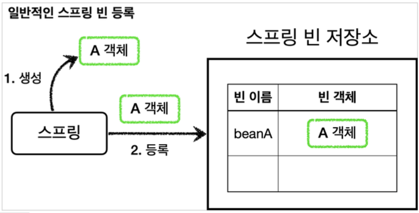
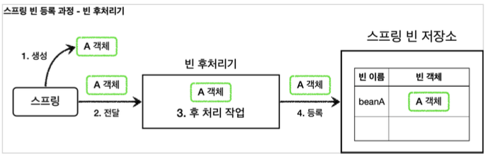
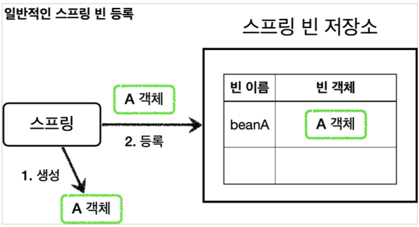
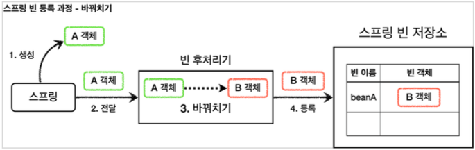

# Section7. 빈 후처리기

## 빈 후처리기 - 소개



`@Bean` 이나 컴포넌트 스캔으로 스프링 빈을 등록하면, 스프링은 대상 객체를 생성하고 스프링 컨테이너 내부의 빈 저장소에 등록한다. 그리고 이후에는 스프링 컨테이너를 통해 등록한 스프링 빈을 조회해서 사용하면 된다.


### 빈 후처리기 - BeanPostProcessor

스프링이 빈 저장소에 등록할 목적으로 생성한 객체를 빈 저장소에 등록하기 직전에 조작하고 싶다면 빈 후처리기를 사용하면 된다.

빈 포스트 프로세서(BeanPostProcessor)는 번역하면 빈 후처리기인데, 이름 그대로 빈을 생성한 후에 무언가를 처리하는 용도로 사용한다.


#### 빈 후처리기 기능

객체를 조작할 수도 있고, 완전히 다른 객체로 바꿔치기 하는 것도 가능하다.


### 빈 후처리기 과정



1. 생성: 스프링 빈 대상이 되는 객체를 생성한다. (`@Bean`, 컴포넌트 스캔 모두 포함)
2. 전달: 생성된 객체를 빈 저장소에 등록하기 직전에 빈 후처리기에 전달한다.
3. 후 처리 작업: 빈 후처리기는 전달된 스프링 빈 객체를 조작하거나 다른 객체로 바꿔치기 할 수 있다.
4. 등록: 빈 후처리기는 빈을 반환한다. 전달된 빈을 그대로 반환하면 해당 빈이 등록되고, 바꿔치기 하면 다른 객체가 빈 저장소에 등록된다.


## 빈 후처리기 - 예제코드 1

### 일반적인 스프링 빈 등록 과정

빈 후처리기를 학습하기 전에 먼저 일반적인 스프링 빈 등록 과정을 코드로 작성해보자.




#### BasicTest

``` java
package hello.proxy.postprocessor;

import lombok.extern.slf4j.Slf4j;
import org.junit.jupiter.api.Assertions;
import org.junit.jupiter.api.Test;
import org.springframework.beans.factory.NoSuchBeanDefinitionException;
import org.springframework.context.ApplicationContext;
import org.springframework.context.annotation.AnnotationConfigApplicationContext;
import org.springframework.context.annotation.Bean;
import org.springframework.context.annotation.Configuration;

public class BasicTest {

    @Test
    void basicConfig() {
        ApplicationContext applicationContext = new AnnotationConfigApplicationContext(BasicConfig.class);
        // A는 빈으로 등록된다.
        A a = applicationContext.getBean("beanA", A.class);
        a.helloA();
        // B는 빈으로 등록되지 않는다.
        Assertions.assertThrows(NoSuchBeanDefinitionException.class, () -> applicationContext.getBean(B.class));
    }
    
    @Slf4j
    @Configuration
    static class BasicConfig {
        @Bean(name = "beanA")
        public A a() {
            return new A();
        }
    }

    @Slf4j
    static class A {
        public void helloA() {
            log.info("hello A");
        }
    }

    @Slf4j
    static class B {
        public void helloB() {
            log.info("hello B");
        }
    }
}
```

`new AnnotationConfigApplicationContext(BasicConfig.class)`

스프링 컨테이너를 생성하면서 `BasicConfig.class` 를 넘겨 주었다. `BasicConfig.class` 설정 파일은 스프링 빈으로 등록된다.


#### 등록

- BasicConfig.class

  ``` java
  @Bean(name = "beanA")
  public A a () {
    return new A();
  }
  ```

  - beanA 라는 이름으로 A 객체를 스프링 빈으로 등록했다.


#### 조회

``` java
A a = applicationContext.getBean("beanA", A.class);
```

- beanA 라는 이름으로 A 타입의 스프링 빈을 찾을 수 있다.


``` java
applicationContext.getBean(B.class);
```

- B 타입의 객체는 스프링 빈으로 등록한 적이 없기 때문에 스프링 컨테이너에서 찾을 수 없다.


## 빈 후처리기 - 예제 코드2

### 빈 후처리기 적용

이번에는 빈 후처리기를 통해서 A 객체를 B 객체로 바꿔치기 해보자.




### BeanPostProcessor 인터페이스 - 스프링 제공

``` java
public interface BeanPostProcessor {

  Object postProcessBeforeInitialization(Object bean, String beanName) throws BeansException;
  
  Object postProcessAfterInitialization(Object bean, String beanName) throws BeansException;   
}
```

- 빈 후처리기를 사용하려면 `BeanPostProcessor` 인터페이스를 구현하고, 스프링 빈으로 등록하면 된다.
- `postProcessBeforeInitialization` : 객체 생성 이후에 `@PostConstruct` 같은 초기화가 발생하기 전에 호출되는 포스트 프로세서이다.
- `postProcessAfterInitialization` : 객체 생성 이후에 `@PostConstruct` 같은 초기화가 발생한 다음에 호출되는 포스트 프로세서이다.


#### BeanPOstProcessorTest

``` java
package hello.proxy.postprocessor;

import lombok.extern.slf4j.Slf4j;
import org.junit.jupiter.api.Assertions;
import org.junit.jupiter.api.Test;
import org.springframework.beans.BeansException;
import org.springframework.beans.factory.NoSuchBeanDefinitionException;
import org.springframework.beans.factory.config.BeanPostProcessor;
import org.springframework.context.ApplicationContext;
import org.springframework.context.annotation.AnnotationConfigApplicationContext;
import org.springframework.context.annotation.Bean;
import org.springframework.context.annotation.Configuration;

public class BeanPostProcessorTest {

    @Test
    void postProcessor() {
        ApplicationContext applicationContext = new AnnotationConfigApplicationContext(BeanPostProcessorConfig.class);

        // beanA 이름으로 B 객체가 빈으로 등록된다.
        B b = applicationContext.getBean("beanA", B.class);
        b.helloB();

        // A는 빈으로 등록되지 않는다.
        Assertions.assertThrows(NoSuchBeanDefinitionException.class, () -> applicationContext.getBean(A.class));
    }
    
    @Slf4j
    @Configuration
    static class BeanPostProcessorConfig {

        @Bean(name = "beanA")
        public A a() {
            return new A();
        }

        @Bean
        public AToBPostProcessor helloPostProcessor() {
            return new AToBPostProcessor();
        }
    }

    @Slf4j
    static class A {
        public void helloA() {
            log.info("hello A");
        }
    }

    @Slf4j
    static class B {
        public void helloB() {
            log.info("hello B");
        }
    }

    @Slf4j
    static class AToBPostProcessor implements BeanPostProcessor {
        @Override
        public Object postProcessAfterInitialization(Object bean, String beanName) throws BeansException {
            log.info("beanName={} bean={}", beanName, bean);
            if (bean instanceof A) {
                return new B();
            }
            return bean;
        }
    }
}
```

#### AToBPostProcessor

- 빈 후처리기이다. 인터페이스인 `BeanPostProcessor` 를 구현하고, 스프링 빈으로 등록하면 스프링 컨테이너가 빈 후처리기로 인식하고 동작한다.
- 이 빈 후처리기는 A 객체를 새로운 B 객체로 바꿔치기 한다. 파라미터로 넘어오는 빈(`bean`) 객체가 `A` 의 인스턴스이면 새로운 `B` 객체를 생성해서 반환한다. 여기서 `A` 대신에 반환된 값인 `B` 가 스프링 컨테이너에 등록된다. 다음 실행결과를 보면 `beanName=beanA`, `bean=A` 객체의 인스턴스가 빈 후처리기에 넘어온 것을 확인할 수 있다.


#### 실행 결과

```
..AToBPostProcessor - beanName=beanA
bean=hello.proxy.postprocessor...A@21362712
..B - hello B
```

- 실행 결과를 보면 최종적으로 "beanA" 라는 스프링 빈 이름에 A 객체 대신에 B 객체가 등록된 것을 확인할 수 있다. A는 스프링 빈으로 등록조차 되지 않는다.


### 정리

빈 후처리기는 빈을 조작하고 변경할 수 있는 후킹 포인트이다.

이것은 빈 객체를 조작하거나 심지어 다른 객체로 바꾸어 버릴 수 있을 정도로 막강하다. 여기서 조작이라는 것은 해당 객체의 특정 메서드를 호출하는 것을 뜻한다.

일반적으로 스프링 컨테이너가 등록하는, 특히 컴포넌트 스캔의 대상이 되는 빈들을 중간에 조작할 방법이 없는데, 빈 후처리기를 사용하면 개발자가 등록하는 모든 빈을 중간에 조작할 수 있다. 이 말은 빈 객체를 프록시로 교체하는 것도 가능하다는 뜻이다.


> [참고 - @PostConstruct의 비밀]
>
> `@PostConstruct` 는 스프링 빈 생성 이후에 빈을 초기화 하는 역할을 한다. 그런데 생각해보면 빈의 초기화라는 것이 단순히 @PostConstruct 어노테이션이 붙은 초기화 메서드를 한번 호출만 하면 된다. 쉽게 이야기해서 생성된 빈을 한번 조작하는 것이다.
>
> 따라서 빈을 조작하는 행위를 하는 적절한 빈 후처리기가 있으면 될 것 같다. 스프링은 `CommonAnnotationBeanPostProcessor` 라는 빈 후처리기를 자동으로 등록하는데, 여기에서 `@PostConstruct` 어노테이션이 붙은 메서드를 호출한다. 따라서 스프링 스스로도 스프링 내부의 기능을 확장하기 위해 빈 후처리기를 사용한다.

